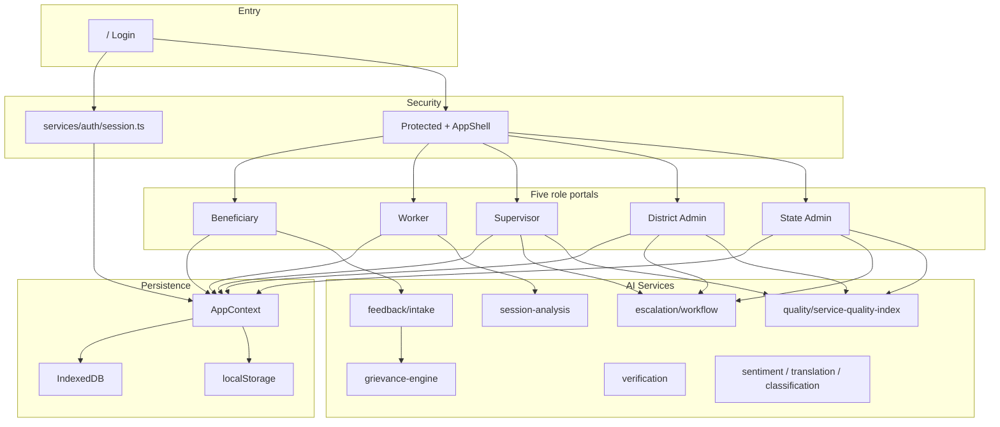

# AnganSakti 360 — Complete Application Overview

**AnganSakti 360** is a unified government platform for Andhra Pradesh Anganwadi centers:

> *AI Enabled Anganwadi Performance, Beneficiary Feedback and Grievance Resolution*

It answers four operational questions in one system:

| Question | How the platform answers it |
|----------|-----------------------------|
| **Were services delivered?** | Geo-tagged attendance, service evidence capture, AI verification, preschool session recordings |
| **Were beneficiaries satisfied?** | Mobile feedback, omnichannel intake (IVR/WhatsApp/SMS/QR/OCR/photo), sentiment analytics |
| **Were grievances resolved?** | Full escalation workflow with SLA, worker/supervisor/district/state steps, beneficiary confirmation |
| **Which centers need intervention?** | Service Quality Index (SQI), risk alerts, session scorecards, complaint heatmaps, AI recommendations |

**Design philosophy:** Continuous improvement and transparency — not surveillance. Low session scores trigger **coaching and training**, not punishment.

---

## Table of contents

1. [Technology stack](#1-technology-stack)
2. [Architecture](#2-architecture)
3. [Roles and authentication](#3-roles-and-authentication)
4. [Complete route map](#4-complete-route-map)
5. [Public and shared pages](#5-public-and-shared-pages)
6. [Beneficiary portal](#6-beneficiary-portal)
7. [Worker portal](#7-worker-portal)
8. [Supervisor portal](#8-supervisor-portal)
9. [District Admin portal](#9-district-admin-portal)
10. [State Admin portal](#10-state-admin-portal)
11. [AI services layer](#11-ai-services-layer)
12. [Grievance and escalation](#12-grievance-and-escalation)
13. [Preschool session evaluation](#13-preschool-session-evaluation)
14. [Omnichannel feedback](#14-omnichannel-feedback)
15. [Service Quality Index (SQI)](#15-service-quality-index-sqi)
16. [Notifications and communication](#16-notifications-and-communication)
17. [Data and persistence](#17-data-and-persistence)
18. [Global state (AppContext)](#18-global-state-appcontext)
19. [Demo access](#19-demo-access)
20. [Project structure](#20-project-structure)
21. [Running the application](#21-running-the-application)

---

## 1. Technology stack

| Layer | Technology |
|--------|------------|
| UI framework | React 18 + TypeScript |
| Build | Vite |
| Routing | React Router v6 |
| Styling | Tailwind CSS + shadcn/ui (Radix) |
| Charts | Recharts |
| Global state | React Context (`AppContext`) |
| Server state (wired) | TanStack Query |
| Languages | English, Telugu, Hindi (`src/lib/i18n.ts`) |
| Persistence | `localStorage` + IndexedDB (`AnganSakti360_DB` v3) |
| Mobile shell | Capacitor (Android project present) |

---

## 2. Architecture



**Typical request flow**

1. User opens a URL (e.g. `/worker/session-monitor`).
2. `Protected` checks `user` in `AppContext`.
3. No user → redirect to `/`.
4. Wrong role → redirect to that role’s home (`roleHomePath` in `src/lib/rolePaths.ts`).
5. Valid → `AppShell` (header, sidebar, sync, language) + page content.

---

## 3. Roles and authentication

### Roles

| Role | Home URL | Primary responsibility |
|------|----------|------------------------|
| **Beneficiary** (parent/caregiver) | `/beneficiary` | View child services, submit feedback, track grievances |
| **Worker** | `/worker` | Attendance, evidence, sessions, grievance responses, coaching |
| **Supervisor** | `/supervisor` | Center oversight, coaching, audits, SLA, development |
| **District Admin** | `/district-admin` | District analytics, compliance, centers, workers, grievances |
| **State Admin** | `/state-admin` | Statewide KPIs, SQI, integrations, communication hub |

Legacy `/admin` URLs redirect to `/district-admin`.

### Login (`/` → `Login.tsx`)

- Five role cards on the sign-in screen.
- Phone and password fields are **editable**; demo still uses **role-based profiles** from `demoUsers` (`src/data/mockData.ts`).
- Session stored in `localStorage` (`angansakti.user`; legacy `awai.user` migrated).
- Auth logic: `src/services/auth/session.ts` — `authenticate()`, `buildUserFromRole()`, extensible for future API login.

### User profile fields (`AppUser`)

- Common: `id`, `name`, `phone`, `role`, `centerId`, `centerName`, `district`, `languagePreference`
- Beneficiary: `children[]`, `complaintCount`, `notificationSettings`
- Admin: `assignedDistrict`

### Logout

- Clears session; returns to `/`.
- Available from header and Profile pages.

---

## 4. Complete route map

### Public

| Route | Page | Sidebar |
|-------|------|---------|
| `/` | Login | — |
| `*` | NotFound | — |

### Beneficiary (8 routes)

| Route | Page file | In sidebar |
|-------|-----------|------------|
| `/beneficiary` | `BeneficiaryDashboard.tsx` | Yes |
| `/beneficiary/omnichannel-feedback` | `OmnichannelFeedback.tsx` | Yes |
| `/beneficiary/feedback` | `Feedback.tsx` | Yes |
| `/beneficiary/complaints` | `Complaints.tsx` | Yes |
| `/beneficiary/status` | `Status.tsx` | Yes |
| `/beneficiary/activities` | `Activities.tsx` | Yes |
| `/beneficiary/notifications` | `Notifications.tsx` | Yes |
| `/beneficiary/profile` | `Profile.tsx` | Yes |

### Worker (15 routes)

| Route | Page file | In sidebar |
|-------|-----------|------------|
| `/worker` | `WorkerDashboard.tsx` | Yes |
| `/worker/session-monitor` | `SessionMonitor.tsx` | Yes |
| `/worker/attendance` | `Attendance.tsx` | Yes |
| `/worker/performance` | `Performance.tsx` | Yes |
| `/worker/training` | `Training.tsx` | Yes |
| `/worker/complaints` | `Complaints.tsx` | Yes |
| `/worker/session-history` | `SessionHistory.tsx` | Yes |
| `/worker/alerts` | `Alerts.tsx` | Yes |
| `/worker/profile` | `Profile.tsx` | Yes |
| `/worker/activities` | `Activities.tsx` | No* |
| `/worker/attendance-history` | `AttendanceHistory.tsx` | No* |
| `/worker/history` | `History.tsx` | No* |
| `/worker/uploads` | `Uploads.tsx` | No* |
| `/worker/activity/:id` | `VerificationDetail.tsx` | No* |
| `/worker/session-feedback` | `SessionFeedback.tsx` | No* |

\*Linked from dashboard, history, or post-session flow.

### Supervisor (12 routes)

| Route | Page file | In sidebar |
|-------|-----------|------------|
| `/supervisor` | `SupervisorDashboard.tsx` | Yes |
| `/supervisor/coaching` | `Coaching.tsx` | Yes |
| `/supervisor/session-review` | `SessionReview.tsx` | Yes |
| `/supervisor/development` | `Development.tsx` | Yes |
| `/supervisor/centers` | `Centers.tsx` | Yes |
| `/supervisor/complaints` | `Complaints.tsx` | Yes |
| `/supervisor/alerts` | `Alerts.tsx` | Yes |
| `/supervisor/map` | `MapView.tsx` | Yes |
| `/supervisor/reports` | `Reports.tsx` | Yes |
| `/supervisor/centers/:id` | `CenterDetail.tsx` | No* |
| `/supervisor/verifications` | `Verifications.tsx` | No* |
| `/supervisor/audit/:id` | `SupervisorAuditDetail.tsx` | No* |

### District Admin (8 routes)

| Route | Page file | In sidebar |
|-------|-----------|------------|
| `/district-admin` | `AdminDashboard.tsx` | Yes |
| `/district-admin/compliance` | `AdminCompliance.tsx` | Yes |
| `/district-admin/centers` | `AdminCenters.tsx` | Yes |
| `/district-admin/workers` | `AdminWorkers.tsx` | Yes |
| `/district-admin/complaints` | `district-admin/Complaints.tsx` | Yes |
| `/district-admin/integrations` | `shared/Integrations.tsx` | Yes |
| `/district-admin/reports` | `AdminReports.tsx` | Yes |
| `/district-admin/alerts` | Redirect → complaints | — |

### State Admin (6 routes)

| Route | Page file | In sidebar |
|-------|-----------|------------|
| `/state-admin` | `StateAdminDashboard.tsx` | Yes |
| `/state-admin/compliance` | `AdminCompliance.tsx` | Yes |
| `/state-admin/complaints` | `state-admin/Complaints.tsx` | Yes |
| `/state-admin/integrations` | `Integrations.tsx` (state scope) | Yes |
| `/state-admin/reports` | `AdminReports.tsx` | Yes |
| `/state-admin/notifications` | `state-admin/Notifications.tsx` | Yes |

**Total authenticated routes:** 49 + login + 404.

---

## 5. Public and shared pages

### Login (`/`)

- Branding: **AnganSakti 360**, AP government context.
- Role selection: Beneficiary, Worker, Supervisor, District Admin, State Admin.
- Language toggle: EN / తె / हि.
- Auto-redirect if session exists.

### NotFound (`*`)

- Standard 404 for unknown URLs.

### Shared: Role complaints (`shared/RoleComplaints.tsx`)

Reused by:

- `/worker/complaints`
- `/supervisor/complaints`
- `/district-admin/complaints`
- `/state-admin/complaints`

**Behavior by mode:**

| Mode | Features |
|------|----------|
| Worker | Assigned grievances; submit field response |
| Supervisor | Approve, escalate; `GrievanceAnalytics` |
| District | Volume, aging, SLA breach KPIs; analytics |
| State | Statewide queue + analytics |

### Shared: Integrations (`shared/Integrations.tsx`)

- Mock connections: ICDS MIS, POSHAN Tracker, Attendance API, AP Reporting Hub, Beneficiary dataset.
- Manual sync buttons; status: connected / pending.
- District vs state scope label.

### Shared components

| Component | Purpose |
|-----------|---------|
| `AppShell` | Layout, nav, logout, sync, language |
| `Protected` | Auth + role guard |
| `SyncIndicator` | Online/offline toggle, last sync |
| `LangToggle` | EN / TE / HI |
| `StatusBadge` | Activity/complaint status chips |
| `StatCard` | KPI cards on dashboards |
| `ComplaintTimeline` | Full escalation lifecycle UI |
| `ComplaintCard` | Grievance summary card |
| `PerformanceBandBadge` | Green / Orange / Red with supportive copy |
| `ScorecardGrid` | Session score breakdown |
| `GrievanceAnalytics` | Heatmap, unresolved, satisfaction |

---

## 6. Beneficiary portal

**Demo user:** Sunita Rao — Alipiri Center (`AWC-TPT-01`), children Aarav & Priya.

### `/beneficiary` — Dashboard

- Enrolled children cards.
- Today: nutrition, attendance, activity count, open grievances.
- Classroom photo from worker (if available).
- Quick actions: Feedback, File complaint.
- Government announcements (mock).

### `/beneficiary/omnichannel-feedback` — Omnichannel intake

**Channels supported:**

| Channel | Processing |
|---------|------------|
| IVR | Speech → text, auto language detection |
| WhatsApp | Text, voice, images |
| QR code | Center-specific form after scan |
| SMS | Short message intake |
| Handwritten OCR | OCR + complaint classification |
| Photo issue | Detect food, hygiene, infrastructure gaps |

All channels normalize through `src/services/feedback/intake.ts` → `submitOmnichannel()` in AppContext.

### `/beneficiary/feedback` — In-app feedback

- Star rating (1–5).
- Text, voice (simulated STT), photo upload.
- AI pipeline: translation → sentiment → classification → optional auto-grievance.
- Languages: EN / TE / HI.

### `/beneficiary/complaints` — My grievances

- List of grievances linked to beneficiary ID.
- `ComplaintTimeline` per item.
- Link to submit new via feedback.

### `/beneficiary/status` — Grievance status

- Full lifecycle view per complaint.
- Resolution notes from worker.
- **Confirm resolution** button → closes grievance (`beneficiary_confirmation` → `closed`).

### `/beneficiary/activities` — Center services

- Activities logged at beneficiary’s center.
- Status badges, AI confidence / service metrics when present.

### `/beneficiary/notifications` — Communication hub

- In-app notifications (acknowledgements, status, surveys).
- Channels shown: push, SMS, WhatsApp, in_app (demo).

### `/beneficiary/profile` — Profile

- Personal and center info.
- Language preference (EN / TE / HI).
- Notification settings display.
- Logout.

---

## 7. Worker portal

**Demo user:** Lakshmi Devi — Alipiri Center (`AWC-TPT-01`).

### `/worker` — Dashboard

- Attendance status, today’s activities, pending reviews, alerts.
- Quick link to **Session Monitor** (preschool recording).
- Recent activity feed with status badges.
- Refresh simulation; offline-aware messaging.

### `/worker/session-monitor` — Preschool session recording

**Core feature: AI Preschool Session Evaluation**

| Feature | Detail |
|---------|--------|
| Setup | Session type, syllabus category (language, numeracy, etc.), age group 3–6 |
| Metadata | Auto: worker ID, center ID, timestamp, GPS |
| Recording | Video + audio via `MediaRecorder`; pause/resume; timer |
| Upload | Progress bar; offline → `queued_offline` |
| AI | `analyzePreschoolSession()` → full scorecard |
| After | Navigate to session feedback |

### `/worker/session-history` — Session history

- All sessions for logged-in worker.
- Performance band (Green / Orange / Red).
- Link to session feedback detail.

### `/worker/performance` — Performance trends

- Weekly session count, average OPI (Overall Performance Index).
- Latest scorecard grid (5 dimensions).
- Strengths and growth areas.
- AI training recommendation summary.

### `/worker/training` — Learning path

- AI-assigned modules from session gaps.
- Supervisor coaching assignments.
- Module library from `TRAINING_MODULES` (9+ modules).
- Mark/start module UI (demo).

### `/worker/session-feedback` — Review AI findings

- Query: `?id=SES-xxx`
- `PerformanceBandBadge` + `ScorecardGrid`.
- Supportive recommendations list.
- Worker comment; request re-evaluation.

### `/worker/attendance` — Check-in / check-out

- Geo-tagged attendance (simulated GPS).
- Stored in `localStorage` (`angansakti.attendance`).
- Sync flag when offline.
- Link to attendance history.

### `/worker/attendance-history` — Calendar view

- Month calendar with present/absent/holidays.
- Mock leave and verification status.

### `/worker/activities` — Service evidence capture

- Log nutrition, education, health, immunization, etc.
- Photo/video capture, live camera, voice hook, GPS.
- On submit: `verifyServiceDelivery()` → `serviceMetrics`, `aiResult`.
- Navigates to verification detail.

### `/worker/history` — Activity ledger

- Search and filter by status.
- Stats: total, approved, submitted.
- Links to `/worker/activity/:id`.

### `/worker/activity/:id` — Verification detail

- View/upload evidence.
- Real geolocation on upload (where supported).
- AI analysis phases; updates activity in context.

### `/worker/uploads` — Evidence upload queue

- Pending activities without images.
- Simulated AI verification on upload.

### `/worker/complaints` — Grievance assignments

- Complaints assigned to worker or center.
- Submit field response → `worker_review` status.

### `/worker/alerts` — Dynamic alerts

- Missing today’s log, missing images, low confidence, sync pending.
- Action links to fix issues.

### `/worker/profile` — Profile

- Worker ID, center, phone.
- Language toggle.
- Logout.

---

## 8. Supervisor portal

**Demo user:** Ravi Kumar — Tirupati District scope.

### `/supervisor` — Operations dashboard

- Tirupati centers, compliance, activity feed, charts.
- **Complaint monitoring** + SLA open count.
- **Parent feedback sentiment** (positive vs at-risk).
- **Risk centers** ranking by compliance.
- Critical alerts preview.

### `/supervisor/coaching` — Coaching & Development Center

- Workers/sessions with Orange or Red bands.
- Supportive recommendations from AI.
- **Assign coaching modules** → `coachingAssignments` + worker notification.
- Training module library preview.

### `/supervisor/session-review` — Session review

- District session scorecards.
- Body language, child engagement counts, syllabus compliance grid.

### `/supervisor/development` — Workforce development

- OPI trend chart.
- Session heatmap (color by band).
- Center SQI ranking table.
- At-risk feedback signal count.

### `/supervisor/centers` — Center list

- Grid/list view; search; filter by health status.
- Open center detail.

### `/supervisor/centers/:id` — Center detail

- Compliance, children, worker, activities, alerts.
- Send reminder / raise issue (UI demo).

### `/supervisor/verifications` — Governance audit queue

- Filter: submitted / approved / issue.
- Search by center, date.
- Link to `/supervisor/audit/:id`.

### `/supervisor/audit/:id` — Audit detail

- Simulated neural extraction by activity type.
- Approve, flag issue, supervisor remark.
- Updates activity status.

### `/supervisor/complaints` — Grievance center

- `GrievanceAnalytics`: heatmap, unresolved, satisfaction, SLA breach.
- Approve worker responses; escalate to district.
- Full escalation timeline.

### `/supervisor/alerts` — System alerts

- Missed logs, geo anomalies, low AI confidence.
- Mark read / action toasts.

### `/supervisor/map` — Geospatial monitor

- Mock map with center markers by compliance.
- Live / historical toggle UI.

### `/supervisor/reports` — Reports

- Compliance and activity charts.
- Export simulation.

---

## 9. District Admin portal

**Demo user:** Dr. Meena Reddy — Tirupati District.

### `/district-admin` — Analytics dashboard

- District KPIs: centers, workers, compliance, verifications.
- Charts: attendance, activity breakdown.
- Links to compliance and reports.

### `/district-admin/compliance` — Compliance matrix

- Filter compliant (≥90%) vs non-compliant (&lt;75%).
- Search centers; export toast.
- Per-center info actions.

### `/district-admin/centers` — Center registry

- Statewide center list (demo data).
- Register new center modal (simulated).
- Grid/list views.

### `/district-admin/workers` — Staff directory

- Workers derived from center data.
- Mock attendance % and ratings.

### `/district-admin/complaints` — Grievance analytics

- Total / open / SLA breach cards.
- `GrievanceAnalytics` (district scope).
- Complaint cards with district aging view.

### `/district-admin/integrations` — Integration layer

- ICDS, POSHAN, attendance, reporting APIs (mock sync).

### `/district-admin/reports` — Reports & records

- Report catalog with download simulation.

---

## 10. State Admin portal

**Demo user:** Sri Venkatesh Rao — Andhra Pradesh.

### `/state-admin` — Executive command

**Executive KPIs:**

- Service Quality Index
- Complaint Index
- Feedback Score
- Adoption Rate
- Activity Compliance
- Grievance Closure %

**Also includes:**

- District comparison bar chart.
- AI intervention recommendations per center.
- High-risk center alerts.
- **Real-Time SQI** grid (ranked centers).
- `GrievanceAnalytics` (state scope).

### `/state-admin/compliance` — Statewide compliance

- Same component as district; full state center set.

### `/state-admin/complaints` — Statewide grievances

- Full complaint queue + analytics.

### `/state-admin/integrations` — State integrations

- Same integration UI; state-wide label.

### `/state-admin/reports` — State reports

- District-wide report catalog.

### `/state-admin/notifications` — Communication center

- All platform notifications across roles.
- Push, SMS, WhatsApp, in_app, IVR labels (demo broadcast view).

---

## 11. AI services layer

All under `src/services/` — designed for local/demo operation; replace with cloud APIs in production.

### Session intelligence (`ai/session-analysis/`)

| Module | Function |
|--------|----------|
| `index.ts` | `analyzePreschoolSession()` — full pipeline |
| `training-recommendations.ts` | Map gaps → module IDs |

**Outputs:** Body language, child engagement, speech, syllabus compliance, classroom quality → weighted scorecard:

- Teaching Effectiveness
- Child Engagement
- Communication
- Activity Compliance
- Classroom Management
- **Overall Performance Index (OPI)**

**Bands:** Green (≥75%), Orange (55–74%), Red (&lt;55%) — always with supportive recommendations.

### Service verification (`ai/verification.ts`)

- `verifyServiceDelivery()` for activity evidence.
- Classroom setup, child presence, meal delivery, safety, anomalies.

### Feedback AI (`ai/index.ts` + modules)

| File | Purpose |
|------|---------|
| `translation.ts` | EN ↔ TE ↔ HI |
| `sentiment.ts` | positive / neutral / negative / critical |
| `classification.ts` | Legacy category + complaint flag |
| `speech.ts` | Simulated STT for voice |
| `processFeedbackWithAI()` | Combined feedback pipeline |

### Grievance AI (`ai/grievance-engine.ts`)

- Expanded categories (10 types).
- Severity, SLA hours, routing path.
- `shouldEscalate()` rules: safety, SLA breach, repeats, satisfaction, red session flags.

### Risk & analytics

| File | Purpose |
|------|---------|
| `ai/alerts.ts` | `generateRiskAlerts()` for centers |
| `ai/analytics.ts` | Executive KPIs, intervention predictions |
| `quality/service-quality-index.ts` | Per-center SQI + district rankings |

### Omnichannel (`feedback/intake.ts`)

- `processChannelIntake()` per channel rules.
- Normalizes to unified schema before grievance creation.

### Escalation (`escalation/workflow.ts`)

- `ESCALATION_FLOW` status order.
- `applyEscalationRule()`, legacy status mapping.

---

## 12. Grievance and escalation

### Complaint categories

- Service Delivery
- Nutrition Quality
- Hot Cooked Meals
- Infrastructure
- Cleanliness
- Drinking Water
- Worker Behavior
- Child Safety
- Attendance
- Other Concerns

(Legacy categories still accepted in data.)

### Escalation lifecycle

```
Channel Intake → AI Processing → Classification → Worker Review → Supervisor Review
    → District Escalation → State Escalation → Resolution → Beneficiary Confirmation → Closed
```

Visualized in `ComplaintTimeline` component.

### Escalation triggers (automatic checks)

| Rule | Action |
|------|--------|
| Critical safety | District escalation |
| SLA breach | Supervisor escalation |
| 3+ repeat complaints | District escalation |
| Low satisfaction trend | District escalation |
| 2+ red session flags | Supervisor coaching link |

### SLA

- Set from severity at classification (12h–72h).
- Overdue complaints marked **SLA Breach** in UI.

---

## 13. Preschool session evaluation

### Session metadata (auto-attached)

- Worker ID, center ID, timestamp
- Session type, GPS, age group 3–6, syllabus category

### Recording capabilities

- Video + audio capture
- Pause / resume
- Upload progress
- Offline queue (`queued_offline`) with background sync intent

### Scorecard → training loop

1. Session uploaded → AI scorecard.
2. `trainingRecommendations` created in AppContext.
3. Orange/Red → worker notification → `/worker/training`.
4. Supervisor can `assignCoaching()` with modules and due date.

---

## 14. Omnichannel feedback

Beneficiaries are **not limited to the mobile app**.

| Channel | Route entry | Engine |
|---------|-------------|--------|
| Mobile app | `/beneficiary/feedback` | `submitFeedback()` |
| All other channels | `/beneficiary/omnichannel-feedback` | `submitOmnichannel()` |

Stored entities:

- `OmnichannelInput` (raw + normalized)
- `FeedbackEntry` (unified)
- `ComplaintRecord` (if escalated)

---

## 15. Service Quality Index (SQI)

**Formula (weighted):**

| Input | Weight (approx.) |
|-------|------------------|
| Worker performance (session OPI) | 22% |
| Session evaluation | 20% |
| Complaint volume (inverse) | 18% |
| Beneficiary satisfaction | 18% |
| Attendance/compliance | 12% |
| Verification confidence | 10% |

**Used on:**

- Supervisor Development page (rankings)
- State Admin dashboard (SQI grid)
- Refreshed when sessions/complaints/feedback change

---

## 16. Notifications and communication

**Channels (demo):** push, SMS, WhatsApp, in_app, IVR.

| Audience | Example notifications |
|----------|----------------------|
| Beneficiary | Grievance acknowledged, status updates, surveys |
| Worker | Coaching insights, session score ready, assignments |
| Supervisor | Escalations (via complaint updates) |
| State Admin | All notifications in communication center |

Managed in AppContext: `notifications`, `addNotification()`, `markNotificationRead()`.

---

## 17. Data and persistence

### IndexedDB (`AnganSakti360_DB` v3)

| Store | Contents |
|-------|----------|
| `activities` | Activity ledger |
| `feedback` | Beneficiary feedback |
| `complaints` | Grievance records |
| `notifications` | Platform notifications |
| `session_recordings` | Session records + scorecards |
| `training_recommendations` | AI/supervisor training paths |
| `coaching_assignments` | Supervisor-assigned coaching |
| `omnichannel_inputs` | Channel intake log |
| `service_quality_scores` | SQI snapshots |
| `escalations` | Escalation audit (reserved) |
| `worker_progress` | Progress snapshots (reserved) |
| `session_offline_queue` | Offline upload queue (reserved) |
| `audit_logs` | Audit trail (reserved) |

### localStorage

| Key | Contents |
|-----|----------|
| `angansakti.user` | Session user |
| `angansakti.lang` | UI language |
| `angansakti.attendance` | Worker attendance records |
| `angansakti.integrations` | Integration sync status |

### Mock seed data

| File | Data |
|------|------|
| `mockData.ts` | Centers, activities, charts, demo users |
| `mockGrievances.ts` | Feedback, complaints, notifications, announcements |
| `mockSessions.ts` | Sample session + training modules |

---

## 18. Global state (AppContext)

`src/context/AppContext.tsx` — single source of truth.

| State / API | Description |
|-------------|-------------|
| `user`, `login`, `logout` | Auth session |
| `lang`, `setLang`, `t` | i18n |
| `online`, `toggleOnline`, `lastSync` | Sync simulation |
| `activities`, `addActivity`, `updateActivity` | Service evidence |
| `feedback`, `submitFeedback` | In-app feedback + AI |
| `submitOmnichannel` | All non-app channels |
| `complaints`, `updateComplaint`, `advanceComplaint` | Grievance workflow |
| `notifications`, `addNotification`, `markNotificationRead` | Comms hub |
| `sessions`, `addSession`, `updateSession`, `processSessionUpload` | Preschool sessions |
| `trainingRecommendations` | AI coaching paths |
| `coachingAssignments`, `assignCoaching` | Supervisor assignments |
| `omnichannelInputs` | Channel intake log |
| `serviceQualityScores`, `refreshServiceQuality` | SQI |
| `workerRedFlagCount` | Red session count per worker |

---

## 19. Demo access

| Role | Select on login | Lands on |
|------|-----------------|----------|
| Beneficiary | Parent / Caregiver | `/beneficiary` |
| Worker | Anganwadi Worker | `/worker` |
| Supervisor | Supervisor | `/supervisor` |
| District Admin | District Admin | `/district-admin` |
| State Admin | State Admin | `/state-admin` |

**Suggested demo flows**

1. **Worker:** Session Monitor → record → AI scorecard → Training.
2. **Beneficiary:** Omnichannel → low rating → auto grievance → Status → confirm close.
3. **Supervisor:** Coaching → assign modules; Complaints → approve.
4. **State Admin:** Executive KPIs + SQI + grievance heatmap.

---

## 20. Project structure

```
src/
├── App.tsx                    # All routes
├── main.tsx
├── context/
│   └── AppContext.tsx         # Global state
├── types/
│   ├── platform.ts            # Users, complaints, SQI, etc.
│   ├── session.ts             # Sessions, scorecards, training
│   └── feedback-channels.ts   # Omnichannel types
├── data/
│   ├── mockData.ts
│   ├── mockGrievances.ts
│   └── mockSessions.ts
├── services/
│   ├── auth/session.ts
│   ├── ai/                    # AI modules
│   ├── feedback/intake.ts
│   ├── escalation/workflow.ts
│   └── quality/service-quality-index.ts
├── lib/
│   ├── i18n.ts
│   ├── rolePaths.ts
│   └── storage/               # IDB + localStorage
├── components/
│   ├── app/                   # Shell, Protected, badges
│   ├── complaints/
│   ├── session/
│   └── analytics/
└── pages/
    ├── Login.tsx / Index.tsx
    ├── beneficiary/           # 8 pages
    ├── worker/                # 15 pages
    ├── supervisor/            # 12 pages
    ├── admin/                 # District admin screens
    ├── district-admin/
    ├── state-admin/
    └── shared/
```

---

## 21. Running the application

```bash
npm install
npm run dev
```

Open the dev server URL (typically `http://localhost:5173`).

```bash
npm run build    # Production build
npm run preview  # Preview production bundle
```

**Mobile:** Capacitor Android project under `android/`.

---

## Document history

| Document | Description |
|----------|-------------|
| `APPLICATION_OVERVIEW.md` | Earlier AnganwadiAI-era overview (may be partially outdated) |
| **`ANGANSAKTI_360_FULL_OVERVIEW.md`** | **This file** — complete current platform reference |

---

*AnganSakti 360 — integrated government operating system for Anganwadi performance, beneficiary experience, and grievance resolution. Demo AI and integrations are simulated locally; production deployment would connect to state APIs, cloud STT/vision models, and SMS/WhatsApp gateways.*
