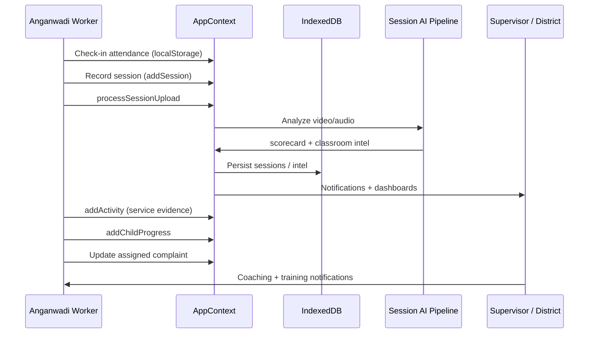

# AnganSakti 360 — Anganwadi Worker Portal  
## Full Context, Pages, Functionalities & Daily Flow

**Document purpose:** Single reference for the **Government of Andhra Pradesh – WDCW Daily Operations Console** used by Anganwadi workers after login. Covers architecture context, navigation, every route, features, data flow, and the recommended end-to-end working day.

**Application:** AnganSakti 360 (Child Welfare Hackathon)  
**Default worker home:** `/worker/dashboard`  
**Last updated:** May 2026 (aligned with current codebase)

---

## 1. What this portal is

The worker portal is a **mobile-first, offline-capable field operations application** for Anganwadi workers in villages. It is **not** an admin analytics dashboard. Workers complete daily duties; the system captures **evidence**, runs **AI on preschool sessions**, and links **beneficiary feedback** to assigned issues and coaching.

### Hackathon goals served

| Goal | How the worker portal contributes |
|------|----------------------------------|
| **AI classroom performance tracking** | Preschool session video/audio recording → AI scorecard → **Session Support Summary** (coaching language) → supervisor/district classroom intelligence |
| **Beneficiary feedback → service improvement** | Grievances from voice/WhatsApp/QR/survey flow to **Assigned Issues**; worker responds with actions and evidence; closure feeds trust metrics upstream |

### Design principles

- **Low literacy:** Large touch targets, plain language, support levels (green / orange / red) as *coaching*, not punishment  
- **Mobile-first:** Bottom nav on phones; collapsible sidebar on desktop  
- **Offline-first:** Local storage + IndexedDB via `AppContext`; sync queue; queued session uploads  
- **Voice assistance:** Speech synthesis on Help; voice notes on activities/sessions  
- **Multilingual:** English default at login; Telugu/Hindi via header toggle during session only  
- **Full-width field layout:** Content uses the main area beside the sidebar (open or collapsed)

---

## 2. Technology & architecture (unchanged core)

| Layer | Implementation |
|-------|----------------|
| UI | React 18 + TypeScript + Vite |
| Styling | Tailwind CSS + shadcn/ui patterns |
| State | `AppContext` (`src/context/AppContext.tsx`) |
| Persistence | IndexedDB (`src/lib/storage/index.ts`) + `localStorage` (e.g. attendance key `awai.attendance`) |
| Routing | React Router (`src/App.tsx`), role guard `Protected` |
| AI sessions | `processSessionUpload` → session analysis pipeline + classroom intelligence (`src/services/ai/`) |
| Service evidence AI | `verifyServiceDelivery` on activity uploads |
| Layout | `AppShell` + `GovernmentHeader` + worker-specific `WorkerFieldLayout` |

**Roles in system:** `beneficiary`, `worker`, `supervisor`, `district_admin`, `state_admin` — worker extends existing modules only; no new roles.

---

## 3. Login → worker entry

### 3.1 Login page (`/`)

- **UI:** Split government login (branding left, form right), single viewport, no page scroll  
- **Role selection:** User picks **Worker** (among five roles)  
- **Credentials (demo):** Phone `9876543210`, password `demo1234`  
- **Language rule:** On login, language is forced to **English** (`AppContext.login`). Logout resets to English. Telugu/Hindi only via **header language toggle** while signed in.  
- **Redirect:** Successful worker login → `/worker/dashboard` (`src/lib/rolePaths.ts`)

### 3.2 Demo worker identity

Typical demo profile after login:

| Field | Example |
|-------|---------|
| Worker ID | `W-1042` |
| Name | Lakshmi Devi |
| Center | Alipiri Center (`AWC-TPT-01`) |
| District | Tirupati |

---

## 4. Application shell (after login)

### 4.1 Global chrome

- **Government header:** AP WDCW branding, online/offline indicator, district, language toggle, accessibility (text size/contrast), user menu  
- **Sidebar (desktop):** Five sections — collapsible (`lg:ml-64` → `lg:ml-16`)  
- **Bottom nav (mobile):** First five items from **Operations** section  
- **Worker status strip:** On most pages via `WorkerFieldLayout` — name, center, date, network, last sync, children count  
- **Help FAB:** Fixed button → `/worker/help-support` (voice icon)  
- **Background:** Light field grey (`#eef2f6`) for worker role main area  

### 4.2 Sidebar navigation (`src/lib/govNav.ts`)

#### Operations

| Route | Label | Purpose |
|-------|-------|---------|
| `/worker/dashboard` | Daily Operations | Default home / day console |
| `/worker/my-day` | My day | Day planner & timeline |
| `/worker/attendance` | Attendance | Check-in / check-out |
| `/worker/session-monitor` | Session recording | Preschool classroom capture |

#### Service Delivery

| Route | Label | Purpose |
|-------|-------|---------|
| `/worker/activities` | Service delivery tracker | Non-session government services |
| `/worker/child-progress` | Child outcomes | Per-child observations |
| `/worker/uploads` | Service submission queue | Evidence upload & verification |
| `/worker/training` | Training & coaching | Modules linked to AI insights |
| `/worker/complaints` | Assigned issues | Beneficiary grievances assigned to worker |

#### Monitoring

| Route | Label | Purpose |
|-------|-------|---------|
| `/worker/growth` | My growth journey | Worker development over time |

#### Communication

| Route | Label | Purpose |
|-------|-------|---------|
| `/worker/alerts` | Communication center | Tabbed messages & alerts |

#### Profile

| Route | Label | Purpose |
|-------|-------|---------|
| `/worker/profile` | Identity & settings | Profile, language, sync info |
| `/worker/help-support` | Help & support | FAQs, voice help, helpline |
| `/settings/sync` | Sync settings | Shared offline sync controls |

---

## 5. Recommended daily workflow

```mermaid
flowchart LR
  A[Login] --> B[Daily Operations Console]
  B --> C[Attendance Check-In]
  C --> D[Preschool Session Recording]
  D --> E[AI Session Support Summary]
  E --> F[Service Delivery Tracker]
  F --> G[Service Submission Queue]
  G --> H[Assigned Issues]
  H --> I[Training & Coaching]
  I --> J[My Growth Journey]
  J --> K[Attendance Check-Out / End Day]
```

**Parallel / anytime:** My day planner, Communication center, Child outcomes, Teaching guidance (from session AI), Help & support, Sync offline data.

---

## 6. Page-by-page reference

### 6.1 Daily Operations Console — `/worker/dashboard`  
**File:** `src/pages/worker/DailyOperationsDashboard.tsx`  
**Layout:** `WorkerFieldLayout`

**Purpose:** Full-day working planner and operational home (replaces old admin-style worker dashboard as default landing).

**Shows:**

- WDCW banner, center, date, **attendance state** (Not checked in / On duty / Day complete)  
- **Summary cards:** Attendance, Today’s sessions, Activities pending, Assigned issues, Training progress, Service completion %  
- **Quick actions:** Check in, Start preschool, Submit activity, Open issues, Continue training, Sync offline  
- **Full-day timeline:** Attendance → Preschool → Nutrition & activities → Service uploads → Issue responses → End day  
- Offline queue notice when disconnected  

**Links:** Drills into attendance, session monitor, activities, complaints, training, my-day, uploads.

---

### 6.2 My day — `/worker/my-day`  
**File:** `src/pages/worker/MyDay.tsx`

**Purpose:** Worker **day planner** — scheduled steps, completion counts, reminders.

**Features:**

- Today’s date  
- **Scheduled today** timeline (check-in, session, nutrition, services, issues, sync/end day) — statuses: done / current / pending  
- **Completed vs pending** counts  
- **Reminders** from unread worker notifications  
- Link back to Daily Operations Console  

**Layout:** Wide screen — timeline left (8 cols), stats/reminders right (4 cols).

---

### 6.3 Attendance — `/worker/attendance`  
**File:** `src/pages/worker/Attendance.tsx`  
**Storage:** `localStorage` key `awai.attendance`

**Purpose:** Complete attendance workflow for the center.

**Features:**

- **Check-in / Check-out** with GPS capture (simulated geolocation), timestamp  
- Geo-fence messaging (within center / pending verification) — **anomaly explanation** (supervisor review, not penalty)  
- Map-style UI with coordinates  
- **Today’s shift** card with in/out times  
- **Offline:** `synced: false` shows “Queued” badge on record  
- **Recent logs** (last 5) + link to full history  

**Related:** `/worker/attendance-history` — calendar/history view (`AttendanceHistory.tsx`).

---

### 6.4 Preschool Session Recording — `/worker/session-monitor`  
**File:** `src/pages/worker/SessionMonitor.tsx`

**Purpose:** **Primary classroom workflow** — separate from Service Delivery Tracker.

**Setup (before record):**

- Activity type: Storytelling, Rhymes, Drawing, Alphabet Learning, Group Play, Nutrition Awareness, Custom  
- Age group, planned duration, syllabus category  
- Children present count  
- Capture mode: **video** or **audio only**  
- Voice note / observations (optional)  
- GPS on metadata  

**Recording:**

- Start / pause / stop (minimum ~60s before stop)  
- Live preview, elapsed timer  
- Offline: saves as `queued_offline`, background sync message  

**After stop:**

- Upload progress UI  
- Online: `processSessionUpload` → AI scorecard + classroom intelligence  
- Auto-navigate to **`/worker/session-feedback/:id`** when scorecard ready  

**Related:** `/worker/session-history` — list of past sessions.

---

### 6.5 Session Support Summary — `/worker/session-feedback` or `/worker/session-feedback/:id`  
**File:** `src/pages/worker/SessionFeedback.tsx`  
**Not in sidebar** — reached after upload or direct link.

**Purpose:** Present AI outputs in **worker-friendly coaching language** (not raw scores or penalties).

**Displays:**

- **Support level** badge (green / orange / red as support levels)  
- Metrics: Overall session quality, Child engagement, Teaching communication, Activity completion, Classroom readiness, Participation level  
- **What went well** (strengths first)  
- **What to improve next time**  
- **Suggested activity**  
- **Supervisor guidance** note  
- Comparison chart — **last 3 sessions**  
- Development path timeline (from classroom intel)  
- Optional worker comment saved on session  
- Link to detailed AI explanation route  

**Data:** `sessions` + `getClassroomAnalytics(sessionId)` from `AppContext`.

---

### 6.6 Service Delivery Tracker — `/worker/activities`  
**File:** `src/pages/worker/Activities.tsx`

**Purpose:** Log **government services delivered** through the day (meals, health, visits, etc.) — **must not** duplicate session recording.

**Service sections (types):**

- Preschool Activities  
- Nutrition Distribution  
- Health Activities  
- Home Visits  
- Community Outreach  
- Infrastructure Updates  

**Per submission:**

- Description, child count, photo/video capture, GPS, voice dictation (simulated)  
- Optional link to child progress logging  
- AI verification via `verifyServiceDelivery`  
- Status: pending / submitted; sync when online  

**Adds:** `addActivity` → `activities` in context → IndexedDB.

---

### 6.7 Service Submission Queue — `/worker/uploads`  
**File:** `src/pages/worker/Uploads.tsx`  
**Redirect:** `/worker/history` → `/worker/uploads`

**Purpose:** Operational **submission center** for evidence pending upload/verification.

**Features:**

- Lists activities needing proof (`status: pending`, no `imageUrl`)  
- Select activity → capture/upload image → simulated AI confidence  
- Header shows offline queue count from `syncQueue`  
- Verification result (matched / low confidence)  

**Statuses (conceptual):** Draft, Pending verification, Synced, Returned — driven by activity `status` and sync flags.

**Related:** `/worker/activity/:id` — `VerificationDetail.tsx` for single activity review.

---

### 6.8 Child Outcomes & Observations — `/worker/child-progress`  
**File:** `src/pages/worker/ChildProgress.tsx`

**Purpose:** Per-child wellness and development logging.

**Record fields:**

- Child name  
- Attended, nutrition completed  
- Preschool participation %  
- Growth milestone, learning observation, developmental notes  
- Growth indicator: on_track / monitor / concern  
- Attendance consistency %  

**UX:**

- Quick observation templates (tap to fill note)  
- **Wellness alerts** for absence or concern  
- History list per center  
- `addChildProgress` → Child Wellness / intelligence upstream  

---

### 6.9 Assigned Issues & Responses — `/worker/complaints`  
**File:** `src/pages/worker/Complaints.tsx` (wraps `RoleComplaints` mode=`worker`)

**Purpose:** Grievances **assigned to this worker only** — tied to beneficiary feedback pipeline.

**Worker sees:**

- Issue source (voice, WhatsApp, QR, survey, supervisor)  
- Category, urgency, due date, stage  
- Submit actions, upload evidence, mark progress/completion  
- History and closure feedback (via shared complaints module)  

**Context:** `complaints` filtered by `assignedWorkerId`; classification may auto-assign demo worker `W-1042`.

---

### 6.10 Training & Coaching Center — `/worker/training`  
**File:** `src/pages/worker/Training.tsx`

**Purpose:** Professional development linked to session AI.

**Sections:**

- **Supervisor coaching** assignments (`coachingAssignments`)  
- **Assigned training** modules from `trainingRecommendations`  
- **Recommended** modules with estimated impact copy  
- **Completed** count  
- Module library reference (`TRAINING_MODULES`)  
- Offline/download messaging (demo)  

**Trigger:** After session AI, notifications may point here (`actionUrl: /worker/training`).

---

### 6.11 My Growth Journey — `/worker/growth`  
**File:** `src/pages/worker/WorkerGrowth.tsx`

**Purpose:** Worker-centric development (not district admin metrics).

**Shows:**

- Current **support level** band  
- Before vs after coaching comparison  
- Weekly trajectory chart  
- Historical session bands  
- Counts: AI evaluations, training completed, interventions  
- AI recommendations + projected improvement  
- Link to training  

**Data:** `getWorkerGrowth(workerId, name, centerId)`.

---

### 6.12 Teaching Guidance Center — `/worker/performance`  
**File:** `src/pages/worker/Performance.tsx`  
**Redirect:** `/worker/teaching-insights` → `/worker/performance`  
**Not in sidebar** — contextual access from session summary or bookmarks.

**Purpose:** Coaching tips derived from AI (not surveillance dashboard).

**Includes:**

- Weekly summary in plain language  
- Suggested activities, engagement techniques  
- Classroom layout / participation tips  
- Link to latest **Session Support Summary**  

---

### 6.13 Communication Center — `/worker/alerts`  
**File:** `src/pages/worker/Alerts.tsx`

**Purpose:** Unified inbox for worker communications.

**Tabs:**

1. **Notifications** — all worker notifications + evidence reminders  
2. **Supervisor** — coaching/visit messages  
3. **Issues** — complaint/grievance updates  
4. **Training** — module/training messages  
5. **Department** — WDCW announcements  

**Features:** Priority labels (high/medium), offline-readable list, deep links (`actionUrl`).

---

### 6.14 Worker Identity & Settings — `/worker/profile`  
**File:** `src/pages/worker/Profile.tsx`

**Purpose:** Identity card and preferences.

**Includes:**

- Name, ID, assigned center, phone  
- Active duty / verification messaging  
- **Language toggle** (English ↔ Telugu)  
- **Sync & offline storage** — online state + `syncQueue.length`  
- Sign out (resets language to English)  

---

### 6.15 Help & Support — `/worker/help-support`  
**File:** `src/pages/worker/HelpSupport.tsx`

**Purpose:** Field help for low-literacy users.

**Features:**

- **Voice help** button (Web Speech API, `en-IN`)  
- Expandable **FAQs** (check-in, session vs activity, support levels) with “Listen” per answer  
- **Troubleshooting:** offline mode, sync settings  
- WDCW helpline demo link (`tel:181`)  

---

### 6.16 Sync settings — `/settings/sync`  
**Shared route** (all roles)

**Purpose:** Retry failed uploads, manage offline queue (linked from dashboard quick action).

---

### 6.17 Legacy / secondary routes

| Route | Notes |
|-------|--------|
| `/worker` | Redirects to `/worker/dashboard` |
| `/worker/dashboard` (old) | `WorkerDashboard.tsx` exists but is **not** default route |
| `/worker/session-history` | Past session list |
| `/worker/attendance-history` | Extended attendance calendar |
| `/worker/history` | Redirect to uploads |
| `/worker/teaching-insights` | Redirect to performance |
| `/session-explanation/:sessionId` | Deep AI explanation (linked from feedback page) |

---

## 7. Global worker capabilities

| Capability | Behavior |
|------------|----------|
| **Offline indicator** | Header + page-level badges; amber banners on session/attendance |
| **Auto-sync** | `AppContext` sync queue; `lastSync` timestamp on layout |
| **Voice** | Help page TTS; activity voice dictation; session observation notes |
| **i18n** | Keys in `src/lib/i18n.ts`; worker-specific labels (`daily_operations_console`, `service_delivery_tracker`, etc.) |
| **Accessibility** | Government accessibility controls in header |
| **Confirmations** | Toasts (sonner) on save, check-in, upload, AI complete |
| **Audit metadata** | GPS, timestamps, worker/center IDs on sessions and activities |
| **Print/export** | Government page frame print button (worker breadcrumb hidden) |

---

## 8. Data & AI flow (worker → government intelligence)

**Key context methods (worker-relevant):**

- `addSession`, `updateSession`, `processSessionUpload`  
- `addActivity`, `updateActivity`  
- `addChildProgress`  
- `getClassroomAnalytics`, `getWorkerGrowth`  
- `trainingRecommendations`, `coachingAssignments`  
- `complaints`, `notifications`, `syncQueue`, `online`  

---

## 9. Integration with other roles

| Upstream / downstream | Connection |
|----------------------|------------|
| **Beneficiary** | Feedback & complaints create issues assigned to worker |
| **Supervisor** | Session AI → classroom intelligence, coaching assignments, grievance monitoring |
| **District / State** | Aggregated classroom analytics, SQI bridges, mission control (worker does not see admin metrics in nav) |
| **Hackathon demo flow** | `src/services/demo/hackathonFlow.ts` — Lakshmi / AWC-TPT-01 narrative |

---

## 10. Key source files (quick index)

| Area | Path |
|------|------|
| Routes | `src/App.tsx` |
| Worker nav | `src/lib/govNav.ts` |
| Home path | `src/lib/rolePaths.ts` |
| Global state | `src/context/AppContext.tsx` |
| Worker layout | `src/components/worker/WorkerFieldLayout.tsx` |
| Day timeline UI | `src/components/worker/DayTimeline.tsx` |
| Support level badge | `src/components/worker/SupportLevel.tsx` |
| Shell | `src/components/app/AppShell.tsx` |
| Login | `src/pages/Login.tsx` |
| Worker pages | `src/pages/worker/*.tsx` |
| Session types | `src/types/session.ts` |
| Classroom intel types | `src/types/classroom-intelligence.ts` |
| i18n | `src/lib/i18n.ts` |

---

## 11. Demo quick start

1. Open app → Login  
2. Select **Worker**  
3. Phone `9876543210`, password `demo1234`  
4. Land on **Daily Operations Console**  
5. Typical path: **Attendance** check-in → **Session recording** → review **Session support summary** → **Service delivery** logs → **Uploads** → **Assigned issues** → **Training** → **Growth** → check-out  

---

## 12. Related documentation

- `ANGANSAKTI_360_FULL_OVERVIEW.md` — platform-wide routes and roles  
- `APPLICATION_OVERVIEW.md` — application summary  
- `ANGANSAKTI_360_APPLICATION_COMPLETE_OVERVIEW.md` — complete route reference (if present in repo)

---

*This document describes the worker portal as implemented in the AnganSakti 360 codebase. For production deployment, map simulated GPS/AI/verification to live WDCW APIs while keeping the same routes and worker journey.*
