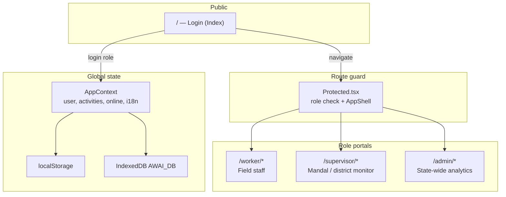
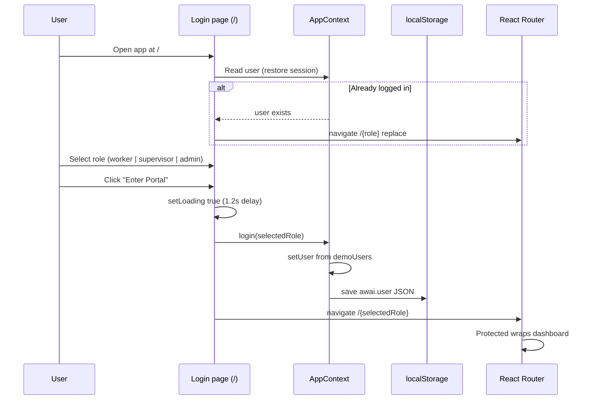

# AnganwadiAI — Application Overview

**AnganwadiAI** is a unified performance tracking system for Andhra Pradesh Anganwadi (child welfare) centers. It supports three roles—**Worker**, **Supervisor**, and **Admin**—with AI-assisted activity verification, geo-tagged attendance, compliance dashboards, and bilingual UI (English / Telugu).

This document describes the full application architecture, **login and session flow**, and **every page** with routes and purpose.

---

## Table of contents

1. [Technology stack](#technology-stack)
2. [High-level architecture](#high-level-architecture)
3. [Login and authentication flow](#login-and-authentication-flow)
4. [Route map (all URLs)](#route-map-all-urls)
5. [Shared UI and global state](#shared-ui-and-global-state)
6. [Worker role — pages](#worker-role--pages)
7. [Supervisor role — pages](#supervisor-role--pages)
8. [Admin role — pages](#admin-role--pages)
9. [Data and persistence](#data-and-persistence)
10. [Demo credentials and test users](#demo-credentials-and-test-users)
11. [How to run locally](#how-to-run-locally)

---

## Technology stack

| Layer | Technology |
|--------|------------|
| UI | React 18, TypeScript, Vite |
| Routing | React Router v6 |
| Styling | Tailwind CSS, shadcn/ui (Radix) |
| Charts | Recharts |
| State | React Context (`AppContext`) + TanStack Query (provider wired; most data is context/mock) |
| Persistence | `localStorage` (user, language, attendance), IndexedDB (activity ledger) |
| Mobile | Capacitor (Android project present) |
| i18n | Custom `src/lib/i18n.ts` (English / Telugu) |

---

## High-level architecture



**Request flow (authenticated page):**

1. User opens a URL (e.g. `/worker/activities`).
2. `Protected` reads `user` from `AppContext`.
3. If no user → redirect to `/` (login).
4. If user role ≠ required role → redirect to `/{user.role}` (home for their role).
5. If OK → render `AppShell` (header, sidebar, sync indicator) + page content.

---

## Login and authentication flow

### Important: demo / prototype auth

Authentication is **not** connected to a real backend. Login is **role-based demo access**:

- Phone and password fields are **read-only** placeholders (`9876543210` / `demo1234`).
- Only the **selected role** (Worker, Supervisor, or Admin) matters on submit.
- `login(role)` loads a fixed demo user from `demoUsers` in `src/data/mockData.ts`.

### Step-by-step login flow



| Step | What happens | Code location |
|------|----------------|---------------|
| 1 | App loads; `AppProvider` restores `user` from `localStorage` key `awai.user` if present | `AppContext.tsx` |
| 2 | Route `/` renders `Index` → `Login.tsx` | `pages/Index.tsx` |
| 3 | If `user` already set, `useEffect` redirects to `/{user.role}` | `Login.tsx` |
| 4 | User picks role card (Worker / Supervisor / Admin) | `Login.tsx` |
| 5 | Submit → 1.2s loading animation → `login(selected)` → `navigate(\`/${selected}\`)` | `Login.tsx`, `AppContext.login` |
| 6 | Worker gets `centerId`, `centerName`, `phone`; supervisor/admin get `name`, `id`, `phone` | `AppContext.login` |

### Logout flow

| Step | What happens |
|------|----------------|
| 1 | User clicks **Logout** in sidebar/header (`AppShell`) or **Profile** |
| 2 | `logout()` sets `user` to `null` |
| 3 | `localStorage` removes `awai.user` |
| 4 | Navigate to `/` |

### Session persistence

- Closing the browser and reopening: if `awai.user` exists in `localStorage`, user is still logged in and sent to their role dashboard from `/`.
- Wrong-role URL: visiting `/admin` as a worker redirects to `/worker`.

### Role → default landing page

| Role | After login URL | Demo identity |
|------|-----------------|---------------|
| Worker | `/worker` | Lakshmi Devi — Alipiri Center (`AWC-TPT-01`) |
| Supervisor | `/supervisor` | Ravi Kumar — Tirupati District |
| Admin | `/admin` | Dr. Meena Reddy — Andhra Pradesh |

---

## Route map (all URLs)

| Path | Role | In sidebar? | Page component |
|------|------|-------------|----------------|
| `/` | Public | — | Login |
| `/worker` | Worker | Yes | WorkerDashboard |
| `/worker/attendance` | Worker | Yes | Attendance |
| `/worker/attendance-history` | Worker | No* | AttendanceHistory |
| `/worker/activities` | Worker | Yes | Activities |
| `/worker/history` | Worker | Yes | History |
| `/worker/alerts` | Worker | Yes | Alerts |
| `/worker/profile` | Worker | Yes | Profile |
| `/worker/uploads` | Worker | No* | Uploads |
| `/worker/activity/:id` | Worker | No* | VerificationDetail |
| `/supervisor` | Supervisor | Yes | SupervisorDashboard |
| `/supervisor/centers` | Supervisor | Yes | Centers |
| `/supervisor/centers/:id` | Supervisor | No* | CenterDetail |
| `/supervisor/verifications` | Supervisor | Yes | Verifications |
| `/supervisor/audit/:id` | Supervisor | No* | SupervisorAuditDetail |
| `/supervisor/alerts` | Supervisor | Yes | Alerts |
| `/supervisor/map` | Supervisor | Yes | MapView |
| `/supervisor/reports` | Supervisor | Yes | SupervisorReports |
| `/admin` | Admin | Yes (Analytics) | AdminDashboard |
| `/admin/compliance` | Admin | Yes | AdminCompliance |
| `/admin/centers` | Admin | Yes | AdminCenters |
| `/admin/workers` | Admin | Yes | AdminWorkers |
| `/admin/alerts` | Admin | Yes | AdminAlerts |
| `/admin/reports` | Admin | Yes | AdminReports |
| `*` | Any | — | NotFound |

\*Reachable via links/buttons inside the app, not listed in the main sidebar.

---

## Shared UI and global state

### AppShell (`src/components/app/AppShell.tsx`)

- Fixed AP government header, role label, user name.
- Collapsible sidebar with role-specific navigation (`navByRole`).
- `SyncIndicator` — online/offline toggle and last sync time.
- `LangToggle` — English ↔ Telugu.
- Logout button.

### AppContext (`src/context/AppContext.tsx`)

| State / API | Purpose |
|-------------|---------|
| `user` | Current logged-in user |
| `login(role)` / `logout()` | Session management |
| `lang`, `setLang`, `t(key)` | Translations |
| `online`, `toggleOnline`, `lastSync` | Simulated sync mode |
| `activities`, `addActivity`, `updateActivity`, `removeActivity` | Activity ledger (shared across roles) |

### Protected (`src/components/app/Protected.tsx`)

- Enforces login and correct role.
- Wraps authenticated pages in `AppShell`.

---

## Worker role — pages

**Audience:** Anganwadi field worker at one center (demo: **Alipiri Center**, Tirupati).

**Data scope:** Activities and alerts filtered by `user.centerId` (`AWC-TPT-01`).

### `/worker` — Dashboard

- **Purpose:** Daily operational snapshot.
- **Shows:** Attendance status (present / not marked), today’s activity count, pending supervisor reviews, alert count.
- **Actions:** Quick links to Attendance, Activities, Alerts; refresh simulation; recent activity list with status badges.

### `/worker/attendance` — Attendance (check-in / check-out)

- **Purpose:** Geo-tagged daily attendance.
- **Features:** Check-in and check-out with simulated GPS (~1.8s); stores records in `localStorage` key `awai.attendance`.
- **Shows:** Today’s status, sync state when offline, link to attendance history.
- **Note:** GPS is mocked (random offset near demo coordinates), not production geolocation on every action.

### `/worker/attendance-history` — Attendance calendar

- **Purpose:** Month view of past attendance, holidays, leave, verification status.
- **Features:** Navigate months, filter, export UI; uses mock calendar data (not the same store as live check-in unless extended).

### `/worker/activities` — Log activity

- **Purpose:** Create new activity submissions (nutrition, education, health, etc.).
- **Features:** Activity type, description, children count, photo/video capture or upload, live camera recording, voice input hook, geo capture, submit to global `activities` via `addActivity`.
- **After submit:** Can navigate to verification detail for the new log.

### `/worker/history` — Activity ledger

- **Purpose:** Searchable list of all activities for the worker’s center.
- **Features:** Search by type/ID, filter by status (approved, submitted, issue), stats (total, approved, submitted), link to `/worker/activity/:id`.

### `/worker/alerts` — Worker alerts

- **Purpose:** Actionable warnings derived from the worker’s data.
- **Examples:** No activity logged today, missing photo evidence, low AI confidence, pending sync.
- **Features:** Links to Activities or specific activity detail to fix issues.

### `/worker/profile` — Profile & settings

- **Purpose:** View worker ID, center, phone; change language; logout.
- **Shows:** Demo personnel details from logged-in `user`.

### `/worker/uploads` — Evidence upload (secondary route)

- **Purpose:** Attach images to pending activities and run simulated AI verification.
- **Note:** Not in sidebar; use direct URL or in-app links if wired.

### `/worker/activity/:id` — Activity / verification detail

- **Purpose:** View one activity; upload or replace evidence; trigger AI analysis simulation.
- **Features:** Real `navigator.geolocation` on file upload in some flows, phased UI (“Capturing Geolocation…”, “Uploading Evidence…”), updates activity via `updateActivity` (status, `aiResult`, `imageUrl`).

---

## Supervisor role — pages

**Audience:** Mandal / district supervisor (demo: **Tirupati** district).

**Data scope:** Centers where `district === "Tirupati"`; activities and alerts for those center IDs.

### `/supervisor` — Supervisor dashboard

- **Purpose:** District oversight summary for Tirupati.
- **Shows:** Center counts, compliance averages, recent activities, alerts, compliance trend chart (Recharts).
- **Links:** Centers, verifications, alerts.

### `/supervisor/centers` — Center list

- **Purpose:** Browse all Anganwadi centers in the supervisor’s district.
- **Features:** Grid/list view, search, filter by status (healthy / warning / critical), open center detail.

### `/supervisor/centers/:id` — Center detail

- **Purpose:** Single-center drill-down.
- **Shows:** Compliance %, children enrolled, worker name, recent activities, alerts for that center.
- **Actions:** UI for “Send Reminder” and “Raise Issue” (toast/demo behavior).

### `/supervisor/verifications` — Governance audit queue

- **Purpose:** Review worker submissions awaiting approval.
- **Features:** Filter by status (submitted / approved / issue), center, date, search; cards link to `/supervisor/audit/:id`.

### `/supervisor/audit/:id` — Audit detail

- **Purpose:** Deep review of one activity; run simulated “neural extraction” audit.
- **Features:** Approve, flag issue, add supervisor remark; updates activity status in context.

### `/supervisor/alerts` — Alerts

- **Purpose:** District-relevant system alerts (missed logs, geo anomalies, low AI confidence).
- **Features:** Search/filter, mark actions (toast feedback).

### `/supervisor/map` — Geospatial monitor

- **Purpose:** Visual map of center locations (styled mock map, not live Google/OSM tiles).
- **Shows:** Center markers with compliance coloring; Live/Historical toggle UI.

### `/supervisor/reports` — Reports

- **Purpose:** Charts and export-oriented compliance/activity reporting for the mandal.
- **Features:** Bar/line/pie charts, date range UI, download simulation.

---

## Admin role — pages

**Audience:** State / district administration (demo: **all districts** in mock data).

**Data scope:** All centers in `mockCenters` (Tirupati, Krishna, Guntur, Visakhapatnam, Kurnool, etc.).

### `/admin` — Analytics dashboard

- **Purpose:** State-wide KPIs and trends.
- **Shows:** Total centers, workers, compliance, open alerts; attendance and category charts; district performance snippets; links to compliance and reports.

### `/admin/compliance` — Compliance matrix

- **Purpose:** Find underperforming centers across districts.
- **Features:** Filter compliant (≥90%) vs non-compliant (&lt;75%), search, export toast, per-center info actions.

### `/admin/centers` — Center registry

- **Purpose:** Manage Anganwadi center records statewide.
- **Features:** Grid/list, search, “Register new center” modal (simulated success toast).

### `/admin/workers` — Staff directory

- **Purpose:** Worker roster derived from center data.
- **Shows:** Name, center, mandal, mock attendance % and rating, active/on-leave status.

### `/admin/alerts` — Alerts & escalations

- **Purpose:** All `mockAlerts` with severity (high/medium/low) and escalation actions.
- **Features:** Bulk resolve UI, forward/acknowledge toasts.

### `/admin/reports` — Reports & records

- **Purpose:** Official report catalog (compliance monthly, attendance weekly, nutrition log, personnel audit).
- **Features:** Generate/download/share UI with toast feedback.

---

## Data and persistence

| Storage | Key / DB | Contents |
|---------|-----------|----------|
| `localStorage` | `awai.user` | Logged-in user JSON |
| `localStorage` | `awai.lang` | `en` or `te` |
| `localStorage` | `awai.attendance` | Worker check-in/out records |
| IndexedDB | `AWAI_DB` → `activities` → `current_ledger` | Full activity array (images/evidence can be large) |
| In-memory | `mockData.ts` | Centers, alerts, charts, seed activities |

**Activity model** (`ActivityLog`): id, center, worker, type, description, children count, timestamp, lat/lng, image, status, `aiConfidence`, optional `aiResult`, sync flag.

---

## Demo credentials and test users

| Field | Value | Notes |
|-------|--------|--------|
| Phone / ID | `9876543210` | Display only; not validated |
| Password | `demo1234` | Display only; not validated |
| Worker | Select **Worker** → Lakshmi Devi, `AWC-TPT-01` | |
| Supervisor | Select **Supervisor** → Ravi Kumar | Tirupati scope |
| Admin | Select **Admin** → Dr. Meena Reddy | State-wide scope |

To test another role: **Profile → Logout**, then sign in again with a different role selected.

---

## How to run locally

```bash
npm install
npm run dev
```

Open the URL shown in the terminal (typically `http://localhost:5173`). Start at `/`, choose a role, and click **Enter Portal**.

**Build for production:**

```bash
npm run build
npm run preview
```

**Android (Capacitor):** Android project under `android/`; configure via `capacitor.config.ts`.

---

## File structure (reference)

```
src/
  App.tsx                 # All routes
  main.tsx                # Entry
  context/AppContext.tsx  # Auth, activities, i18n, sync
  data/mockData.ts        # Centers, users, seed data
  lib/i18n.ts             # Translations
  components/app/
    Protected.tsx         # Auth guard
    AppShell.tsx          # Layout + nav
  pages/
    Index.tsx → Login.tsx
    worker/               # Field worker screens
    supervisor/           # Supervisor screens
    admin/                # Admin screens
    NotFound.tsx
```

---

*Document generated for the Child Welfare Hackathon — AnganwadiAI prototype. Auth and AI verification are simulated for demonstration; production would require API integration, real OTP/password auth, and server-side model inference.*
