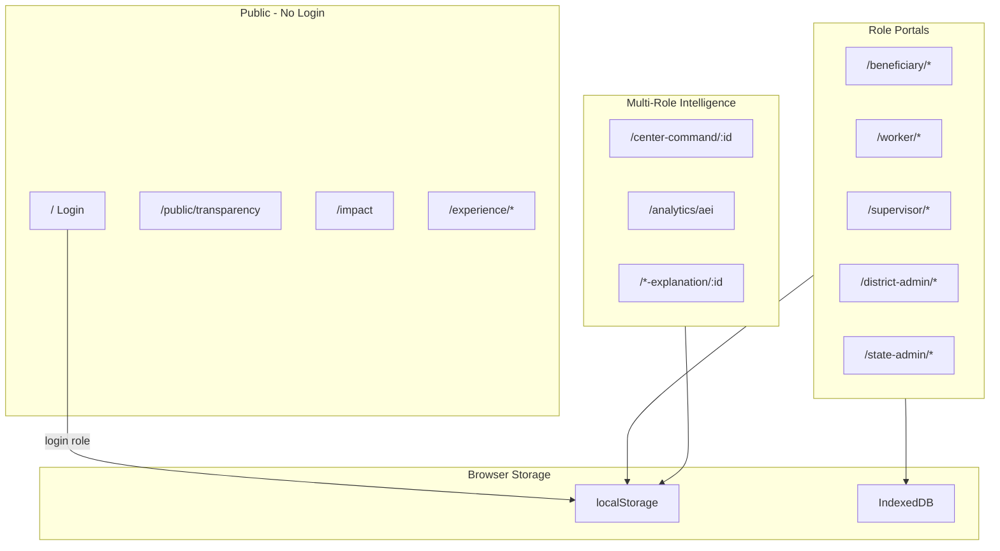
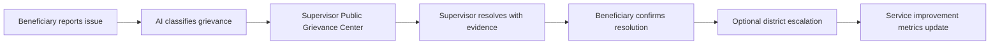

# AnganSakti 360 — Full Application Overview

**Application:** AnganSakti 360 (Child Welfare Hackathon)  
**Department:** Women Development and Child Welfare Department, Government of Andhra Pradesh  
**Pilot area:** Tirupati District  
**Last updated:** June 2026 (aligned with current codebase)

This document is the complete reference for the entire application: what it does, how login works, every page, user flows, and what is fully functional versus demonstration-only.

---

## Table of contents

1. [What this application is](#1-what-this-application-is)
2. [Technology stack](#2-technology-stack)
3. [All logins and demo identities](#3-all-logins-and-demo-identities)
4. [Authentication and session flow](#4-authentication-and-session-flow)
5. [High-level architecture](#5-high-level-architecture)
6. [Shared UI shell](#6-shared-ui-shell)
7. [Complete route map](#7-complete-route-map)
8. [Public pages (no login)](#8-public-pages-no-login)
9. [Beneficiary / Public User portal](#9-beneficiary--public-user-portal)
10. [Worker portal](#10-worker-portal)
11. [Supervisor portal](#11-supervisor-portal)
12. [District Admin portal](#12-district-admin-portal)
13. [State Admin portal](#13-state-admin-portal)
14. [Shared and multi-role pages](#14-shared-and-multi-role-pages)
15. [Experience and demo walkthrough pages](#15-experience-and-demo-walkthrough-pages)
16. [Data persistence](#16-data-persistence)
17. [What is working vs demonstration-only](#17-what-is-working-vs-demonstration-only)
18. [How to run locally](#18-how-to-run-locally)

---

## 1. What this application is

AnganSakti 360 is a **unified digital platform** for Andhra Pradesh Anganwadi (child welfare) centers. It connects five user roles in one system:

| Role | Who they are | Primary purpose |
|------|--------------|-----------------|
| **Public User (Beneficiary)** | Parents and guardians | View child services, share experiences, file grievances, track resolution |
| **Worker** | Anganwadi field staff | Daily operations: attendance, session recording, service delivery, training |
| **Supervisor** | Mandal / block monitor | Center oversight, classroom intelligence, coaching, grievance resolution |
| **District Admin** | District WDCW officer | Mission control, compliance, escalated grievances, district outcomes |
| **State Admin** | State-level leadership | Statewide mission control, impact metrics, classroom intelligence, policy narrative |

### Core capabilities

- **AI classroom performance tracking** — Preschool session video/audio → AI scorecard → coaching guidance → supervisor review
- **Beneficiary feedback and grievances** — Share experiences, report issues (omnichannel), track SLA and resolution
- **Service delivery evidence** — Workers log nutrition, health, preschool activities with GPS and photo proof
- **Intelligence layer** — Center health, Anganwadi Excellence Index (AEI), child wellness, interventions
- **Public transparency** — Anonymized statewide KPIs without login
- **Bilingual UI** — English, Telugu, and Hindi via header language toggle
- **Offline-first** — Local storage, IndexedDB, sync queue for field use

---

## 2. Technology stack

| Layer | Technology |
|-------|------------|
| UI framework | React 18, TypeScript, Vite |
| Routing | React Router v6 |
| Styling | Tailwind CSS, shadcn/ui (Radix primitives) |
| Charts | Recharts |
| State | React Context (`AppContext`) + TanStack Query (provider wired) |
| Persistence | `localStorage` + IndexedDB (`AWAI_DB`) |
| Mobile | Capacitor (Android project included) |
| i18n | Custom `src/lib/i18n.ts` (English / Telugu / Hindi) |
| AI services | Client-side mock/analysis pipelines in `src/services/ai/` |

**Important:** There is **no real backend server**. All data lives in the browser. Login is role-based demo access, not production authentication.

---

## 3. All logins and demo identities

### How to log in

1. Open the app at `/` (Login page).
2. Select an **Access Category** (role) from the dropdown.
3. Phone and password are **pre-filled** for the pilot demo.
4. Click **Continue** → you are redirected to that role's home page.

### Demo credentials (all roles)

| Field | Value |
|-------|-------|
| Phone | `9876543210` (editable; stored on profile) |
| Password | `demo1234` |

Credentials are accepted but **not validated against a server**. Only the **selected role** determines which portal you enter.

### All five roles — login selection and landing page

| Access category (login dropdown) | Role ID | After login lands at | Demo identity |
|----------------------------------|---------|----------------------|---------------|
| Public User | `beneficiary` | `/beneficiary` | **Sunita Rao** — Parent at Alipiri Center (`B-1001`) |
| Worker | `worker` | `/worker/dashboard` | **Lakshmi Devi** — Alipiri Center (`W-1042`, `AWC-TPT-01`) |
| Supervisor | `supervisor` | `/supervisor` | **Ravi Kumar** — Tirupati District (`S-204`) |
| District Admin | `district_admin` | `/district-admin/mission-control` | **Dr. Meena Reddy** — Tirupati District (`DA-01`) |
| State Admin | `state_admin` | `/state-admin/mission-control` | **Sri Venkatesh Rao** — Andhra Pradesh (`SA-01`) |

### Beneficiary-specific demo data

- **Children enrolled:** Aarav Rao (age 4), Priya Rao (age 3)
- **Center:** Alipiri Center (`AWC-TPT-01`), Tirupati District
- **Phone on profile:** `9876501234`

### Legacy note

- Old URLs `/admin` and `/admin/*` automatically redirect to `/district-admin`.
- Old storage key `awai.user` is migrated to `angansakti.user`.

---

## 4. Authentication and session flow

### Login flow (step by step)

```
1. User opens /
2. AppProvider restores user from localStorage (angansakti.user) if present
3. If already logged in → auto-redirect to role home (roleHomePath)
4. User selects role + clicks Continue
5. authenticate() waits ~800ms (simulated delay)
6. buildUserFromRole() loads demo profile from mockData
7. User saved to localStorage → navigate to role home
8. Protected route wraps page in AppShell (header + sidebar)
```

### Logout flow

1. Click **Logout** in sidebar, header, or Profile page.
2. `logout()` clears user from memory and localStorage.
3. Redirect to `/` (login).

### Route protection rules

| Guard | Behavior |
|-------|----------|
| `Protected` | Must be logged in with **exact role match**. Wrong role → sent to own home. No user → `/`. |
| `MultiRoleProtected` | Must be logged in; role must be in allowed list. |
| `AuthRequired` | Any logged-in user can access. |
| No guard | Public pages (transparency, impact, experience demos). |

### Session persistence

- Closing and reopening the browser: if `angansakti.user` exists, you remain logged in.
- Visiting another role's URL while logged in: redirected to your own role home.

---

## 5. High-level architecture



### End-to-end grievance flow (working in pilot)



---

## 6. Shared UI shell

Every authenticated page uses **AppShell** (`src/components/app/AppShell.tsx`):

| Element | Purpose |
|---------|---------|
| Government header | AP WDCW branding, pilot badge, user name, role label |
| Sidebar navigation | Role-specific sections from `src/lib/govNav.ts` |
| Bottom nav (mobile) | First items from Operations section (worker/beneficiary) |
| Language toggle | English ↔ Telugu ↔ Hindi |
| Accessibility controls | Text size, contrast |
| Sync indicator | Online/offline toggle, last sync time |
| Logout | Ends session, returns to login |

Worker pages additionally use **WorkerFieldLayout** — status strip with center name, date, network, children count, and a floating Help button.

---

## 7. Complete route map

### Public

| Path | Page | Login required |
|------|------|----------------|
| `/` | Login | No |
| `/public/transparency` | Transparency Portal | No |
| `/impact` | Public Impact Dashboard | No |
| `/experience/demo` | Demo Experience | No |
| `/experience/hackathon` | Hackathon Walkthrough | No |
| `/experience/scenarios` | Scenario Generator | No |

### Beneficiary

| Path | Page | In sidebar |
|------|------|------------|
| `/beneficiary` | Control Room (Dashboard) | Yes |
| `/beneficiary/my-child` | My Services | Yes |
| `/beneficiary/daily-journey` | Today's Services | Yes |
| `/beneficiary/activities` | Center Services | Yes |
| `/beneficiary/nutrition` | Nutrition | Yes |
| `/beneficiary/center-timeline` | Center Timeline | Yes |
| `/beneficiary/feedback` | Share Experience | Yes |
| `/beneficiary/omnichannel-feedback` | Report Issue | Yes |
| `/public/my-experiences` | My Experiences | Yes |
| `/public/my-requests` | My Requests | Yes |
| `/beneficiary/complaints` | Grievance Center | Yes |
| `/beneficiary/status` | Track Resolution | Yes |
| `/beneficiary/surveys` | Surveys | Yes |
| `/beneficiary/notifications` | Communication Center | Yes |
| `/beneficiary/center-health` | Center Health | Yes |
| `/beneficiary/profile` | Profile | Yes |
| `/beneficiary/help` | Help & Support | Yes |
| `/beneficiary/request/:id` | Request Detail | No (linked) |
| `/public/experience/:id` | Experience Detail | No (linked) |

### Worker

| Path | Page | In sidebar |
|------|------|------------|
| `/worker` | → redirects to `/worker/dashboard` | — |
| `/worker/dashboard` | Daily Operations Console | Yes |
| `/worker/my-day` | My Day | Yes |
| `/worker/attendance` | Attendance | Yes |
| `/worker/session-monitor` | Session Recording | Yes |
| `/worker/activities` | Service Delivery Tracker | Yes |
| `/worker/child-progress` | Child Outcomes | Yes |
| `/worker/uploads` | Service Submission Queue | Yes |
| `/worker/training` | Training & Coaching | Yes |
| `/worker/training/:moduleId` | Training Course | No (linked) |
| `/worker/complaints` | Assigned Issues (info) | Yes |
| `/worker/growth` | My Growth Journey | Yes |
| `/worker/alerts` | Communication Center | Yes |
| `/worker/profile` | Identity & Settings | Yes |
| `/worker/help-support` | Help & Support | Yes |
| `/settings/sync` | Sync Settings | Yes |
| `/worker/attendance-history` | Attendance History | No |
| `/worker/session-history` | Session History | No |
| `/worker/performance` | Performance / Coaching | No |
| `/worker/session-feedback` | Session Feedback | No |
| `/worker/session-feedback/:id` | Session Feedback Detail | No |
| `/worker/activity/:id` | Verification Detail | No |
| `/worker/history` | → redirects to `/worker/uploads` | — |

### Supervisor

| Path | Page | In sidebar |
|------|------|------------|
| `/supervisor` | Monitoring Command | Yes |
| `/supervisor/centers` | Centers | Yes |
| `/supervisor/centers/:id` | Center Detail | No |
| `/supervisor/map` | Location Map | Yes |
| `/supervisor/interventions` | Intervention Status | Yes |
| `/supervisor/classroom-intelligence` | Classroom Intelligence | Yes |
| `/supervisor/session-review` | Session Observation | Yes |
| `/supervisor/coaching` | Coaching | Yes |
| `/supervisor/development` | Workforce Development | Yes |
| `/supervisor/child-outcomes` | Child Outcomes | Yes |
| `/supervisor/public-grievance-center` | Public Grievance Center | Yes |
| `/supervisor/complaints` | Grievance Monitoring | Yes |
| `/supervisor/grievance/:id` | Grievance Detail | No |
| `/supervisor/verifications` | Verifications | No |
| `/supervisor/audit/:id` | Audit Detail | No |
| `/supervisor/alerts` | Communication Center | Yes |
| `/supervisor/reports` | Reports | Yes |
| `/voice-of-citizen` | Voice of Beneficiary | Yes |
| `/center-command/AWC-TPT-01` | Center Journey | Yes |
| `/analytics/aei` | Service Insight (AEI) | Yes |

### District Admin

| Path | Page | In sidebar |
|------|------|------------|
| `/district-admin` | → Mission Control (via dashboard redirect) | — |
| `/district-admin/mission-control` | Mission Control | Yes |
| `/district-admin/centers` | Centers Covered | Yes |
| `/district-admin/workers` | Workers | Yes |
| `/district-admin/classroom-intelligence` | Classroom Intelligence | Yes |
| `/district-admin/compliance` | Compliance Module | Yes |
| `/district-admin/escalated-grievances` | Escalated Grievances | Yes |
| `/district-admin/complaints` | Grievance Monitoring | Yes |
| `/district-admin/interventions` | Intervention Status | Yes |
| `/district-admin/outcomes` | Child Outcomes | Yes |
| `/district-admin/integrations` | Integrations | Yes |
| `/district-admin/reports` | Reports | Yes |
| `/district-admin/session-review/:sessionId` | Session Review | No |

### State Admin

| Path | Page | In sidebar |
|------|------|------------|
| `/state-admin` | State Command (dashboard) | — |
| `/state-admin/mission-control` | Mission Control | Yes |
| `/state-admin/classroom-intelligence` | Classroom Intelligence | Yes |
| `/state-admin/complaints` | Grievance Monitoring | Yes |
| `/state-admin/compliance` | Compliance Module | Yes |
| `/state-admin/outcomes` | Child Outcomes | Yes |
| `/state-admin/impact` | Public Impact | Yes |
| `/state-admin/story` | Government Story | Yes |
| `/state-admin/integrations` | Integrations | Yes |
| `/state-admin/reports` | Reports | Yes |
| `/state-admin/notifications` | Communication Center | Yes |
| `/state-admin/session-insights/:sessionId` | Session Insights | No |

### Multi-role and explainability

| Path | Allowed roles |
|------|---------------|
| `/center-command/:id`, `/center-journey/:id` | All five roles |
| `/center-score/:id` | supervisor, district_admin, state_admin, worker |
| `/center-health/:id` | supervisor, district_admin, state_admin |
| `/center-digital-view/:id` | supervisor, district_admin, state_admin |
| `/center-timeline/:id` | supervisor, district_admin, state_admin |
| `/voice-of-citizen` | supervisor, district_admin, state_admin |
| `/analytics/aei` | supervisor, district_admin, state_admin |
| `/session-explanation/:id` | Any logged-in user |
| `/grievance-explanation/:id` | Any logged-in user |
| `/risk-explanation/:id` | Any logged-in user |
| `/sqi-explanation/:id` | Any logged-in user |
| `/aei-explanation/:id` | Any logged-in user |
| `/settings/sync` | Any logged-in user |

---

## 8. Public pages (no login)

### Transparency Portal — `/public/transparency`

**Purpose:** Public accountability without signing in.

**What's on the page:**
- Statewide anonymized KPIs (grievance resolution, service quality, center performance)
- FAQ about the pilot program
- Links to impact dashboard and walkthrough

**Working:** Aggregates from in-app state when demo data has been loaded; static pilot labels for empty state.

**Flow:** Login page footer → Transparency → browse metrics → optional link to Impact or Hackathon walkthrough.

---

### Public Impact Dashboard — `/impact`

**Purpose:** Answer six public questions about program outcomes (before/after, district AEI, child wellness).

**What's on the page:**
- Impact question cards with narrative answers
- Before/after comparison charts
- District-level AEI breakdown

**Working:** Reads `impactMetrics` and related intelligence from AppContext.

**Flow:** Accessible from login, district admin sidebar, or transparency portal.

---

## 9. Beneficiary / Public User portal

**Home:** `/beneficiary`  
**Recommended daily flow:** Control Room → Today's Services → Center Services → Share Experience or Report Issue → Track Resolution

---

### Control Room — `/beneficiary`

**What's on the page:**
- Personalized greeting and "Who are you today" context selector
- Center trust score card
- Quick actions (feedback, grievance, my child, nutrition)
- Experience buckets (positive, needs attention)
- Announcements and child journey preview

**Working:** Live portal hooks, trust score, experience data. Announcements use mock content.

**Actions:** Choose context → navigate to any service or feedback page.

---

### My Services — `/beneficiary/my-child`

**What's on the page:**
- Enrolled children and benefits eligibility
- Trust score and service timeline
- Tabs: attendance, meals, learning, evidence gallery

**Working:** Child progress records, grievance/request links. PDF download shows toast only.

---

### Today's Services — `/beneficiary/daily-journey`

**What's on the page:**
- Today's timeline for the child
- Attendance, meals, session cards
- Learning summary for the day

**Working:** Built from `buildTodayChildJourney` service data.

---

### Center Services — `/beneficiary/activities`

**What's on the page:**
- Filterable feed of center activities (nutrition, preschool, health, etc.)
- Child participation hints

**Working:** Center activities from portal hooks; filter by category.

---

### Nutrition — `/beneficiary/nutrition`

**What's on the page:**
- Today's ICDS menu
- 14-day meal history
- Receipt/attendance status per meal

**Working:** Nutrition records from storage. Today's menu has static fallback.

---

### Center Timeline — `/beneficiary/center-timeline`

**What's on the page:**
- Citizen-safe chronological view of center service events

**Working:** Timeline from `getTimeline` / public services.

---

### Share Experience — `/beneficiary/feedback`

**What's on the page:**
- Rating, category, text, optional photo evidence
- Recent submissions list

**Working:** `submitShareExperience` → AI analysis → saved to citizen experiences store.

**Flow:** Submit → appears in My Experiences → can view Experience Detail.

---

### Report Issue — `/beneficiary/omnichannel-feedback`

**What's on the page:**
- Grievance intake form (category, priority, evidence, consent)
- AI-assisted classification preview
- Workflow explainer (what happens after submit)

**Working:** `submitReportIssue` creates supervisor-routed grievance with AI summary.

**Flow:** File issue → track in My Requests → supervisor resolves → confirm on Status page.

---

### My Experiences — `/public/my-experiences`

**What's on the page:**
- Buckets: positive, neutral, needs follow-up
- Filterable experience list

**Working:** Full experience service; links to detail pages.

---

### My Requests — `/public/my-requests`

**What's on the page:**
- Evidence buckets by status
- Unified grievance/request list with SLA indicators

**Working:** Reads complaints assigned to beneficiary; links to request detail.

---

### Grievance Center — `/beneficiary/complaints`

**What's on the page:**
- All grievances with step-by-step timeline
- Status badges and SLA countdown

**Working:** Filters `myComplaints` from AppContext.

---

### Track Resolution — `/beneficiary/status`

**What's on the page:**
- Active resolution cards with evidence
- Confirm resolution or reopen buttons
- Satisfaction survey trigger on confirm

**Working:** `advanceComplaint`, `updateComplaint` update lifecycle.

---

### Request Detail — `/beneficiary/request/:id`

**What's on the page:**
- Full grievance transparency: SLA, AI analysis panel, evidence gallery
- Action log, confirm/reopen/escalate (role-dependent)

**Working:** Complete grievance lifecycle UI. Export bundle is toast-only.

---

### Experience Detail — `/public/experience/:id`

**What's on the page:**
- Experience metadata, rating, AI summary
- Service improvement actions taken

**Working:** Read-only experience record.

---

### Surveys — `/beneficiary/surveys`

**What's on the page:**
- Pending surveys (post-visit, post-closure)
- Multi-dimension star ratings

**Working:** `submitSurvey` persists responses.

---

### Communication Center — `/beneficiary/notifications`

**What's on the page:**
- Tabbed inbox (all, grievances, services, announcements)
- Alert preference toggles

**Working:** Notifications list, mark as read. WhatsApp/SMS prefs are UI-only.

---

### Center Health — `/beneficiary/center-health`

**What's on the page:**
- Government summary chips (service status, trust)
- Link to center journey (no internal worker scores shown)

**Working:** Aggregated center metrics for parents.

---

### Profile — `/beneficiary/profile`

**What's on the page:**
- Name, phone, center, children
- Language preference, feedback context settings
- Logout

**Working:** Language switch, logout.

---

### Help & Support — `/beneficiary/help`

**What's on the page:**
- FAQ accordion
- Contact numbers, voice help button

**Working:** FAQ UI, browser speech. Helpline numbers are demo.

---

## 10. Worker portal

**Home:** `/worker/dashboard`  
**Recommended daily flow:** Login → Attendance Check-In → Session Recording → Service Delivery → Submission Queue → Training → Check-Out

---

### Daily Operations Console — `/worker/dashboard`

**What's on the page:**
- Day progress percentage and summary cards
- Quick action buttons (attendance, session, activities, issues)
- Today's timeline from WorkerFlowContext

**Working:** Real flow metrics, navigation to all daily tasks.

---

### My Day — `/worker/my-day`

**What's on the page:**
- Full day planner with scheduled steps
- Reminders and completion stats

**Working:** WorkerFlowContext + notifications.

---

### Attendance — `/worker/attendance`

**What's on the page:**
- GPS check-in / check-out buttons
- Map preview, distance from center
- Link to session attendance verification

**Working:** Check-in via `useAttendance`, saved to localStorage. Map uses mock/fake GPS in demo.

---

### Attendance History — `/worker/attendance-history`

**What's on the page:**
- Calendar view, monthly stats, export button

**Mostly demo:** Hardcoded mock attendance data; calendar is visual only.

---

### Session Recording — `/worker/session-monitor`

**What's on the page:**
- Video/audio record or upload
- GPS verification, extraction pipeline progress bar
- AI analysis report (band, confidence, coaching summary)

**Working:** Full recording pipeline, IndexedDB video storage, AI analysis. Demo mode available via `USE_DEMO_CLASSROOM_ANALYSIS` flag.

**Flow:** Record → upload → AI processes → view in Session History / Performance.

---

### Session History — `/worker/session-history`

**What's on the page:**
- List of past analyzed sessions
- Performance band, confidence, reopen in workspace

**Working:** Real session records from storage.

---

### Service Delivery Tracker — `/worker/activities`

**What's on the page:**
- Service log form (nutrition, preschool, health, etc.)
- Camera capture, GPS tagging, voice note stub

**Working:** `submitActivity` with real camera/GPS when permitted. Voice transcription times out to stub.

---

### Service Submission Queue — `/worker/uploads`

**What's on the page:**
- Unified upload queue with status (pending, syncing, failed)
- Batch sync, add proof to existing items

**Working:** `useUploads` queue, retry sync.

---

### Verification Detail — `/worker/activity/:id`

**What's on the page:**
- Single activity evidence upload
- GPS verification for proof photo

**Working:** `updateActivity` with geolocation.

---

### Child Outcomes — `/worker/child-progress`

**What's on the page:**
- Per-child outcome entry form
- Records list (attendance, nutrition, milestones)

**Working:** `addChildProgress` persists records.

---

### Training & Coaching — `/worker/training`

**What's on the page:**
- Training module cards with progress
- AI and supervisor-assigned recommendations
- Trend indicators

**Working:** TrainingProgressContext, recommendations from sessions.

---

### Training Course — `/worker/training/:moduleId`

**What's on the page:**
- Section navigation, progress bar
- Interactive course sections (text, quiz, practice)

**Working:** `useTrainingCourse` with persistence.

---

### Performance / Session Feedback — `/worker/performance`, `/worker/session-feedback`

**What's on the page:**
- Coaching tips derived from real session AI
- Support summary, metrics, worker comment field

**Working:** Derived from session scorecards; save transcript/comment.

---

### Assigned Issues — `/worker/complaints`

**What's on the page:**
- Informational page explaining workers do not handle public grievances directly
- Redirect guidance to supervisor queue

**Info only:** No worker grievance actions.

---

### My Growth Journey — `/worker/growth`

**What's on the page:**
- Growth band, timeline, charts
- Coaching recommendations over time

**Working:** `useGrowth` hook, event-driven from sessions and coaching.

---

### Communication Center — `/worker/alerts`

**What's on the page:**
- Tabbed messages (supervisor, training, department)

**Working:** Notifications from AppContext. Some deep links are demo.

---

### Identity & Settings — `/worker/profile`

**What's on the page:**
- Worker ID, center, phone
- Language toggle, sync queue count, logout

**Working:** Language, logout, upload queue display.

---

### Help & Support — `/worker/help-support`

**What's on the page:**
- FAQ, voice help (text-to-speech), offline/sync tips

**Working:** Browser TTS. Helpline is demo.

---

### Sync Settings — `/settings/sync`

**What's on the page:**
- Sync queue list, storage estimate
- Retry failed items

**Working:** `syncQueue`, `retrySyncItem`.

---

## 11. Supervisor portal

**Home:** `/supervisor`

---

### Monitoring Command — `/supervisor`

**What's on the page:**
- AEI dashboard strip, classroom intelligence strip
- KPI stats, charts, recent activity feed

**Mixed:** Real complaints/activities + mock centers/alerts/chart data.

---

### Centers — `/supervisor/centers`

**What's on the page:**
- Searchable grid/list of centers with status badges

**Demo:** `mockCenters` data. "Register New Center" button is non-functional.

---

### Center Detail — `/supervisor/centers/:id`

**What's on the page:**
- Center profile, stats, recent activities, alerts
- Links to digital twin, timeline, center command

**Mixed:** Mock center metadata + real filtered activities.

---

### Location Map — `/supervisor/map`

**What's on the page:**
- SVG mock map with center pins and status colors

**Demo:** No real map API; visual monitor only.

---

### Intervention Status — `/supervisor/interventions`

**What's on the page:**
- Intervention board (queued, active, completed)
- Launch and update intervention status

**Working:** `InterventionBoard` + `refreshInterventions`.

---

### Classroom Intelligence — `/supervisor/classroom-intelligence`

**What's on the page:**
- District filters, band distribution chart
- Session comparison, detail drawer

**Working:** Operational classroom analytics from real sessions.

---

### Session Observation — `/supervisor/session-review`

**What's on the page:**
- Grid of sessions with AI scorecards
- Links to full session analysis

**Working:** Real sessions with scorecards.

---

### Session Analysis — `/supervisor/session-analysis/:sessionId`

**What's on the page:**
- Full classroom intelligence report
- Engagement heatmap, supervisor review form, video playback

**Working:** Save review, assign coaching, playback viewer.

---

### Coaching — `/supervisor/coaching`

**What's on the page:**
- Workers flagged for coaching
- Assign training modules

**Working:** `assignCoaching` creates assignments.

---

### Workforce Development — `/supervisor/development`

**What's on the page:**
- OPI trend chart, center heatmap, SQI rankings

**Mixed:** Real service quality scores + demo trend arrays.

---

### Child Outcomes — `/supervisor/child-outcomes`

**What's on the page:**
- Child Wellness Index cards
- Risk signal links to explanation pages

**Mixed:** Mock center list + real CWI/risk data.

---

### Public Grievance Center — `/supervisor/public-grievance-center`

**What's on the page:**
- Primary queue for citizen-filed grievances
- Buckets by status, SLA, priority
- Quick investigate actions

**Working:** Supervisor-owned grievances, full action workflow.

---

### Grievance Monitoring — `/supervisor/complaints`

**What's on the page:**
- Shared `RoleComplaints` component in supervisor mode
- Analytics strip, decision log

**Working:** Complaint list, approve, escalate, resolve.

---

### Grievance Detail — `/supervisor/grievance/:id`

**What's on the page:**
- Evidence gallery, AI analysis, resolution form
- Action log with timestamps

**Working:** `advanceComplaint`, grievance actions log.

---

### Verifications — `/supervisor/verifications`

**What's on the page:**
- Audit queue for submitted/approved/issue activities

**Working:** Real activities filtered by status.

---

### Audit Detail — `/supervisor/audit/:id`

**What's on the page:**
- AI audit simulation (geo, count, timing checks)
- Approve / reject / flag buttons

**Working:** Updates activity status in store.

---

### Reports — `/supervisor/reports`

**What's on the page:**
- KPI cards, charts, export buttons

**Demo:** Static chart datasets; PDF export shows toast.

---

### Communication Center — `/supervisor/alerts`

**What's on the page:**
- System alerts list with acknowledge actions

**Demo:** `mockAlerts`; acknowledge shows toast only.

---

## 12. District Admin portal

**Home:** `/district-admin/mission-control`

---

### Mission Control — `/district-admin/mission-control`

**What's on the page:**
- KPI grid (grievances, compliance, classroom, interventions)
- Live grievance feed, intervention strip, classroom strip
- Action bar (escalate, launch intervention, open center command)

**Working:** Real metrics and complaints. Many action buttons show toast only; escalation and intervention launch work.

---

### Centers Covered — `/district-admin/centers`

**What's on the page:**
- Center registry grid, search, add-center modal

**Demo:** Mock center data; register form toast only.

---

### Workers — `/district-admin/workers`

**What's on the page:**
- Staff directory cards with search

**Demo:** Workers derived from mockCenters with random stats.

---

### Classroom Intelligence — `/district-admin/classroom-intelligence`

**What's on the page:**
- District command metrics, center rankings, heatmap

**Mixed:** Real analytics + mock center heatmap data.

---

### District Session Review — `/district-admin/session-review/:sessionId`

**What's on the page:**
- Executive session summary
- Grievance correlation panel, district action recommendation

**Working:** Classroom analytics + correlation logic.

---

### Compliance Module — `/district-admin/compliance`

**What's on the page:**
- Compliance table by center, summary stats, export

**Demo:** `mockCenters`; export toast only.

---

### Escalated Grievances — `/district-admin/escalated-grievances`

**What's on the page:**
- District action center for supervisor-escalated cases
- Approve, investigate, close actions

**Working:** Full escalated grievance workflow.

---

### Grievance Monitoring — `/district-admin/complaints`

**What's on the page:**
- `RoleComplaints` in district mode
- District-filtered SLA analytics

**Working:** District-scoped complaint monitoring.

---

### Intervention Status — `/district-admin/interventions`

**What's on the page:**
- District-scoped intervention board

**Working:** Approve and activate interventions.

---

### Child Outcomes — `/district-admin/outcomes`

**What's on the page:**
- Bar charts, outcome stats, links to digital twin

**Mixed:** Mock centers + real child progress data.

---

### Integrations — `/district-admin/integrations`

**What's on the page:**
- API connection cards (POSHAN, ICDS, etc.)
- Trigger sync buttons

**Demo:** Mock sync to localStorage.

---

### Reports — `/district-admin/reports`

**What's on the page:**
- Official report header, export cards

**Demo:** Download toasts only.

---

## 13. State Admin portal

**Home:** `/state-admin/mission-control`

---

### Mission Control — `/state-admin/mission-control`

**What's on the page:**
- Same Mission Control component with **state scope**
- Executive classroom strip, statewide KPIs

**Working:** Same as district; statewide aggregation.

---

### Classroom Intelligence — `/state-admin/classroom-intelligence`

**What's on the page:**
- Executive classroom dashboard
- District comparison table

**Working:** `getExecutiveClassroom` snapshot.

---

### Session Insights — `/state-admin/session-insights/:sessionId`

**What's on the page:**
- Summary-only session view (restricted recording access)

**Working:** Analytics; video gated behind explicit access button.

---

### Grievance Monitoring — `/state-admin/complaints`

**What's on the page:**
- Statewide `RoleComplaints` with SLA/intervention analytics

**Working:** Statewide complaint analytics.

---

### Compliance Module — `/state-admin/compliance`

**Shared with district admin.** Demo mock centers.

---

### Child Outcomes — `/state-admin/outcomes`

**What's on the page:**
- CWI charts, risk signal table

**Working:** Wellness indexes from intelligence layer.

---

### Public Impact — `/state-admin/impact`

**What's on the page:**
- Executive outcome KPIs, before/after narrative

**Working:** `impactMetrics`, `governmentStory`.

---

### Government Story — `/state-admin/story`

**What's on the page:**
- AI-generated narrative insight cards
- Recommended policy actions

**Working:** `governmentStory` data.

---

### Integrations — `/state-admin/integrations`

**Demo:** Mock API sync UI.

---

### Reports — `/state-admin/reports`

**Demo:** Export toasts.

---

### Communication Center — `/state-admin/notifications`

**What's on the page:**
- Broadcast message list

**Working:** Reads platform notifications.

---

## 14. Shared and multi-role pages

### Center Command / Center Journey — `/center-command/:id`

**Roles:** All five  
**What's on the page:** Tabbed command center — overview, operations, citizen voice, health, coaching, interventions, timeline, impact.  
**Working:** Real app data + mock center metadata. Export is toast-only.

---

### Center Score — `/center-score/:id`

**Roles:** supervisor, district_admin, state_admin, worker  
**What's on the page:** AEI breakdown with weighted components and trend.  
**Working:** `getAEI`.

---

### Center Health — `/center-health/:id`

**Roles:** supervisor, district_admin, state_admin  
**What's on the page:** Risk score, contributing factors, recommendations.  
**Working:** `getCenterHealth`.

---

### Center Digital Twin — `/center-digital-view/:id`

**Roles:** supervisor, district_admin, state_admin  
**What's on the page:** Operational twin — SQI, sessions, feedback snapshot.  
**Mixed:** Real data + mock center info.

---

### Center Timeline — `/center-timeline/:id`

**Roles:** supervisor, district_admin, state_admin  
**What's on the page:** Playback engine with day/week/month filters.  
**Working:** `getTimeline`.

---

### Voice of Beneficiary — `/voice-of-citizen`

**Roles:** supervisor, district_admin, state_admin  
**What's on the page:** Omnichannel sentiment dashboard, theme breakdown.  
**Working:** `voiceOfCitizen` aggregates.

---

### AEI Analytics — `/analytics/aei`

**Roles:** supervisor, district_admin, state_admin  
**What's on the page:** Statewide AEI table and charts, district filter.  
**Mixed:** Real indexes + mock district list.

---

### Explainability pages

| Route | Purpose |
|-------|---------|
| `/session-explanation/:id` | Why AI scored a session a certain way |
| `/grievance-explanation/:id` | How grievance was classified and routed |
| `/risk-explanation/:id` | Child risk signal breakdown |
| `/sqi-explanation/:id` | Service Quality Index transparency |
| `/aei-explanation/:id` | Full Anganwadi Excellence Index report |

**All working** for any logged-in user; read from intelligence/explainability services.

---

## 15. Experience and demo walkthrough pages

### Demo Experience — `/experience/demo`

**Public.** Guided journey cards with progress bar.  
**Working:** `runJourney` seeds IndexedDB and can auto-login per role.

---

### Hackathon Walkthrough — `/experience/hackathon`

**Public.** Full end-to-end loop runner with per-role shortcuts.  
**Working:** `runHackathonFlow` populates all stores → ends at Center Command.

**Linked from:** Login page footer ("Walkthrough").

---

### Scenario Generator — `/experience/scenarios`

**Public.** List of demo scenarios; generate button loads data.  
**Working:** `runScenarioById` populates stores → navigate to Mission Control.

---

## 16. Data persistence

| Storage | Key / DB | What is stored |
|---------|----------|----------------|
| localStorage | `angansakti.user` | Logged-in user profile |
| localStorage | `awai.attendance` | Worker attendance records |
| localStorage | Various `storageKeys` | Activities, complaints, feedback, notifications, sessions, etc. |
| IndexedDB | `AWAI_DB` | Activity ledger, video blobs, upload queue, omnichannel drafts |

Data survives browser refresh. Clearing site data resets the pilot environment.

---

## 17. What is working vs demonstration-only

### Fully working (pilot-functional)

| Area | Details |
|------|---------|
| Login & session | All 5 roles, persistence, role guards |
| Beneficiary feedback | Share experience, report issue, track grievances |
| Grievance lifecycle | Beneficiary → supervisor → district escalation → confirmation |
| Worker day flow | Attendance, activities, uploads, training progress |
| Session recording | Video capture, AI analysis, coaching summary |
| Classroom intelligence | Supervisor/district/state analytics and review |
| Interventions | Create, launch, update across supervisor and district |
| Mission Control | Real KPIs from in-app state |
| Explainability | All five explanation page types |
| Offline sync | Queue, retry, storage management |
| i18n | English, Telugu, Hindi toggle |
| Experience demos | Hackathon flow, scenarios, guided journeys |

### Demonstration / mock only

| Area | Details |
|------|---------|
| Authentication | No real server validation; any password works |
| Center registry | `mockCenters` for lists, maps, compliance tables |
| Supervisor map | SVG mock, not real geospatial API |
| Attendance history | Hardcoded calendar data |
| Reports & exports | PDF/CSV buttons show toast only |
| Integrations | Mock API sync to localStorage |
| Helplines | Display numbers; no real telephony |
| Admin registration | Add center/worker forms toast only |
| Supervisor alerts | `mockAlerts`; acknowledge is cosmetic |
| Some action buttons | Mission control and district actions that only toast |

---

## 18. How to run locally

```bash
# Install dependencies
npm install

# Start development server
npm run dev

# Build for production
npm run build

# Run unit tests
npm test

# Run verification suite
npm run verify:app
```

Open the URL shown in the terminal (typically `http://localhost:5173`). Use the login page to select any role and explore that portal.

---

## Quick reference — role home paths

| Role | Login label | Home URL |
|------|-------------|----------|
| Public User | Public User | `/beneficiary` |
| Worker | Worker | `/worker/dashboard` |
| Supervisor | Supervisor | `/supervisor` |
| District Admin | District Admin | `/district-admin/mission-control` |
| State Admin | State Admin | `/state-admin/mission-control` |

---

*This document supersedes older overviews that listed only three roles (Worker, Supervisor, Admin). The current application has five roles plus public pages and a multi-role intelligence layer.*
