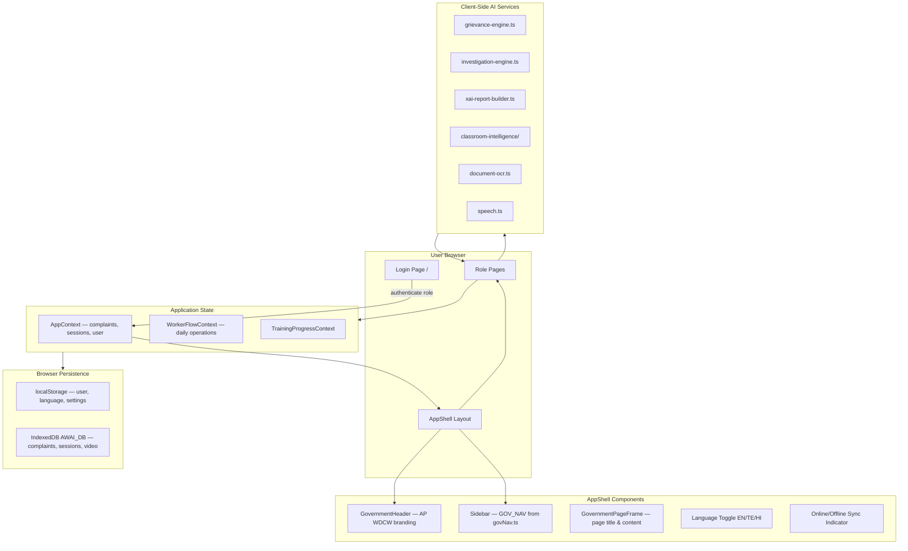
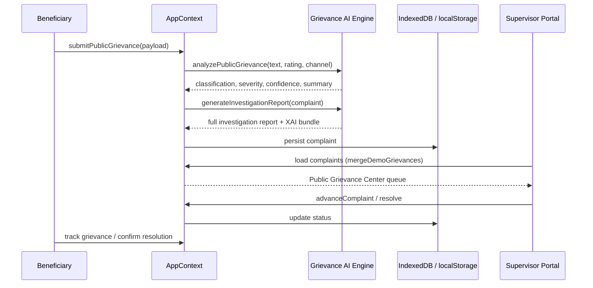
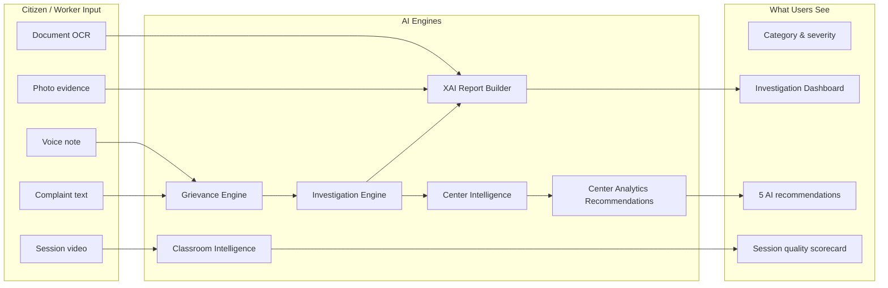
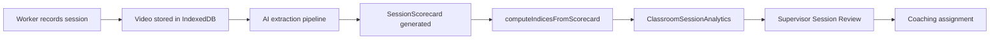

# AnganSakti 360 — Hackathon Presentation Guide

**Document purpose:** This guide helps hackathon judges, evaluators, and team members understand, navigate, and demonstrate **AnganSakti 360** — the Women Development and Child Welfare Department (WDCW) Andhra Pradesh child welfare platform built for the hackathon pilot in Tirupati District.

**Audience:** Non-technical judges, government stakeholders, and demo presenters.

**Version:** June 2026 · Aligned with current codebase (`src/App.tsx`, `src/lib/govNav.ts`, AI services in `src/services/ai/`)

---

## Table of Contents

1. [Executive Summary](#1-executive-summary)
2. [How to Access & Demo Logins](#2-how-to-access--demo-logins)
3. [Application Architecture](#3-application-architecture)
4. [AI Systems — How Analysis Works](#4-ai-systems--how-analysis-works)
5. [Page-by-Page Guide — Beneficiary (Public User)](#5-page-by-page-guide--beneficiary-public-user)
6. [Page-by-Page Guide — Worker](#6-page-by-page-guide--worker)
7. [Page-by-Page Guide — Supervisor](#7-page-by-page-guide--supervisor)
8. [Page-by-Page Guide — District Admin](#8-page-by-page-guide--district-admin)
9. [Page-by-Page Guide — State Admin](#9-page-by-page-guide--state-admin)
10. [End-to-End Demo Script for Judges (15-Minute Walkthrough)](#10-end-to-end-demo-script-for-judges-15-minute-walkthrough)
11. [Data Persistence Note](#11-data-persistence-note)
12. [Glossary](#12-glossary)

---

## 1. Executive Summary

### What is AnganSakti 360?

**AnganSakti 360** is a unified digital platform for **Anganwadi** (integrated child development) centers under the **Women Development and Child Welfare Department, Government of Andhra Pradesh**. The pilot deployment focuses on **Tirupati District**.

The platform connects parents, field workers, supervisors, and district/state administrators in one system so that:

- Parents can track their child's services and file grievances with evidence
- Workers can record daily operations, preschool sessions, and service delivery proof
- Supervisors can investigate citizen complaints using AI-assisted dashboards
- District and state leadership can monitor compliance, outcomes, and public impact

**Brand name:** AnganSakti 360  
**Department:** Women Development and Child Welfare Department  
**Government:** Government of Andhra Pradesh  
**Pilot location:** Tirupati District · Pilot Phase

### Five User Roles

| # | Role | Login label | Who they represent | Primary job in the system |
|---|------|-------------|-------------------|---------------------------|
| 1 | **Beneficiary** | Public User | Parents, guardians, community members | View child services, submit/track grievances, receive notifications |
| 2 | **Worker** | Worker | Anganwadi Worker (AWW) at a center | Daily attendance, session recording, service logs, training |
| 3 | **Supervisor** | Supervisor | Mandal/block CDPO or field supervisor | Center oversight, grievance investigation, classroom coaching |
| 4 | **District Admin** | District Admin | District WDCW officer | Mission control, escalations, compliance, district outcomes |
| 5 | **State Admin** | State Admin | State-level leadership | Statewide mission control, impact narrative, policy view |

Each role has its own sidebar navigation, home page, and permissions. Routes are protected — a worker cannot open supervisor pages.

### Technology Stack

| Layer | Technology |
|-------|------------|
| Frontend framework | **React 18** with **Vite** bundler |
| Language | **TypeScript** (type-safe components and services) |
| Routing | React Router v6 |
| UI styling | Tailwind CSS + shadcn/ui components |
| Charts | Recharts |
| Application state | React Context (`AppContext`) |
| Data fetching layer | TanStack Query (provider wired) |
| Internationalization | English, Telugu, Hindi (`src/lib/i18n.ts`) |
| Mobile packaging | Capacitor (Android project included) |

### Client-Side Only — No Real Backend

> **Important for judges:** AnganSakti 360 is a **demonstration / pilot environment**. There is **no production backend server**.

- All data lives in the **browser** (IndexedDB + localStorage)
- Login accepts demo credentials but does **not** validate against a remote API
- AI analysis runs as **client-side rule engines and mock pipelines** in `src/services/ai/` — designed to show how a production system would behave
- Deployed demos on **Vercel** work fully offline after first load because no server round-trips are required

This architecture lets the hackathon team ship a complete, interactive prototype that judges can explore immediately without infrastructure setup.

### Core Capabilities (What to Highlight)

1. **Citizen grievance lifecycle** — Submit → AI classify → Supervisor investigate → Resolve → Citizen confirm
2. **Explainable AI (XAI) investigation dashboards** — Transparent reasoning for supervisors and admins
3. **Anganwadi Analytics** — Center-level intelligence aggregated from all grievances at a center
4. **Classroom Intelligence** — Preschool session video analysis, SQI scorecards, coaching recommendations
5. **Child outcomes & nutrition tracking** — Parent portal and worker data entry
6. **Public transparency** — Impact and transparency pages without login
7. **Bilingual government UI** — Official AP branding with language toggle

---

## 2. How to Access & Demo Logins

### Opening the Application

1. Navigate to the deployed URL (or `http://localhost:5173` when running locally).
2. The **Login page** appears at `/`.
3. Select an **Access Category** (role) from the dropdown.
4. Phone and password are **pre-filled** for the demo.
5. Click **Continue** — you are redirected to that role's home page.

### Demo Credentials Table

| Role | Login dropdown label | Demo user | User ID | Center / Area | Home URL | Phone (profile) | Password |
|------|---------------------|-----------|---------|---------------|----------|-----------------|------------|
| Beneficiary | Public User | **Sunita Rao** | B-1001 | Alipiri Center (AWC-TPT-01) | `/beneficiary/my-grievances` | 9876501234 | `demo1234` |
| Worker | Worker | **Lakshmi Devi** | W-1042 | Alipiri Center (AWC-TPT-01) | `/worker/dashboard` | 9876543210 | `demo1234` |
| Supervisor | Supervisor | **Ravi Kumar** | S-204 | Tirupati District | `/supervisor` | 9123456780 | `demo1234` |
| District Admin | District Admin | **Dr. Meena Reddy** | DA-01 | Tirupati District | `/district-admin/mission-control` | 9000000001 | `demo1234` |
| State Admin | State Admin | **Sri Venkatesh Rao** | SA-01 | Andhra Pradesh (statewide) | `/state-admin/mission-control` | 9000000099 | `demo1234` |

**Login form defaults:** Phone `9876543210`, Password `demo1234` (same for all roles — only the **selected role** determines which portal opens).

### Beneficiary Demo Family

When logged in as **Sunita Rao (B-1001)**:

| Child | Age | Gender | Enrollment |
|-------|-----|--------|------------|
| Aarav Rao | 4 | M | Jun 2024 |
| Priya Rao | 3 | F | Jan 2025 |

### Public Pages (No Login Required)

| URL | Page name | Purpose |
|-----|-----------|---------|
| `/` | Login | Role selection and sign-in |
| `/public/transparency` | Transparency Portal | Anonymized statewide KPIs, FAQ, accountability metrics |
| `/impact` | Public Impact Dashboard | Before/after outcomes, district AEI, child wellness narrative |
| `/experience/hackathon` | Hackathon Walkthrough | Guided demo experience for evaluators |

Additional public experience routes (optional for demos):

| URL | Purpose |
|-----|---------|
| `/experience/demo` | General demo experience |
| `/experience/scenarios` | Scenario generator for synthetic data |

### Quick Role Switching for Presenters

1. Click **Logout** in the sidebar or profile page.
2. Return to `/` and select a different Access Category.
3. Session is stored in `localStorage` key `angansakti.user` — closing the browser may keep you logged in.

### Legacy URL Note

Old `/admin` URLs automatically redirect to `/district-admin`.

---

## 3. Application Architecture

### High-Level System Diagram



### AppShell — The Shared Layout

Every authenticated page is wrapped in **AppShell** (`src/components/app/AppShell.tsx`).

| UI element | Source | Purpose |
|------------|--------|---------|
| Government header | `GovernmentHeader` | AP emblem, pilot badge, user name, role label, notification bell |
| Sidebar navigation | `GOV_NAV` in `src/lib/govNav.ts` | Role-specific menu sections and links |
| Page frame | `GovernmentPageFrame` | Consistent page title, description, content area |
| Language toggle | Header / login | Switch English ↔ Telugu ↔ Hindi |
| Accessibility controls | Header | Text size and contrast options |
| Sync indicator | Header | Online/offline mode, last sync timestamp |
| Mobile bottom nav | AppShell | Quick links for beneficiary/worker primary items |
| Logout | Sidebar footer | Clears session, returns to `/` |

**Worker pages** additionally use **WorkerFieldLayout** — a status strip showing center name, date, network status, children count, and a floating Help button.

### Navigation Configuration (`govNav.ts`)

Sidebar menus are **not hardcoded in each page**. They are defined centrally in `src/lib/govNav.ts` as `GOV_NAV: Record<Role, GovNavSection[]>`.

Each section has:
- `sectionKey` — translation key for the section header
- `items[]` — array of `{ to, labelKey, icon }` links
- `collapsible` — optional (used for beneficiary "Know Your Child" section)

This means judges can trust that **if a link appears in the sidebar, it is the official navigation for that role**.

### Data Flow Overview



### Route Protection

| Guard component | Rule |
|-----------------|------|
| `Protected` | Must be logged in with **exact role match** |
| `MultiRoleProtected` | Logged in; role must be in allowed list |
| `AuthRequired` | Any logged-in user |
| No guard | Public pages (transparency, impact, experience) |

### Key File Locations for Technical Reviewers

| Concern | File path |
|---------|-----------|
| All routes | `src/App.tsx` |
| Sidebar menus | `src/lib/govNav.ts` |
| Global state | `src/context/AppContext.tsx` |
| Demo users | `src/data/mockData.ts` → `demoUsers` |
| Demo grievances | `src/data/demoGrievances.ts` |
| Login page | `src/pages/Login.tsx` (rendered at `/` via `Index`) |
| Role home paths | `src/lib/rolePaths.ts` |
| Government branding | `src/lib/govBranding.ts` |

---

## 4. AI Systems — How Analysis Works

> **For non-technical judges:** The AI in this demo is **simulated on the device** using transparent rules (keyword matching, category profiles, and structured templates). It is designed to show **what** a production AI system would output and **why** — not to call external cloud APIs. Every AI conclusion on screen can be traced to code in `src/services/ai/`.

### AI Architecture Overview



---

### 4.1 Grievance Classification (`grievance-engine.ts`)

**File:** `src/services/ai/grievance-engine.ts`  
**Main function:** `classifyGrievance(text, rating, channel)`

#### How it works (plain English)

When a citizen types a grievance, the engine scans the text for **keyword rules** and maps the complaint to a **category**, **severity**, and **routing path**.

#### Keyword Rules (examples)

| Keywords detected | Category assigned | Default severity |
|-------------------|-------------------|------------------|
| meal, food, nutrition, rice, egg | `hot_cooked_meals` | high |
| quality, stale, portion | `nutrition_quality` | medium |
| water, drink, thirst | `drinking_water` | high |
| toilet, clean, dirty, hygiene | `cleanliness` | high |
| building, roof, wall, damage | `infrastructure` | medium |
| rude, shout, behavior, staff | `worker_behavior` | high |
| safe, injury, hurt, abuse | `child_safety` | critical |
| absent, attendance, register | `attendance` | medium |
| service, delay, not provided | `service_delivery` | medium |
| policy, scheme, entitlement | `other_concerns` | medium |

#### Outputs from classification

| Output | How it is calculated |
|--------|---------------------|
| **Urgency score** | 0.35 (low) → 0.95 (critical) based on severity |
| **SLA hours** | 72h (low) · 48h (medium) · 24h (high) · 12h (critical) |
| **Routing path** | e.g. `AI Processing → Supervisor Review → District Escalation` |
| **Recommended status** | Usually `supervisor_review` |

#### Routing path logic

- **Infrastructure / cleanliness / water** → Supervisor, then District if unresolved
- **Critical severity** → Fast-track to District Escalation
- **Policy concerns** → Supervisor → District → State Policy Desk
- **Default** → Supervisor Review → Resolution → Public Confirmation

#### Escalation rules (`shouldEscalate`)

The engine also evaluates whether a complaint should escalate based on:
- Critical child safety severity
- SLA breach (past due date)
- Repeat complaints at the same center (≥2)
- Infrastructure categories (auto district review)
- Low citizen satisfaction trend

---

### 4.2 Public Grievance Analysis (`analyzePublicGrievance`)

**Function:** `analyzePublicGrievance(text, rating, channel, lang?)`  
**When it runs:** Immediately when a beneficiary submits a grievance via **Submit Grievance** (`/beneficiary/submit-grievance`).

#### Pipeline steps

1. Call `classifyGrievance()` on the complaint text
2. Compute **confidence** score (typically 75%–98%)
3. Return a `GrievanceAIAnalysis` object attached to the complaint

#### Output fields (what supervisors see)

| Field | Description |
|-------|-------------|
| `issueClassification` | Category code (e.g. `nutrition_quality`) |
| `severity` | low / medium / high / critical |
| `extractedContext` | First 500 characters of citizen text |
| `detectedLanguage` | en / te / hi |
| `suggestedResolutionPath` | Step-by-step routing array |
| `recommendedAction` | Plain-English next step for supervisor |
| `confidence` | 0.0–1.0 calibrated score |
| `summary` | One-line classification summary |

#### Recommended action examples

- **Critical:** "Supervisor immediate review with district alert"
- **Other:** "Supervisor investigation using citizen evidence — no worker routing"

> **Judge talking point:** Public grievances are **never routed to the Anganwadi worker** for investigation — they go to the **supervisor queue** to protect citizen trust and avoid conflict of interest.

---

### 4.3 Investigation Engine (`investigation-engine.ts`)

**Main function:** `generateInvestigationReport(complaint)`  
**Used on:** Supervisor **Grievance Detail** page (`/supervisor/grievance/:id`)

#### What it produces

A full **GrievanceInvestigationReport** including:

| Section | Content |
|---------|---------|
| Executive summary | Government-ready narrative |
| Complaint classification | Label + confidence + reasons |
| Root cause | Category-specific primary cause |
| Fraud score | 0–100% risk assessment |
| Sentiment score | Emotional tone analysis |
| Beneficiary pattern | Repeat submitter / anonymity flags |
| Center risk score | Aggregated center risk |
| Predictions | 2–3 forward-looking forecasts with probability % |
| Recommendations | Action cards with officer, budget, timeline |
| Chart data | Trends, sentiment breakdown, risk factors |
| XAI bundle | Full explainable AI modules (see 4.4) |

#### Category Profiles (`PROFILES`)

Each complaint category has a **profile** with pre-built:

- Classification label (e.g. "Nutrition Service Issue")
- Root cause (e.g. "Nutrition Supply Delay")
- Base fraud, sentiment, and risk scores
- **Predictions** — e.g. "Future Nutrition Shortage 74%", "Child Malnutrition Risk 58%"
- **Recommendations** — e.g. "Increase nutrition stock immediately" with responsible officer and expected impact %
- Trend charts and risk factor breakdowns

Categories with full profiles include:
`nutrition_quality`, `hot_cooked_meals`, `worker_behavior`, `infrastructure`, `education`, `service_delivery`, `drinking_water`, `cleanliness`, `child_safety`, `attendance`

#### Demo grievances

All 8 hardcoded demo grievances in `demoGrievances.ts` call `generateInvestigationReport()` at build time, so they always have rich investigation data ready for the supervisor demo.

---

### 4.4 XAI Report Builder (`xai-report-builder.ts`)

**Main function:** `buildXAIInvestigationBundle(complaint, profile)`  
**Powers:** AI Investigation Dashboard widgets on the Supervisor Grievance Detail page

#### Explainable AI (XAI) — Why this matters

Government AI must be **explainable** — officials need to see *why* the system classified a complaint, not just *what* it classified. The XAI builder creates human-readable modules for each analysis step.

#### XAI modules generated

| Module | What it explains |
|--------|------------------|
| **Complaint Analysis** | Keyword hits, semantic score, NLP narrative |
| **Image Analysis** | Object detection on uploaded photos (if present) |
| **OCR Analysis** | Text extracted from uploaded documents (registers, notes) |
| **Voice Analysis** | Speech-to-text and emotion markers (if voice evidence) |
| **Fraud Analysis** | Fraud risk % with contributing factors |
| **Beneficiary Pattern** | Repeat submissions, anonymity, mobile matching |
| **Root Cause Analysis** | Primary and contributing causes with percentages |
| **Center Risk** | Center-level risk score and factor breakdown |
| **Sentiment Analysis** | Emotional tone label and score |
| **Predictions** | ML-style forecasts with confidence calculation text |
| **Recommendations** | Government action cards with budget estimates |

#### Processing pipeline (visualized on dashboard)

The XAI builder constructs a **16-step pipeline** shown to supervisors:

1. Citizen submits grievance
2. Text extraction (NLP tokenization)
3. Image processing (if photo attached)
4. Document OCR extraction (if document attached)
5. Voice processing (if voice attached)
6. GPS validation
7. Historical complaint matching
8. Center operational data analysis
9. Pattern recognition
10. Fraud detection
11. Sentiment analysis
12. Root cause detection
13. Risk assessment
14. Prediction engine
15. Recommendation engine
16. Final AI investigation report

Each step shows status: `completed`, `active`, or `pending` based on grievance status.

#### Confidence calibration

Confidence scores are adjusted up or down based on evidence:
- **Increases confidence:** photo evidence (+4%), OCR alignment (+4%), GPS match (+3%), repeat pattern (+5%)
- **Decreases confidence:** no photo (-3%), anonymous submission (-2%)

---

### 4.5 Center Intelligence (`generateCenterIntelligenceReport`)

**Function:** `generateCenterIntelligenceReport(centerId, complaints)`  
**Used on:**
- Anganwadi Analytics list page (preview metrics per selected center)
- Center Intelligence Report page (`/supervisor/center/:centerId` or `/supervisor/anganwadi-analytics/:id`)

#### What it aggregates

Unlike single-grievance investigation, this function analyses **ALL grievances ever filed against one Anganwadi center**:

| Metric | Description |
|--------|-------------|
| Total / resolved / pending complaints | Counts and resolution rate % |
| High-priority count | Critical + high urgency cases |
| Average resolution days | Historical performance |
| Center health score | 0–100 composite wellness |
| Center risk score | 0–100 risk index |
| Top complaint categories | Bar chart of category distribution |
| Root cause breakdown | % share per category |
| Fraud signals | Suspicious pattern flags |
| Sentiment trend | Positive / negative / critical mix |
| Monthly volume trend | 6-month complaint volume chart |
| Predictions | Center-level forward forecasts |
| Citizen trust index | Derived from resolution and sentiment |

#### Judge talking point

> "One angry parent filing about eggs is a case. **Four different parents** filing nutrition complaints at the same center is a **pattern** — Center Intelligence detects that pattern and surfaces it for district action."

---

### 4.6 Center Analytics Recommendations (`anganwadiAnalyticsRecommendations.ts`)

**Function:** `buildCenterAnalyticsRecommendations(complaints, centerId)`  
**Returns:** Exactly **5 AI recommendation cards** per center

**Where recommendations appear:**
- ✅ `/supervisor/center/:centerId` — **Full center report WITH recommendations**
- ✅ `/supervisor/anganwadi-analytics/:id` — Same center report page
- ❌ `/supervisor/anganwadi-analytics` — List/overview page only — **NO recommendations** (by design)

#### The five recommendation themes

| # | Theme | Triggered when |
|---|-------|----------------|
| 1 | Emergency Nutrition Replenishment | Nutrition/meal grievances exist at center |
| 2 | Supervisor Resolution Sprint | Pending grievances backlog |
| 3 | Infrastructure Safety Repair | Infrastructure grievances or monsoon risk |
| 4 | Safe Water Emergency Protocol | Drinking water grievances |
| 5 | Workforce / Education / Trust Intervention | Conduct, education, or anonymous grievance patterns |

Each card includes:
- Recommendation title and reason
- Full explanation paragraph with budget estimates (₹)
- Responsible government officer role
- Completion timeline
- Priority level (critical / high / medium)
- Expected complaint reduction %, child welfare improvement, satisfaction improvement
- Confidence score
- "Apply recommendation" action (demo toast)

#### District-level variant

`buildDistrictAnalyticsRecommendations(complaints, district)` provides 5 district-wide recommendations — used in district admin analytics contexts.

---

### 4.7 Classroom Intelligence (`classroom-intelligence/`)

**Directory:** `src/services/ai/classroom-intelligence/`

#### Purpose

Analyse **preschool session recordings** (video/audio) captured by workers to produce a **Session Quality Index (SQI)** scorecard and coaching guidance for supervisors.

#### Pipeline components

| File | Role |
|------|------|
| `pipeline.ts` | Main analytics builder — `buildClassroomAnalytics()`, `publishClassroomIntelligence()` |
| `extraction-pipeline.ts` | Video processing state machine |
| `aggregate.ts` | Operational and executive snapshots across sessions |
| `compare.ts` | Compare two sessions side-by-side |
| `sqi-bridge.ts` | Links session scores to worker evaluation and coaching boost |

#### Session analysis flow



#### Indices computed from scorecard

| Index | Abbreviation | Meaning |
|-------|--------------|---------|
| Overall Performance Index | OPI | Holistic session quality |
| Teaching Effectiveness Index | TEI | Teaching methods quality |
| Child Engagement Index | CEI | How engaged children were |
| Communication Quality Index | CQI | Verbal clarity and pacing |
| Syllabus Adherence Index | SAI | Curriculum coverage |
| Classroom Climate Score | CCS | Environment and participation balance |
| Improvement Potential Score | IPS | Room for coaching (inverse of OPI) |

#### Performance bands

| Band | Color | Message to worker |
|------|-------|-------------------|
| Green | 🟢 | Strong delivery — practices support child outcomes |
| Orange | 🟠 | Progress opportunity — coaching will help |
| Red | 🔴 | Development focus — supervisor support available (not punitive) |

#### Coaching recommendations

- Detects **repeated issues** across a worker's sessions (e.g. low engagement in 2+ sessions)
- Flags sessions for supervisor review
- Links to training modules via `training-recommendations.ts`
- `classroomCoachingSqiBoost()` models improvement after coaching completion

---

### 4.8 Other AI Capabilities

| Capability | File | What it does |
|------------|------|--------------|
| **Sentiment analysis** | `explainability.ts` → `explainSentiment()` | Explains emotional tone of citizen text |
| **Translation** | `src/lib/i18n.ts` | UI strings in English, Telugu, Hindi |
| **Speech-to-text** | `speech.ts` → `captureSpeechFromMicrophone()` | Browser Web Speech API for voice grievance input |
| **Document OCR** | `document-ocr.ts` | Extracts text from uploaded PDFs/images; detects Telugu/English |
| **Session explanation** | `explainability.ts` → `explainSession()` | Plain-language explanation of session AI scores |
| **Grievance explanation** | `explainability.ts` → `explainGrievance()` | Citizen-facing grievance AI summary |
| **Risk explanation** | `explainability.ts` → `explainRisk()` | Child risk signal narrative |
| **SQI explanation** | `explainability.ts` → `explainSQI()` | Service Quality Index breakdown |
| **AEI explanation** | `explainability.ts` → `explainAEI()` | Anganwadi Excellence Index narrative |
| **Risk alerts** | `alerts.ts` → `generateRiskAlerts()` | Automated alert generation from signals |
| **Executive KPIs** | `analytics.ts` → `computeExecutiveKpis()` | Mission control dashboard metrics |
| **Investigation dashboard data** | `investigation-dashboard-data.ts` | Widget data assembly for grievance detail UI |

#### OCR details (`document-ocr.ts`)

- Supports image and PDF uploads on grievance forms
- `detectDocumentLanguage()` identifies English vs Telugu text
- Extracted OCR text is stored as separate evidence items (see GRV-240001 demo — anganwadi register note)
- OCR text is cross-validated against citizen complaint narrative in XAI analysis

#### Speech details (`speech.ts`)

- Uses browser `SpeechRecognition` API when available
- Supports language parameter for Telugu/English input
- Used on grievance forms and help pages for accessibility

---

### 4.9 Demo Grievances (Hardcoded — Always Merged on Load)

**File:** `src/data/demoGrievances.ts`  
**Merge function:** `mergeDemoGrievances(existing)` — called on every app load in `AppContext`

> These 8 grievances are **always present** in the demo, even on fresh Vercel deploys or cleared browser storage. They are upserted by grievance ID so demo data never disappears.

#### Alipiri Center (AWC-TPT-01) — 4 grievances

| ID | Category | Title | Status | Priority | Key demo feature |
|----|----------|-------|--------|----------|------------------|
| **GRV-240001** | nutrition_quality | Children did not receive eggs for three consecutive days | supervisor_review | critical | Photo + **OCR register evidence**, full XAI |
| **GRV-240004** | education | Preschool education not conducted | ai_processing | medium | ECCE session gap |
| **GRV-240006** | hot_cooked_meals | Hot cooked meal not served for five days | supervisor_review | critical | Empty kitchen photo |
| **GRV-240007** | child_safety | Open drain near playground — child safety risk | supervisor_review | critical | Safety escalation demo |

#### Other Tirupati centers — 4 grievances

| ID | Center | Category | Title | Special note |
|----|--------|----------|-------|--------------|
| **GRV-240002** | Renigunta Sector (AWC-TPT-03) | infrastructure | Roof damage — rainwater entering classroom | **Anonymous** citizen |
| **GRV-240003** | Pakala South (AWC-TPT-06) | worker_behavior | Worker misbehaviour with parent | Conduct investigation |
| **GRV-240005** | Pakala South (AWC-TPT-06) | drinking_water | Unsafe drinking water at center | Critical health risk, 24h SLA |
| **GRV-240008** | Puttur Central (AWC-TPT-07) | cleanliness | Unsanitary toilet and kitchen area | Sanitation theme |

#### Supervisor for all demo grievances

**Ravi Kumar (S-204)** is assigned as supervisor on all 8 demo grievances — logging in as supervisor immediately shows a populated queue.

#### Building demo grievances

Each demo grievance is built with:
1. `analyzePublicGrievance()` — initial AI classification
2. `generateInvestigationReport()` — full investigation + XAI bundle
3. Realistic timestamps (minutes/hours ago), SLA due dates, citizen evidence

---

## 5. Page-by-Page Guide — Beneficiary (Public User)

**Role:** Beneficiary (Public User)  
**Demo identity:** Sunita Rao · B-1001 · Alipiri Center  
**Home after login:** `/beneficiary/my-grievances`  
**Sidebar source:** `govNav.ts` → `beneficiary` sections

The beneficiary portal is organized into three sidebar sections:
1. **Feedback & Grievances** — file, track, and receive updates
2. **Know Your Child** (collapsible) — child health, nutrition, attendance, center activity
3. **Profile & Help** — account settings and support

---

### 5.1 My Grievances — `/beneficiary/my-grievances`

| Aspect | Details |
|--------|---------|
| **Sidebar label** | My Grievances |
| **What you see** | List of all grievances filed by the logged-in beneficiary (matched by user ID `B-1001` or registered mobile). Each row shows title, grievance ID, and submission date. Empty state prompts to submit first grievance. |
| **Actions** | Tap a grievance to open detail (`/beneficiary/my-grievances/:id`). Click **Submit Grievance** button to file a new complaint. |
| **AI involvement** | Each listed grievance was classified at submission time. Detail page shows AI summary, severity, and SLA. |

**Presenter tip:** Sunita Rao may have few personal grievances in the list; demo grievances like GRV-240006 are filed under other beneficiary IDs. For a populated view, submit a new grievance during the demo or open **Track Grievance** with a known ID.

---

### 5.2 Submit Grievance — `/beneficiary/submit-grievance`

| Aspect | Details |
|--------|---------|
| **Sidebar label** | Submit Grievance |
| **What you see** | Multi-step grievance form: center selection, category, description, priority, evidence upload (photo/document), contact details. **Anonymous toggle** — when enabled, hides citizen name from supervisors (identity protected on public record). |
| **Actions** | Fill form → Submit → receive confirmation with new grievance ID and SLA deadline. Links to Track Grievance and dashboard. |
| **AI involvement** | On submit, `submitPublicGrievance()` calls `analyzePublicGrievance()` → sets category, severity, urgency score, routing path, and attaches `aiAnalysis` to the complaint. `generateInvestigationReport()` builds supervisor-ready investigation data immediately. |

**Anonymous toggle demo:** Enable anonymous mode and explain that GRV-240002 (Renigunta roof damage) was filed the same way — supervisor sees the case but not the citizen name.

---

### 5.3 Track Grievance — `/beneficiary/track-grievance`

| Aspect | Details |
|--------|---------|
| **Sidebar label** | Track Grievance |
| **What you see** | Search/track interface — enter a grievance ID (e.g. `GRV-240001`) to view status timeline, SLA countdown, assigned supervisor, and resolution progress. |
| **Actions** | Look up by ID. Navigate to full detail. Confirm resolution when supervisor marks case resolved (on detail/status pages). |
| **AI involvement** | Tracked grievance displays AI classification summary and recommended resolution path on the detail view. |

---

### 5.4 Communication Center — `/beneficiary/notifications`

| Aspect | Details |
|--------|---------|
| **Sidebar label** | Communication Center |
| **What you see** | Tabbed notification inbox: All, Grievances, Services, Announcements. Alert preference toggles (WhatsApp/SMS UI — demo only). |
| **Actions** | Read notifications. Mark as read. Adjust notification preferences. |
| **AI involvement** | Grievance-related notifications reference AI-classified priority and SLA status. |

---

### 5.5 My Child Progress — `/beneficiary/my-child`

| Aspect | Details |
|--------|---------|
| **Sidebar label** | My Child Progress |
| **What you see** | Overview of enrolled children (**Aarav Rao**, **Priya Rao**). Trust score card, benefits eligibility, service timeline. Tabs for attendance, meals, learning, evidence gallery. |
| **Actions** | Switch between children. Navigate to sub-pages (growth, vaccination, etc.). View service history. |
| **AI involvement** | Trust score aggregates center performance signals. Learning tab may reference session quality indirectly. |

---

### 5.6 Growth Monitoring — `/beneficiary/my-child/growth`

| Aspect | Details |
|--------|---------|
| **Sidebar label** | Growth Monitoring |
| **What you see** | Height/weight charts, growth percentile indicators, ANM visit notes, on-track vs monitor status. |
| **Actions** | Review growth history. Download report (toast in demo). |
| **AI involvement** | Growth indicator labels (`on_track`, `monitor`) derived from mock outcome records. |

---

### 5.7 Nutrition — `/beneficiary/nutrition`

| Aspect | Details |
|--------|---------|
| **Sidebar label** | Nutrition |
| **What you see** | Today's ICDS menu, 14-day meal history, receipt status per meal (served / not served / take-home ration). |
| **Actions** | Review meal compliance for enrolled children. |
| **AI involvement** | None directly — connects thematically to nutrition grievances (GRV-240001, GRV-240006). |

---

### 5.8 Vaccination — `/beneficiary/my-child/vaccination`

| Aspect | Details |
|--------|---------|
| **Sidebar label** | Vaccination |
| **What you see** | Immunization schedule, completed doses, upcoming vaccines, ANM camp dates. |
| **Actions** | Review vaccination status per child. |
| **AI involvement** | None. |

---

### 5.9 Attendance Records — `/beneficiary/my-child/attendance`

| Aspect | Details |
|--------|---------|
| **Sidebar label** | Attendance Records |
| **What you see** | Monthly attendance calendar, present/absent days, attendance rate percentage. |
| **Actions** | Browse historical attendance. |
| **AI involvement** | None. |

---

### 5.10 Development Milestones — `/beneficiary/my-child/milestones`

| Aspect | Details |
|--------|---------|
| **Sidebar label** | Development Milestones |
| **What you see** | Age-appropriate developmental milestones (motor, language, social) with achieved/pending status. |
| **Actions** | Review milestone progress per child. |
| **AI involvement** | None. |

---

### 5.11 Health Records — `/beneficiary/my-child/health`

| Aspect | Details |
|--------|---------|
| **Sidebar label** | Health Records |
| **What you see** | Health screening results, referral notes, symptom logs, ANM visit summaries. |
| **Actions** | Review health history. |
| **AI involvement** | None. |

---

### 5.12 Today's Services — `/beneficiary/daily-journey`

| Aspect | Details |
|--------|---------|
| **Sidebar label** | Today's Services |
| **What you see** | Timeline of today's expected services for the child: arrival, meals, preschool session, health check, departure. Status cards (completed / pending / missed). |
| **Actions** | See what should have happened today at the center. |
| **AI involvement** | Built from `buildTodayChildJourney` service — reflects worker-logged activities when present. |

---

### 5.13 Center Services — `/beneficiary/activities`

| Aspect | Details |
|--------|---------|
| **Sidebar label** | Center Services |
| **What you see** | Filterable feed of center activities: nutrition, preschool, health camps, celebrations. Child participation hints. |
| **Actions** | Filter by category. View activity details. |
| **AI involvement** | None directly. |

---

### 5.14 Center Timeline — `/beneficiary/center-timeline`

| Aspect | Details |
|--------|---------|
| **Sidebar label** | Center Timeline |
| **What you see** | Citizen-safe chronological view of service events at Alipiri Center — meals served, sessions held, health visits, announcements. |
| **Actions** | Scroll timeline. Filter by event type. |
| **AI involvement** | None — transparency view of center operations. |

---

### 5.15 Profile — `/beneficiary/profile`

| Aspect | Details |
|--------|---------|
| **Sidebar label** | Profile |
| **What you see** | Name (Sunita Rao), phone, center (Alipiri Center), enrolled children list. Language preference selector. Feedback context settings. |
| **Actions** | Change language (EN/TE/HI). Logout. Update display preferences. |
| **AI involvement** | None. |

---

### 5.16 Help & Support — `/beneficiary/help`

| Aspect | Details |
|--------|---------|
| **Sidebar label** | Help & Support |
| **What you see** | FAQ accordion (grievance process, child services, privacy). Contact numbers. Voice help button (text-to-speech). |
| **Actions** | Expand FAQ items. Trigger voice readout. |
| **AI involvement** | Browser speech synthesis for accessibility. |

---

### Beneficiary Pages Not in Sidebar (Linked Routes)

| Route | Purpose |
|-------|---------|
| `/beneficiary/my-grievances/:id` | Full grievance detail with timeline, evidence, AI panel |
| `/beneficiary/request/:id` | Public request transparency view |
| `/public/my-experiences` | Positive/negative experience submissions |
| `/public/experience/:id` | Single experience detail with AI summary |

---

## 6. Page-by-Page Guide — Worker

**Role:** Worker  
**Demo identity:** Lakshmi Devi · W-1042 · Alipiri Center (AWC-TPT-01)  
**Home after login:** `/worker/dashboard`  
**Sidebar source:** `govNav.ts` → `worker` sections

**Recommended daily demo flow:** Dashboard → My Day → Attendance → Session Recording → Activities → Uploads → Training → Alerts

---

### 6.1 Daily Operations Console — `/worker/dashboard`

| Aspect | Details |
|--------|---------|
| **Sidebar label** | Daily Operations |
| **What you see** | Day progress percentage, summary KPI cards, quick-action buttons (attendance, session, activities, issues), today's timeline from WorkerFlowContext. |
| **Actions** | Navigate to any daily task. See completion status at a glance. |
| **AI involvement** | Timeline reflects AI-analysed session status when sessions are recorded. |

---

### 6.2 My Day — `/worker/my-day`

| Aspect | Details |
|--------|---------|
| **Sidebar label** | My Day |
| **What you see** | Full day planner with scheduled steps (check-in, nutrition service, preschool session, health activities, check-out). Reminders and completion statistics. |
| **Actions** | Mark steps complete. Follow guided daily workflow. |
| **AI involvement** | Session steps link to classroom intelligence when recording is done. |

---

### 6.3 Attendance — `/worker/attendance`

| Aspect | Details |
|--------|---------|
| **Sidebar label** | Attendance |
| **What you see** | GPS check-in / check-out buttons, map preview, distance from center, children present count. |
| **Actions** | Check in at start of day. Check out at end. View distance verification. |
| **AI involvement** | GPS proximity validation (demo uses simulated coordinates). |

---

### 6.4 Session Recording — `/worker/session-monitor`

| Aspect | Details |
|--------|---------|
| **Sidebar label** | Session Recording |
| **What you see** | Video/audio record or upload interface. GPS verification badge. AI extraction pipeline progress bar. Session analysis report: performance band (green/orange/red), confidence %, coaching summary. |
| **Actions** | Record live session or upload file. Submit for AI analysis. View results. |
| **AI involvement** | **Core AI page.** Full classroom intelligence pipeline: video → scorecard → indices (OPI, TEI, CEI, CQI, SAI, CCS). Results visible to supervisor in Session Review. |

---

### 6.5 Service Delivery Tracker — `/worker/activities`

| Aspect | Details |
|--------|---------|
| **Sidebar label** | Service Delivery Tracker |
| **What you see** | Service log form for nutrition, preschool, health, and other ICDS services. Camera capture, GPS tagging, optional voice note. |
| **Actions** | Log a completed service with photo proof. Submit activity. |
| **AI involvement** | Voice note uses speech-to-text (stub timeout in demo). GPS tags evidence for supervisor verification. |

---

### 6.6 Child Outcomes — `/worker/child-progress`

| Aspect | Details |
|--------|---------|
| **Sidebar label** | Child Outcomes |
| **What you see** | Per-child outcome entry form. Records list: attendance, nutrition completion, preschool participation, growth notes. |
| **Actions** | Add new child progress record. Review history for Aarav, Priya, and other enrolled children. |
| **AI involvement** | None directly — data feeds parent portal and supervisor outcomes. |

---

### 6.7 Service Submission Queue — `/worker/uploads`

| Aspect | Details |
|--------|---------|
| **Sidebar label** | Service Submission Queue |
| **What you see** | Unified upload queue with status badges: pending, syncing, synced, failed. Batch sync button. |
| **Actions** | Retry failed uploads. Add proof to existing items. Trigger manual sync. |
| **AI involvement** | None — operational sync layer. |

---

### 6.8 Training & Coaching Center — `/worker/training`

| Aspect | Details |
|--------|---------|
| **Sidebar label** | Training & Coaching Center |
| **What you see** | Training module cards with progress bars. AI-recommended modules based on session scores. Supervisor-assigned coaching tasks. Trend indicators. |
| **Actions** | Open a training course (`/worker/training/:moduleId`). Complete sections and quizzes. |
| **AI involvement** | `generateTrainingRecommendations()` suggests modules based on classroom intelligence gaps. |

---

### 6.9 Assigned Issues & Responses — `/worker/complaints`

| Aspect | Details |
|--------|---------|
| **Sidebar label** | Assigned Issues & Responses |
| **What you see** | **Informational page only.** Explains that public grievances are handled by supervisors, not workers. Guidance to contact supervisor. |
| **Actions** | Read policy explanation. No grievance actions available (by design). |
| **AI involvement** | None — intentional separation of citizen complaints from field worker view. |

---

### 6.10 My Growth Journey — `/worker/growth`

| Aspect | Details |
|--------|---------|
| **Sidebar label** | My Growth Journey |
| **What you see** | Personal growth band, timeline of coaching events, performance charts over time, session quality trend. |
| **Actions** | Review coaching history. See improvement after training. |
| **AI involvement** | Growth band derived from session AI scores and coaching completion (`classroomCoachingSqiBoost`). |

---

### 6.11 Communication Center — `/worker/alerts`

| Aspect | Details |
|--------|---------|
| **Sidebar label** | Communication Center |
| **What you see** | Tabbed messages: Supervisor, Training, Department announcements. |
| **Actions** | Read and dismiss alerts. |
| **AI involvement** | Training alerts may reference AI-identified skill gaps. |

---

### 6.12 Worker Identity & Settings — `/worker/profile`

| Aspect | Details |
|--------|---------|
| **Sidebar label** | Worker Identity & Settings |
| **What you see** | Worker ID (W-1042), center name, phone, language toggle, sync queue count. |
| **Actions** | Change language. Logout. View pending upload count. |
| **AI involvement** | None. |

---

### 6.13 Help & Support — `/worker/help-support`

| Aspect | Details |
|--------|---------|
| **Sidebar label** | Help & Support |
| **What you see** | FAQ for field operations, voice help (TTS), offline/sync tips. |
| **Actions** | Read FAQs. Trigger voice assistance. |
| **AI involvement** | Browser text-to-speech. |

---

### 6.14 Sync Settings — `/settings/sync`

| Aspect | Details |
|--------|---------|
| **Sidebar label** | Sync Settings |
| **What you see** | Sync queue list, storage estimate, failed item retry controls. |
| **Actions** | Retry failed syncs. Clear queue items. |
| **AI involvement** | None — offline-first infrastructure. |

---

### Worker Pages Not in Sidebar (Linked Routes)

| Route | Purpose |
|-------|---------|
| `/worker/attendance-history` | Calendar view of past attendance (mostly mock) |
| `/worker/session-history` | List of past AI-analysed sessions |
| `/worker/performance` | Coaching tips from session AI |
| `/worker/session-feedback` | Worker comment on session analysis |
| `/worker/training/:moduleId` | Interactive training course |
| `/worker/activity/:id` | Single activity verification detail |

---

## 7. Page-by-Page Guide — Supervisor

**Role:** Supervisor  
**Demo identity:** Ravi Kumar · S-204 · Tirupati District  
**Home after login:** `/supervisor`  
**Sidebar source:** `govNav.ts` → `supervisor` sections

**Key demo pages for judges:** Public Grievance Center → Grievance Detail (AI Investigation Dashboard) → Anganwadi Analytics → Center Report with 5 Recommendations

---

### 7.1 Monitoring Command — `/supervisor`

| Aspect | Details |
|--------|---------|
| **Sidebar label** | Monitoring Command |
| **What you see** | Executive dashboard: AEI strip, classroom intelligence summary, KPI stats (centers, grievances, sessions), charts, recent activity feed. |
| **Actions** | Navigate to any supervisor module. Quick links to urgent grievances. |
| **AI involvement** | Aggregated AI metrics from complaints and classroom analytics. |

---

### 7.2 Centers — `/supervisor/centers`

| Aspect | Details |
|--------|---------|
| **Sidebar label** | Centers |
| **What you see** | Searchable grid/list of Anganwadi centers with status badges (active, attention, critical). |
| **Actions** | Search/filter. Open center detail (`/supervisor/centers/:id`). |
| **AI involvement** | Status badges reflect complaint volume and risk scores. |

---

### 7.3 Location Map — `/supervisor/map`

| Aspect | Details |
|--------|---------|
| **Sidebar label** | Location |
| **What you see** | SVG mock map of Tirupati district with center pins color-coded by status. |
| **Actions** | Click pins to see center name and status. |
| **AI involvement** | Pin colors derived from center health/risk scores. |

---

### 7.4 Intervention Status — `/supervisor/interventions`

| Aspect | Details |
|--------|---------|
| **Sidebar label** | Intervention Status |
| **What you see** | Intervention board: queued, active, completed interventions with owner and timeline. |
| **Actions** | Launch new intervention. Update status. Approve district interventions. |
| **AI involvement** | Interventions may be triggered by AI recommendations from analytics. |

---

### 7.5 Classroom Intelligence — `/supervisor/classroom-intelligence`

| Aspect | Details |
|--------|---------|
| **Sidebar label** | Classroom Intelligence |
| **What you see** | District filter, session band distribution chart (green/orange/red), session comparison tool, detail drawer with indices. |
| **Actions** | Filter by center/worker. Compare sessions. Open session analysis. |
| **AI involvement** | **Core AI page.** Displays `ClassroomSessionAnalytics` from real recorded sessions. |

---

### 7.6 Session Observation — `/supervisor/session-review`

| Aspect | Details |
|--------|---------|
| **Sidebar label** | Session Observation |
| **What you see** | Grid of recorded sessions with AI scorecards: band, OPI, confidence, worker name, date. |
| **Actions** | Open full analysis (`/supervisor/session-analysis/:sessionId`). Assign coaching. |
| **AI involvement** | Each card shows AI-generated session quality scores. |

---

### 7.7 Session Analysis — `/supervisor/session-analysis/:sessionId`

| Aspect | Details |
|--------|---------|
| **Sidebar label** | (linked from Session Observation) |
| **What you see** | Full classroom intelligence report: engagement heatmap, syllabus gaps, video playback, supervisor review form. |
| **Actions** | Save supervisor review. Assign coaching modules. Play session video. |
| **AI involvement** | Complete SQI breakdown with TEI, CEI, CQI, SAI, CCS indices and improvement areas. |

---

### 7.8 Coaching — `/supervisor/coaching`

| Aspect | Details |
|--------|---------|
| **Sidebar label** | Coaching |
| **What you see** | Workers flagged for coaching (e.g. Lakshmi Devi after low session scores). Module assignment interface. |
| **Actions** | Assign training modules. Set due dates. Mark coaching complete. |
| **AI involvement** | Flags generated from classroom intelligence repeated-issue detection. |

---

### 7.9 Workforce Development — `/supervisor/development`

| Aspect | Details |
|--------|---------|
| **Sidebar label** | Workforce Development |
| **What you see** | OPI trend chart, center heatmap, SQI rankings across workers. |
| **Actions** | Identify low-performing centers/workers. Navigate to coaching. |
| **AI involvement** | Rankings from session AI analytics. |

---

### 7.10 Child Outcomes — `/supervisor/child-outcomes`

| Aspect | Details |
|--------|---------|
| **Sidebar label** | Child Outcomes |
| **What you see** | Child Wellness Index (CWI) cards per center. Risk signal badges with links to explanation pages. |
| **Actions** | Drill into at-risk children. Open `/risk-explanation/:id`. |
| **AI involvement** | Risk signals from `explainRisk()` intelligence layer. |

---

### 7.11 Public Grievance Center — `/supervisor/public-grievance-center` ⭐

| Aspect | Details |
|--------|---------|
| **Sidebar label** | Public Grievance Center |
| **What you see** | **Primary supervisor queue** for citizen-filed grievances. Buckets by status (AI processing, supervisor review, resolved). SLA countdown timers. Priority badges (critical/high). All 8 demo grievances visible here. |
| **Actions** | Filter by status/priority/center. Click **Investigate** to open grievance detail. Assign actions. Begin resolution workflow. |
| **AI involvement** | Each card shows AI-classified category, urgency score, and sentiment. Sorted by priority and SLA. |

> **This is the most important supervisor page for the hackathon demo.**

---

### 7.12 Anganwadi Analytics — `/supervisor/anganwadi-analytics` ⭐

| Aspect | Details |
|--------|---------|
| **Sidebar label** | Anganwadi Analytics |
| **What you see** | District overview KPIs. **Center dropdown** to select any Tirupati Anganwadi. Preview metrics for selected center: total complaints, resolved, pending, high priority, health score, risk score, category charts. Link to full center report. |
| **Actions** | Select center from dropdown (default: first center). View analytics preview. Navigate to full center report for recommendations. |
| **AI involvement** | `generateCenterIntelligenceReport()` powers all metrics. |
| **Important** | **NO recommendation cards on this list page** — only summary analytics. Recommendations appear on the center detail page. |

---

### 7.13 Center Intelligence Report — `/supervisor/center/:centerId` ⭐

| Aspect | Details |
|--------|---------|
| **Sidebar label** | (linked from Anganwadi Analytics) |
| **Alternate route** | `/supervisor/anganwadi-analytics/:id` |
| **What you see** | Full center intelligence report: executive summary KPIs, complaint category breakdown, fraud signals, sentiment analysis, trend charts, predictions. **Section: 5 AI Recommendation Cards** from `buildCenterAnalyticsRecommendations()`. |
| **Actions** | Review all grievances at center. Read each recommendation. Click **Apply Recommendation** (demo toast). |
| **AI involvement** | **Core demo page.** Center intelligence + 5 actionable recommendations. For Alipiri Center (AWC-TPT-01), nutrition recommendations trigger because 4 demo grievances exist there. |

**Demo URL:** `/supervisor/center/AWC-TPT-01`

---

### 7.14 Grievance Detail — `/supervisor/grievance/:id` ⭐

| Aspect | Details |
|--------|---------|
| **Sidebar label** | (linked from Public Grievance Center) |
| **What you see** | **AI Investigation Dashboard** — full XAI report for one grievance. Widgets: complaint analysis, OCR, GPS, fraud, sentiment, root cause, predictions, recommendations. Evidence gallery (photos, OCR documents). Resolution form. Action log with timestamps. |
| **Actions** | Review AI analysis. Add supervisor notes. Mark investigated. Resolve with evidence. Escalate to district. |
| **AI involvement** | **Core AI page.** `GrievanceInvestigationReport` component renders entire XAI bundle. 5 recommendation cards per grievance from investigation engine. |

**Best demo ID:** `GRV-240001` (nutrition + OCR evidence)

---

### 7.15 Grievance Monitoring — `/supervisor/complaints`

| Aspect | Details |
|--------|---------|
| **Sidebar label** | Grievance Monitoring |
| **What you see** | Shared `RoleComplaints` component in supervisor mode. Analytics strip, decision log, all complaints table. |
| **Actions** | Approve, escalate, resolve complaints. View decision history. |
| **AI involvement** | AI classification column and severity filters. |

---

### 7.16 Voice of Beneficiary — `/voice-of-citizen`

| Aspect | Details |
|--------|---------|
| **Sidebar label** | Voice of Beneficiary |
| **What you see** | Aggregated citizen feedback sentiment, experience buckets, grievance themes, satisfaction trends. |
| **Actions** | Filter by center/district. Drill into themes. |
| **AI involvement** | Sentiment aggregation from experiences and grievances. |

---

### 7.17 Center Journey — `/center-command/AWC-TPT-01`

| Aspect | Details |
|--------|---------|
| **Sidebar label** | Center Journey |
| **What you see** | Tabbed command center: overview, operations, citizen voice, health, coaching, interventions, timeline, impact. |
| **Actions** | Explore all dimensions of one center in one view. |
| **AI involvement** | Combines grievance AI, classroom intelligence, and center health scores. |

---

### 7.18 Service Insight (AEI) — `/analytics/aei`

| Aspect | Details |
|--------|---------|
| **Sidebar label** | Service Insight |
| **What you see** | Anganwadi Excellence Index (AEI) breakdown: weighted components, district comparison, trend line. |
| **Actions** | View AEI explanation (`/aei-explanation/:id`). Compare centers. |
| **AI involvement** | `explainAEI()` provides narrative for each component score. |

---

### 7.19 Reports — `/supervisor/reports`

| Aspect | Details |
|--------|---------|
| **Sidebar label** | Reports |
| **What you see** | KPI cards, trend charts, export buttons (PDF/Excel). |
| **Actions** | Export reports (toast in demo). |
| **AI involvement** | Charts include AI-derived metrics. |

---

### 7.20 Communication Center — `/supervisor/alerts`

| Aspect | Details |
|--------|---------|
| **Sidebar label** | Communication Center |
| **What you see** | System alerts list with acknowledge buttons. |
| **Actions** | Acknowledge alerts. |
| **AI involvement** | Alerts generated from `generateRiskAlerts()`. |

---

### Supervisor Pages Not in Sidebar

| Route | Purpose |
|-------|---------|
| `/supervisor/centers/:id` | Center detail with links to digital twin |
| `/supervisor/grievance-action-center` | Alternate grievance action view |
| `/supervisor/verifications` | Activity audit queue |
| `/supervisor/audit/:id` | AI audit simulation for worker activities |
| `/center-digital-view/:id` | Center digital twin |
| `/center-timeline/:id` | Operational timeline |
| `/grievance-explanation/:id` | Citizen-facing grievance AI explanation |

---

## 8. Page-by-Page Guide — District Admin

**Role:** District Admin  
**Demo identity:** Dr. Meena Reddy · DA-01 · Tirupati District  
**Home after login:** `/district-admin/mission-control`  
**Sidebar source:** `govNav.ts` → `district_admin` sections

---

### 8.1 Mission Control — `/district-admin/mission-control`

| Aspect | Details |
|--------|---------|
| **Sidebar label** | Mission Control |
| **What you see** | District command dashboard: KPI grid (grievances, compliance, classroom, interventions), live grievance feed, intervention strip, classroom intelligence strip, action bar. |
| **Actions** | Escalate grievances. Launch interventions. Open center command. Navigate to any district module. |
| **AI involvement** | `computeExecutiveKpis()` powers KPI cards. Live feed shows AI-classified grievances. |

---

### 8.2 Centers Covered — `/district-admin/centers`

| Aspect | Details |
|--------|---------|
| **Sidebar label** | Centers Covered |
| **What you see** | District center registry grid with search. Center status, worker assignment, complaint count. |
| **Actions** | Search centers. Open center command links. Register new center (toast only in demo). |
| **AI involvement** | Center status reflects aggregated risk scores. |

---

### 8.3 Workers — `/district-admin/workers`

| Aspect | Details |
|--------|---------|
| **Sidebar label** | Workers |
| **What you see** | Staff directory cards: worker name, center, session quality band, training progress. |
| **Actions** | Search workers. View worker details. |
| **AI involvement** | Session quality bands from classroom intelligence. |

---

### 8.4 Classroom Intelligence — `/district-admin/classroom-intelligence`

| Aspect | Details |
|--------|---------|
| **Sidebar label** | Classroom Intelligence |
| **What you see** | District command metrics, center rankings by OPI/SQI, engagement heatmap across centers. |
| **Actions** | Open session review (`/district-admin/session-review/:sessionId`). Compare centers. |
| **AI involvement** | `buildExecutiveSnapshot()` from classroom intelligence aggregate. |

---

### 8.5 Compliance Module — `/district-admin/compliance`

| Aspect | Details |
|--------|---------|
| **Sidebar label** | Compliance Module |
| **What you see** | Compliance table by center: nutrition, attendance, session recording, grievance SLA. Summary stats and export. |
| **Actions** | Filter non-compliant centers. Export report (toast). |
| **AI involvement** | Compliance scores derived from operational data and AI session flags. |

---

### 8.6 Escalated Grievances — `/district-admin/escalated-grievances`

| Aspect | Details |
|--------|---------|
| **Sidebar label** | District Escalated Grievances |
| **What you see** | District action center for supervisor-escalated cases. Critical and SLA-breached grievances. Full investigation data from supervisor. |
| **Actions** | Approve district action. Investigate further. Close with district resolution. Reassign to engineering/nutrition officers. |
| **AI involvement** | Escalation triggered by `shouldEscalate()` rules — critical safety, infrastructure, repeat complaints. |

---

### 8.7 Grievance Monitoring — `/district-admin/complaints`

| Aspect | Details |
|--------|---------|
| **Sidebar label** | Grievance Monitoring |
| **What you see** | `RoleComplaints` in district mode. District-filtered SLA analytics, priority breakdown, resolution rate. |
| **Actions** | Monitor all Tirupati grievances. Approve supervisor resolutions. Force escalation. |
| **AI involvement** | District-wide AI analytics on complaint categories and trends. |

---

### 8.8 Intervention Status — `/district-admin/interventions`

| Aspect | Details |
|--------|---------|
| **Sidebar label** | Intervention Status |
| **What you see** | District-scoped intervention board. Pending approvals, active interventions, completed outcomes. |
| **Actions** | Approve supervisor-initiated interventions. Activate district programs. Mark complete. |
| **AI involvement** | Interventions may originate from center analytics recommendations. |

---

### 8.9 Child Outcomes — `/district-admin/outcomes`

| Aspect | Details |
|--------|---------|
| **Sidebar label** | Child Outcomes |
| **What you see** | Bar charts of child wellness indicators, attendance rates, nutrition completion, preschool participation across district centers. |
| **Actions** | Drill into underperforming centers. Link to digital twin views. |
| **AI involvement** | Child Wellness Index and risk signals. |

---

### 8.10 Integrations — `/district-admin/integrations`

| Aspect | Details |
|--------|---------|
| **Sidebar label** | Integrations |
| **What you see** | API connection cards: POSHAN Tracker, ICDS MIS, ANM health system, treasury payments. Connection status indicators. |
| **Actions** | Trigger sync (mock — saves to localStorage). View last sync time. |
| **AI involvement** | None — integration layer demo. |

---

### 8.11 Reports — `/district-admin/reports`

| Aspect | Details |
|--------|---------|
| **Sidebar label** | Reports |
| **What you see** | Official report header with AP government branding. Export cards: monthly grievance report, compliance summary, classroom intelligence report. |
| **Actions** | Download reports (toast in demo). |
| **AI involvement** | Report templates include AI analytics sections. |

---

### District Admin Intelligence Sidebar Links

| Route | Label | Purpose |
|-------|-------|---------|
| `/voice-of-citizen` | Voice of Beneficiary | District citizen sentiment |
| `/center-command/AWC-TPT-01` | Center Journey | Single-center command view |
| `/analytics/aei` | Service Insight | District AEI analytics |
| `/impact` | Public Impact | Public-facing impact dashboard |

---

## 9. Page-by-Page Guide — State Admin

**Role:** State Admin  
**Demo identity:** Sri Venkatesh Rao · SA-01 · Andhra Pradesh  
**Home after login:** `/state-admin/mission-control`  
**Sidebar source:** `govNav.ts` → `state_admin` sections

---

### 9.1 Mission Control — `/state-admin/mission-control`

| Aspect | Details |
|--------|---------|
| **Sidebar label** | Mission Control |
| **What you see** | Statewide command dashboard — same Mission Control component as district but with **state scope**. Executive classroom strip, statewide KPIs across all pilot districts, grievance volume, compliance rate. |
| **Actions** | Navigate to state modules. View statewide trends. |
| **AI involvement** | Statewide aggregation of all AI metrics. |

---

### 9.2 Classroom Intelligence — `/state-admin/classroom-intelligence`

| Aspect | Details |
|--------|---------|
| **Sidebar label** | Classroom Intelligence |
| **What you see** | Executive classroom dashboard. District comparison table (Tirupati vs other districts in mock data). Band distribution statewide. |
| **Actions** | Compare districts. Open session insights (`/state-admin/session-insights/:sessionId`). |
| **AI involvement** | `getExecutiveClassroom()` statewide snapshot. |

---

### 9.3 Grievance Monitoring — `/state-admin/complaints`

| Aspect | Details |
|--------|---------|
| **Sidebar label** | Grievance Monitoring |
| **What you see** | Statewide `RoleComplaints` with SLA analytics, intervention tracking, category heatmap across districts. |
| **Actions** | Monitor statewide grievance performance. Identify district outliers. |
| **AI involvement** | Statewide AI trend analysis. |

---

### 9.4 Compliance Module — `/state-admin/compliance`

| Aspect | Details |
|--------|---------|
| **Sidebar label** | Compliance Module |
| **What you see** | Same compliance module as district admin but with statewide center list. |
| **Actions** | Identify non-compliant districts. Export (toast). |
| **AI involvement** | Compliance scoring from operational AI signals. |

---

### 9.5 Child Outcomes — `/state-admin/outcomes`

| Aspect | Details |
|--------|---------|
| **Sidebar label** | Child Outcomes |
| **What you see** | Statewide Child Wellness Index charts. Risk signal table across districts. Outcome trend lines. |
| **Actions** | Drill into district outcomes. Open risk explanations. |
| **AI involvement** | CWI and risk intelligence layer. |

---

### 9.6 Public Impact — `/state-admin/impact`

| Aspect | Details |
|--------|---------|
| **Sidebar label** | Public Impact |
| **What you see** | Executive outcome KPIs, before/after program narrative, district AEI comparison, child wellness improvement story. |
| **Actions** | Review impact metrics. Share link to public `/impact` page. |
| **AI involvement** | Impact metrics from intelligence layer and government story data. |

---

### 9.7 Government Story — `/state-admin/story`

| Aspect | Details |
|--------|---------|
| **Sidebar label** | Government Story |
| **What you see** | AI-generated narrative insight cards telling the transformation story: grievance resolution improvement, classroom quality gains, beneficiary trust increase. Recommended policy actions. |
| **Actions** | Read narrative cards. Review recommended state policy actions. |
| **AI involvement** | `governmentStory` data — narrative synthesis from platform metrics. |

---

### 9.8 Integrations — `/state-admin/integrations`

| Aspect | Details |
|--------|---------|
| **Sidebar label** | Integrations |
| **What you see** | State-level API connections: national POSHAN, state treasury, education department, health department. |
| **Actions** | Trigger statewide sync (mock). |
| **AI involvement** | None. |

---

### 9.9 Reports — `/state-admin/reports`

| Aspect | Details |
|--------|---------|
| **Sidebar label** | Reports |
| **What you see** | State official report templates. Export cards for quarterly review. |
| **Actions** | Download (toast in demo). |
| **AI involvement** | Reports include AI analytics annexures. |

---

### 9.10 Communication Center — `/state-admin/notifications`

| Aspect | Details |
|--------|---------|
| **Sidebar label** | Communication Center |
| **What you see** | Statewide broadcast message list. Department announcements. Policy circulars. |
| **Actions** | Read notifications. Compose broadcast (demo). |
| **AI involvement** | None. |

---

### State Admin Intelligence Sidebar Links

| Route | Label | Purpose |
|-------|-------|---------|
| `/voice-of-citizen` | Voice of Beneficiary | Statewide citizen sentiment |
| `/state-admin/impact` | Public Impact | Executive impact view |
| `/state-admin/story` | Government Story | Policy narrative |

---

## 10. End-to-End Demo Script for Judges (15-Minute Walkthrough)

This script demonstrates the **complete grievance-to-intelligence loop** — the platform's strongest hackathon story.

### Prerequisites

- Open the deployed app or `localhost:5173`
- Have this guide open for reference
- Total time: **~15 minutes** (adjust pacing as needed)

---

### Minute 0–2: Introduction & Public Pages

**Presenter says:**
> "AnganSakti 360 is Andhra Pradesh's unified Anganwadi platform. It connects parents, workers, supervisors, and government officials. Everything runs in the browser for this pilot — no server required."

**Actions:**
1. Show Login page at `/` — point out AP government branding, pilot badge, bilingual toggle
2. Optionally open `/public/transparency` in a new tab — anonymized KPIs without login
3. Mention `/impact` and `/experience/hackathon` for self-guided exploration

---

### Minute 2–5: Beneficiary — Submit a Grievance

**Actions:**
1. On Login page, select **Public User** → Continue
2. Lands at `/beneficiary/my-grievances` as **Sunita Rao**
3. Click **Submit Grievance**
4. Fill form:
   - Center: **Alipiri Center**
   - Description: *"Children did not receive eggs today. Food storage was empty."*
   - Attach a photo (optional)
   - Toggle **Anonymous** off (or on to demo privacy feature)
5. Submit → note the **grievance ID** and **SLA deadline** on success screen

**Presenter says:**
> "The moment the parent submits, our AI engine classifies the complaint — category, severity, urgency, and routing path — entirely on the device. No cloud API needed for this demo."

**Point out:** AI classified as nutrition-related, assigned to supervisor queue, not to the Anganwadi worker.

---

### Minute 5–8: Supervisor — Public Grievance Center

**Actions:**
1. Logout → Login as **Supervisor** (Ravi Kumar)
2. Lands at `/supervisor` Monitoring Command
3. Sidebar → **Public Grievance Center** (`/supervisor/public-grievance-center`)
4. Show the queue — **8 demo grievances** always present
5. Highlight **GRV-240001** (eggs/nutrition) — critical priority, supervisor review status
6. Click to open **Investigate** → `/supervisor/grievance/GRV-240001`

**Presenter says:**
> "The supervisor sees every citizen complaint in one queue, sorted by AI priority and SLA deadline. Demo data includes 8 realistic Tirupati grievances that are always available — even on a fresh Vercel deploy."

---

### Minute 8–11: AI Investigation Dashboard

**On `/supervisor/grievance/GRV-240001`:**

**Actions:**
1. Scroll through **AI Investigation Dashboard** widgets:
   - Complaint classification with keyword highlights
   - **OCR evidence** — anganwadi register note extracted from PDF
   - Photo evidence analysis
   - Fraud score (low — legitimate complaint)
   - Sentiment analysis (negative — parent frustration)
   - Root cause: Nutrition Supply Delay
   - Predictions: Future nutrition shortage 74%
2. Show **5 recommendation cards** with responsible officer and budget
3. Point out the **16-step XAI pipeline** — explainable AI for government accountability

**Presenter says:**
> "Every AI conclusion is explainable. The supervisor can see which keywords triggered classification, how OCR document text corroborates the complaint, and what action the system recommends — with expected impact on complaints and child welfare."

---

### Minute 11–13: Anganwadi Analytics — Center Intelligence

**Actions:**
1. Sidebar → **Anganwadi Analytics** (`/supervisor/anganwadi-analytics`)
2. Show district overview KPIs
3. Select **Alipiri Center** from dropdown — 4 grievances visible
4. Note: **No recommendation cards on this page** — analytics preview only
5. Navigate to full center report: `/supervisor/center/AWC-TPT-01`
6. Scroll to **5 AI Recommendations** section:
   - Emergency Nutrition Replenishment (critical)
   - Supervisor Resolution Sprint
   - Infrastructure / Water / Trust interventions

**Presenter says:**
> "One complaint is a case. Four nutrition complaints at the same center is a pattern. Center Intelligence aggregates all grievances and generates five district-actionable recommendations with budget estimates."

---

### Minute 13–15: Optional Role Highlights & Close

**Quick optional stops (pick one based on time):**

| Role | 30-second highlight |
|------|---------------------|
| Worker | `/worker/session-monitor` — record preschool session, AI scorecard |
| District Admin | `/district-admin/escalated-grievances` — district escalation workflow |
| State Admin | `/state-admin/story` — government transformation narrative |
| Public | `/impact` — before/after child welfare outcomes |

**Closing statement:**
> "AnganSakti 360 closes the loop: citizens report → AI investigates → supervisors act → centers improve → parents see results. All five roles, one platform, built for Andhra Pradesh child welfare."

---

### Demo Troubleshooting

| Issue | Solution |
|-------|----------|
| Empty grievance queue | Refresh page — `mergeDemoGrievances` runs on load |
| Wrong role page | Logout and re-select role |
| Grievance not found | Use exact ID e.g. `GRV-240001` |
| No session AI data | Worker must record a session first, or use demo session flag |
| Language wrong | Toggle EN/TE/HI in header |

---

## 11. Data Persistence Note

### Storage Architecture

AnganSakti 360 uses **browser-only persistence** — no database server.

| Storage | Key / Database | What is stored |
|---------|----------------|----------------|
| **localStorage** | `angansakti.user` | Logged-in user profile and role |
| **localStorage** | `angansakti.lang` / `awai.lang` | Language preference |
| **localStorage** | Various `awai.*` keys | Activities, feedback, settings |
| **IndexedDB** | `AWAI_DB` | Complaints, sessions, video blobs, classroom analytics, sync queue |

### Demo Grievances Always Merged

**Critical for Vercel demos:**

```typescript
// src/data/demoGrievances.ts
export function mergeDemoGrievances(existing: ComplaintRecord[]): ComplaintRecord[] {
  const demoIds = new Set(DEMO_GRIEVANCES.map((d) => d.id));
  const withoutDemo = existing.filter((c) => !demoIds.has(c.id));
  return [...withoutDemo, ...DEMO_GRIEVANCES];
}
```

**Called in `AppContext.tsx`:**
- On initial state: `useState(() => mergeDemoGrievances(mockComplaints))`
- On IndexedDB load: `setComplaints(mergeDemoGrievances(l?.length ? l : mockComplaints))`

**What this means for judges:**
- The **8 demo grievances** (GRV-240001 through GRV-240008) are **always injected** on every page load
- User-submitted grievances persist in IndexedDB **alongside** demo data
- Clearing browser data removes user submissions but **demo grievances return** on next load
- Vercel deployments always show a populated supervisor queue — no seed script required

### Session Video Storage

- Worker session videos stored in IndexedDB (can be large)
- Classroom analytics computed on load from session scorecards
- `backfillClassroomAnalytics()` ensures analytics exist for all scored sessions

### Offline-First Design

- App tracks online/offline state in header
- Sync queue (`/settings/sync`) holds pending uploads
- Field workers can log activities offline; sync when connectivity returns
- Pilot disclaimer on login: "Demonstration data only"

### Data Reset for Fresh Demo

To present with only demo data:
1. Open browser DevTools → Application → Clear site data
2. Reload — demo grievances and mock users restore automatically
3. Log in with any role

---

## 12. Glossary

| Term | Full form | Meaning in AnganSakti 360 |
|------|-----------|---------------------------|
| **AEI** | Anganwadi Excellence Index | Composite 0–100 score measuring overall center performance across nutrition, education, compliance, and citizen satisfaction |
| **AWC** | Anganwadi Center | Government preschool and nutrition center for children under 6, pregnant women, and lactating mothers |
| **AWW** | Anganwadi Worker | Field worker who runs daily center operations |
| **CDPO** | Child Development Project Officer | Block-level supervisor overseeing multiple Anganwadi centers |
| **CWI** | Child Wellness Index | Health and development composite score per child |
| **ECCE** | Early Childhood Care and Education | Preschool curriculum and session delivery at Anganwadi centers |
| **ICDS** | Integrated Child Development Services | National program providing nutrition, health, and preschool at Anganwadi centers |
| **OPI** | Overall Performance Index | Classroom session quality score (0–100%) from video AI analysis |
| **TEI** | Teaching Effectiveness Index | How effectively the worker taught during a session |
| **CEI** | Child Engagement Index | How engaged children were during a session |
| **CQI** | Communication Quality Index | Verbal clarity and pacing during teaching |
| **SAI** | Syllabus Adherence Index | How well the session followed the ECCE curriculum |
| **CCS** | Classroom Climate Score | Overall environment and participation balance |
| **IPS** | Improvement Potential Score | Room for coaching improvement (inverse of performance) |
| **SQI** | Service Quality Index | Center-level service delivery quality metric |
| **SLA** | Service Level Agreement | Maximum time allowed to resolve a grievance (12h–72h based on severity) |
| **THR** | Take Home Ration | Dry ration packet given to families when hot meals are unavailable |
| **WDCW** | Women Development and Child Welfare | Andhra Pradesh department operating Anganwadi services |
| **XAI** | Explainable Artificial Intelligence | AI that shows its reasoning steps, not just conclusions — required for government accountability |
| **ANM** | Auxiliary Nurse Midwife | Health worker who conducts child health screenings at centers |
| **ASHA** | Accredited Social Health Activist | Community health volunteer linked to village health services |
| **POSHAN** | Prime Minister's Overarching Scheme for Holistic Nutrition | National nutrition mission; POSHAN Tracker is its mobile app |
| **NABL** | National Accreditation Board for Testing and Calibration Laboratories | Standard for water/food testing lab quality |
| **Mandal** | Administrative subdivision | Sub-district unit in Andhra Pradesh; supervisors often cover one mandal |
| **Beneficiary** | — | Parent, guardian, or community member registered with the platform |
| **Grievance** | — | Formal citizen complaint about Anganwadi service delivery |
| **Investigation Report** | — | AI-generated analysis package for one grievance |
| **Center Intelligence** | — | AI-generated analysis aggregating all grievances at one center |
| **Classroom Intelligence** | — | AI analysis of recorded preschool sessions |
| **Mission Control** | — | Executive dashboard for district and state administrators |
| **Pilot Environment** | — | Demo mode label — data is for demonstration, not production |

---

## Appendix A: Quick Reference — All Sidebar Routes by Role

### Beneficiary

| Route | Sidebar label |
|-------|---------------|
| `/beneficiary/my-grievances` | My Grievances |
| `/beneficiary/submit-grievance` | Submit Grievance |
| `/beneficiary/track-grievance` | Track Grievance |
| `/beneficiary/notifications` | Communication Center |
| `/beneficiary/my-child` | My Child Progress |
| `/beneficiary/my-child/growth` | Growth Monitoring |
| `/beneficiary/nutrition` | Nutrition |
| `/beneficiary/my-child/vaccination` | Vaccination |
| `/beneficiary/my-child/attendance` | Attendance Records |
| `/beneficiary/my-child/milestones` | Development Milestones |
| `/beneficiary/my-child/health` | Health Records |
| `/beneficiary/daily-journey` | Today's Services |
| `/beneficiary/activities` | Center Services |
| `/beneficiary/center-timeline` | Center Timeline |
| `/beneficiary/profile` | Profile |
| `/beneficiary/help` | Help & Support |

### Worker

| Route | Sidebar label |
|-------|---------------|
| `/worker/dashboard` | Daily Operations |
| `/worker/my-day` | My Day |
| `/worker/attendance` | Attendance |
| `/worker/session-monitor` | Session Recording |
| `/worker/activities` | Service Delivery Tracker |
| `/worker/child-progress` | Child Outcomes |
| `/worker/uploads` | Service Submission Queue |
| `/worker/training` | Training & Coaching Center |
| `/worker/complaints` | Assigned Issues & Responses |
| `/worker/growth` | My Growth Journey |
| `/worker/alerts` | Communication Center |
| `/worker/profile` | Worker Identity & Settings |
| `/worker/help-support` | Help & Support |
| `/settings/sync` | Sync Settings |

### Supervisor

| Route | Sidebar label |
|-------|---------------|
| `/supervisor` | Monitoring Command |
| `/supervisor/centers` | Centers |
| `/supervisor/map` | Location |
| `/supervisor/interventions` | Intervention Status |
| `/supervisor/classroom-intelligence` | Classroom Intelligence |
| `/supervisor/session-review` | Session Observation |
| `/supervisor/coaching` | Coaching |
| `/supervisor/development` | Workforce Development |
| `/supervisor/child-outcomes` | Child Outcomes |
| `/supervisor/public-grievance-center` | Public Grievance Center |
| `/supervisor/anganwadi-analytics` | Anganwadi Analytics |
| `/supervisor/complaints` | Grievance Monitoring |
| `/voice-of-citizen` | Voice of Beneficiary |
| `/center-command/AWC-TPT-01` | Center Journey |
| `/analytics/aei` | Service Insight |
| `/supervisor/reports` | Reports |
| `/supervisor/alerts` | Communication Center |

### District Admin

| Route | Sidebar label |
|-------|---------------|
| `/district-admin/mission-control` | Mission Control |
| `/district-admin/centers` | Centers Covered |
| `/district-admin/workers` | Workers |
| `/district-admin/classroom-intelligence` | Classroom Intelligence |
| `/district-admin/compliance` | Compliance Module |
| `/district-admin/escalated-grievances` | District Escalated Grievances |
| `/district-admin/complaints` | Grievance Monitoring |
| `/district-admin/interventions` | Intervention Status |
| `/district-admin/outcomes` | Child Outcomes |
| `/voice-of-citizen` | Voice of Beneficiary |
| `/center-command/AWC-TPT-01` | Center Journey |
| `/analytics/aei` | Service Insight |
| `/impact` | Public Impact |
| `/district-admin/integrations` | Integrations |
| `/district-admin/reports` | Reports |

### State Admin

| Route | Sidebar label |
|-------|---------------|
| `/state-admin/mission-control` | Mission Control |
| `/state-admin/classroom-intelligence` | Classroom Intelligence |
| `/state-admin/complaints` | Grievance Monitoring |
| `/state-admin/compliance` | Compliance Module |
| `/state-admin/outcomes` | Child Outcomes |
| `/voice-of-citizen` | Voice of Beneficiary |
| `/state-admin/impact` | Public Impact |
| `/state-admin/story` | Government Story |
| `/state-admin/integrations` | Integrations |
| `/state-admin/reports` | Reports |
| `/state-admin/notifications` | Communication Center |

---

## Appendix B: AI File Reference

| File | Primary exports |
|------|-----------------|
| `src/services/ai/grievance-engine.ts` | `classifyGrievance`, `analyzePublicGrievance`, `shouldEscalate` |
| `src/services/ai/investigation-engine.ts` | `generateInvestigationReport`, `generateCenterIntelligenceReport` |
| `src/services/ai/xai-report-builder.ts` | `buildXAIInvestigationBundle` |
| `src/services/grievance/anganwadiAnalyticsRecommendations.ts` | `buildCenterAnalyticsRecommendations`, `buildDistrictAnalyticsRecommendations` |
| `src/services/ai/classroom-intelligence/pipeline.ts` | `buildClassroomAnalytics`, `publishClassroomIntelligence` |
| `src/services/ai/document-ocr.ts` | `detectDocumentLanguage`, OCR extraction |
| `src/services/ai/speech.ts` | `captureSpeechFromMicrophone` |
| `src/services/ai/explainability.ts` | `explainGrievance`, `explainSession`, `explainSQI`, `explainAEI` |
| `src/data/demoGrievances.ts` | `DEMO_GRIEVANCES`, `mergeDemoGrievances` |

---

*End of AnganSakti 360 Hackathon Presentation Guide · WDCW Andhra Pradesh · June 2026*


