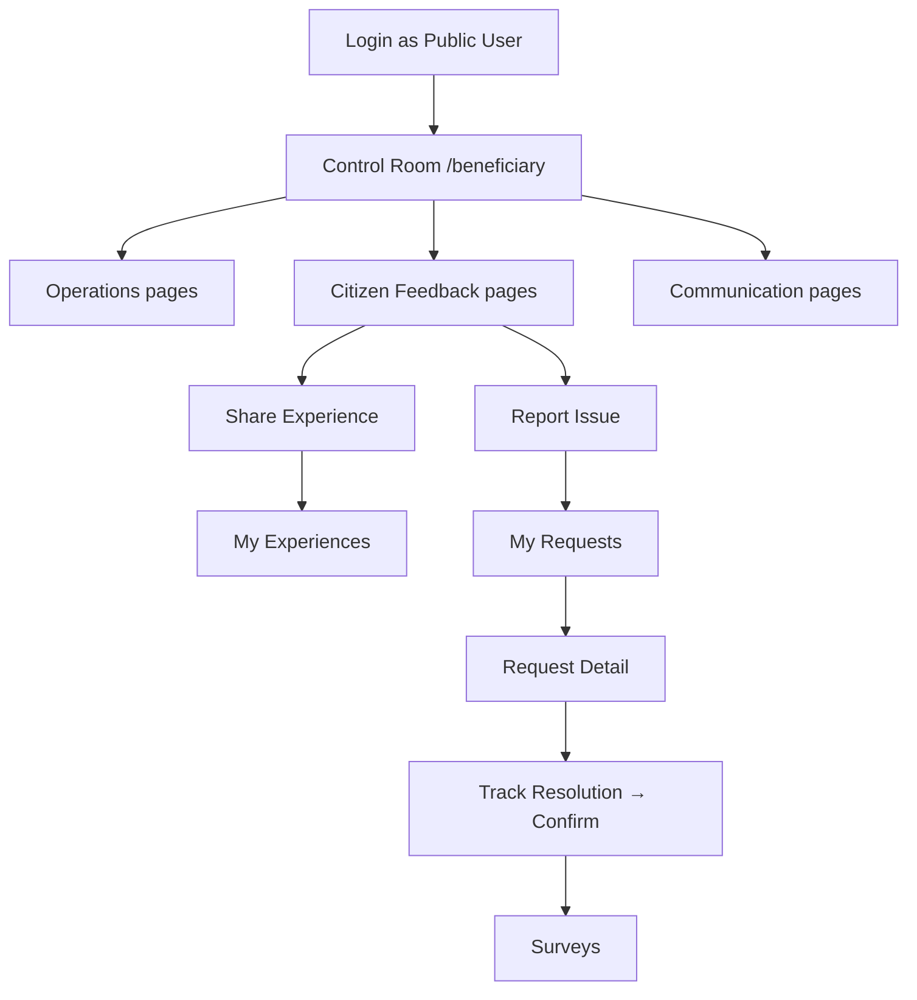

# AnganSakti 360 — Public User Portal (Full Overview)

**Role:** Public User (Beneficiary)  
**Login label on sign-in page:** **Public User**  
**Home after login:** `/beneficiary`  
**Application:** AnganSakti 360 — WDCW, Government of Andhra Pradesh  
**Pilot area:** Tirupati District (Alipiri Center demo)

This document explains everything a **Public User** can do after logging in: how login works, sidebar navigation, every page, user flows, and what is fully working versus demonstration-only.

---

## Table of contents

1. [What the Public User portal is](#1-what-the-public-user-portal-is)
2. [How to log in](#2-how-to-log-in)
3. [Your demo profile after login](#3-your-demo-profile-after-login)
4. [Application shell and navigation](#4-application-shell-and-navigation)
5. [Recommended user journeys](#5-recommended-user-journeys)
6. [Sidebar map — all menu items](#6-sidebar-map--all-menu-items)
7. [Complete route list](#7-complete-route-list)
8. [Page-by-page explanation](#8-page-by-page-explanation)
9. [Linked pages (not in sidebar)](#9-linked-pages-not-in-sidebar)
10. [Share Experience vs Report Issue](#10-share-experience-vs-report-issue)
11. [Grievance lifecycle (what happens after you report)](#11-grievance-lifecycle-what-happens-after-you-report)
12. [What is working vs demo-only](#12-what-is-working-vs-demo-only)

---

## 1. What the Public User portal is

The Public User portal is the **citizen-facing side** of AnganSakti 360. It is designed for:

- **Parents and caregivers** tracking their child’s Anganwadi services
- **Pregnant women and lactating mothers** viewing nutrition and health services
- **Guardians and community members** observing center services and raising concerns

### What you can do

| Area | Capabilities |
|------|----------------|
| **Service visibility** | See today’s attendance, meals, preschool sessions, and center activity logs |
| **Share Experience** | Give opinions, appreciation, and suggestions (no formal grievance) |
| **Report Issue** | File a tracked grievance with evidence — supervisor investigates |
| **Track requests** | Follow grievance timeline, SLA, officer actions, and confirm resolution |
| **Surveys** | Rate services after visits or complaint closure |
| **Transparency** | View center health summary and statewide public data |
| **Communication** | In-app notifications about services, grievances, and announcements |

### What you cannot see (by design)

- Worker performance scores and internal coaching notes
- Supervisor-only audit tools
- District or state admin dashboards

The portal uses **plain language**, large touch-friendly cards, and supports **English, Telugu, and Hindi**.

---

## 2. How to log in

### Step-by-step

```
1. Open the application at /
2. On the sign-in form, open "Access Category" dropdown
3. Select "Public User"
4. Phone and password are pre-filled (demo)
5. Click "Continue"
6. You are redirected to /beneficiary (Control Room)
```

### Demo credentials

| Field | Value |
|-------|-------|
| Access category | **Public User** |
| Phone | `9876543210` (you may edit; saved to profile) |
| Password | `demo1234` |

**Note:** This is a **pilot demonstration**. There is no real server checking your password. Selecting **Public User** is what matters.

### Session behavior

- Your session is saved in the browser (`localStorage` key `angansakti.user`).
- If you close the browser and return, you stay logged in and go straight to `/beneficiary`.
- If you try to open a Worker or Supervisor URL while logged in as Public User, you are redirected back to `/beneficiary`.
- **Logout:** Profile page → Logout, or sidebar Logout → returns to `/`.

### Language at login

- Language is set to **English** when you are on the login page.
- After login, change language on **Profile** (English / Telugu / Hindi).

---

## 3. Your demo profile after login

When you log in as Public User, you become:

| Field | Demo value |
|-------|------------|
| Name | **Sunita Rao** |
| User ID | `B-1001` |
| Phone | `9876501234` |
| Center | **Alipiri Center** |
| Center ID | `AWC-TPT-01` |
| District | Tirupati |

### Enrolled children

| Child | Age | ID |
|-------|-----|-----|
| Aarav Rao | 4 | `CH-01` |
| Priya Rao | 3 | `CH-02` |

---

## 4. Application shell and navigation

After login, every page shares the same layout:

### Header
- AP Government / WDCW branding
- Your name and role (“Public User”)
- Language toggle
- Accessibility controls (text size, contrast)
- Online/offline indicator

### Sidebar (3 sections)

| Section | Purpose |
|---------|---------|
| **Operations** | Daily services — child, meals, activities, timeline |
| **Citizen Feedback** | Experiences, grievances, surveys |
| **Communication** | Notifications, center health, profile, help |

### Mobile
- Bottom navigation shows key Operations shortcuts
- All pages use scrollable content with padding for mobile use

### “Who Are You Today?” (Control Room)

On the home page you choose your **session context**. This personalizes links and content but does not change your account:

| Context | Who it is for |
|---------|----------------|
| Parent / Caregiver | Child services, daily journey, preschool |
| Pregnant Woman | Nutrition and health priority banners |
| Lactating Mother | Nutrition and THR services |
| Guardian | Child services on behalf of ward |
| Citizen / Community | Community observation, anonymous grievance option |
| Other Beneficiary | General public services |

---

## 5. Recommended user journeys

### Journey A — Check how my child is doing today

```
Login → Control Room → Today's Services → Nutrition
         ↘ My Services (attendance, meals, learning tabs)
```

### Journey B — Share positive feedback (no grievance)

```
Login → Share Experience → fill form → My Experiences → Experience Detail
```

### Journey C — Report a problem that needs action

```
Login → Report Issue → fill form + evidence → My Requests → Request Detail
      → Track Resolution → Confirm resolution → Surveys
```

### Journey D — See center transparency

```
Login → Center Health → Full Center Service Journey
      OR Control Room → State Transparency (public page, no extra login)
```



---

## 6. Sidebar map — all menu items

### Operations

| Sidebar label | Route | Page |
|---------------|-------|------|
| Control Room | `/beneficiary` | Home dashboard |
| My Services | `/beneficiary/my-child` | Child service visibility hub |
| Today's Services | `/beneficiary/daily-journey` | Today’s timeline |
| Center Services | `/beneficiary/activities` | Activity feed at center |
| Nutrition | `/beneficiary/nutrition` | Meals and ICDS history |
| Center Timeline | `/beneficiary/center-timeline` | Public center event timeline |

### Citizen Feedback

| Sidebar label | Route | Page |
|---------------|-------|------|
| Share Experience | `/beneficiary/feedback` | Submit appreciation/opinion |
| Report Issue | `/beneficiary/omnichannel-feedback` | File formal grievance |
| My Experiences | `/public/my-experiences` | List of experience submissions |
| My Requests | `/public/my-requests` | List of grievances/requests |
| Grievance Center | `/beneficiary/complaints` | All grievances with step timeline |
| Track Resolution | `/beneficiary/status` | Confirm or reopen resolutions |
| Surveys | `/beneficiary/surveys` | Parent satisfaction surveys |

### Communication

| Sidebar label | Route | Page |
|---------------|-------|------|
| Communication Center | `/beneficiary/notifications` | In-app messages |
| Center Health | `/beneficiary/center-health` | Center transparency summary |
| Profile | `/beneficiary/profile` | Name, language, logout |
| Help & Support | `/beneficiary/help` | FAQ and contacts |

---

## 7. Complete route list

All routes below require **Public User login** unless marked *public*.

| Route | Page | In sidebar |
|-------|------|------------|
| `/beneficiary` | Control Room | Yes |
| `/beneficiary/my-child` | My Services | Yes |
| `/beneficiary/daily-journey` | Today's Services | Yes |
| `/beneficiary/activities` | Center Services | Yes |
| `/beneficiary/nutrition` | Nutrition | Yes |
| `/beneficiary/center-timeline` | Center Timeline | Yes |
| `/beneficiary/feedback` | Share Experience | Yes |
| `/beneficiary/omnichannel-feedback` | Report Issue | Yes |
| `/public/my-experiences` | My Experiences | Yes |
| `/public/my-requests` | My Requests | Yes |
| `/beneficiary/complaints` | Grievance Center | Yes |
| `/beneficiary/status` | Track Resolution | Yes |
| `/beneficiary/surveys` | Surveys | Yes |
| `/beneficiary/notifications` | Communication Center | Yes |
| `/beneficiary/center-health` | Center Health | Yes |
| `/beneficiary/profile` | Profile | Yes |
| `/beneficiary/help` | Help & Support | Yes |
| `/beneficiary/request/:id` | Request Detail | No — linked from lists |
| `/public/experience/:id` | Experience Detail | No — linked from lists |
| `/center-journey/:id` | Full Center Service Journey | No — linked from Center Health |
| `/center-command/:id` | Center Command (same as journey) | No — linked internally |
| `/public/transparency` | State Transparency | No — *public, no login* |
| `/impact` | Public Impact | No — *public, no login* |

---

## 8. Page-by-page explanation

---

### Control Room — `/beneficiary`

**Purpose:** Your home dashboard — one place to see everything important.

**What is on the page:**
- Greeting with your name and center
- **Who Are You Today?** — session context selector (parent, pregnant woman, guardian, etc.)
- Personalized link strip based on your context
- **My Experiences** summary — submitted, appreciated, included in improvements
- **My Requests** summary — submitted, under review, resolved
- **Center Trust Score** card — score built from feedback, grievances, activities, sessions
- **Today's Services** preview (when context is Parent or Guardian) — child photo, attendance, preschool, meal, activities
- Context-specific banners (pregnant woman → nutrition; community → anonymous reporting)
- **Quick actions** — shortcuts to all major pages
- **Announcements** — pilot scheme updates (demo content)
- Links to **State Transparency** (public page)

**What you can do:**
- Select who you are today to personalize the portal
- Tap any quick action or summary card to drill down
- See at a glance if you have open grievances or new experiences

**Working:** Trust score, experience/request buckets, child journey, portal hooks, context personalization.  
**Demo:** Announcement text is static mock content.

**Typical flow:** Login lands here → pick context → open Today's Services or Report Issue.

---

### My Services — `/beneficiary/my-child`

**Purpose:** Full **service visibility hub** for your child (or general beneficiary view).

**What is on the page:**
- Child name, age, center, ECCE enrollment status
- **Benefits eligibility** card (based on session context)
- **Center Trust Score**
- **Center timeline** (embedded preview)
- Summary chips: service usage days, meals received, participation %, service status
- **Tabs:** Attendance | Meals | Learning | Progress
- Date range filter: daily / weekly / monthly
- **Submitted evidence** section — photos and proof linked to your requests
- Photo gallery from center activity logs
- Download public service report button

**What you can do:**
- Switch child via URL `?child=CH-01` or `CH-02`
- Browse attendance and meal history
- View learning milestones and progress records
- Filter evidence by transparency bucket
- Open linked grievances from evidence section

**Working:** Child progress history, activity photos, trust score, request evidence, tab data.  
**Demo:** PDF download shows success toast only — no real file.

**Typical flow:** Control Room → My Services → Attendance tab → check if child attended this week.

---

### Today's Services — `/beneficiary/daily-journey`

**Purpose:** See **everything happening today** for your child at the Anganwadi.

**What is on the page:**
- Today's date and child name
- **Day timeline** — ordered steps with done/pending icons (arrival, preschool, meals, etc.)
- Summary cards: Attendance, Classroom session, Meals served, Departure
- **Today children learned** — story/activity summary from latest preschool session
- Link to Nutrition page

**What you can do:**
- Read step-by-step what has been logged today
- See if attendance, preschool, and meals are recorded
- Jump to nutrition details

**Working:** Built from real center activities, child progress, and session data via `buildTodayChildJourney`.  
**Demo:** Shows "No journey data yet" if worker has not logged today's services.

**Typical flow:** Morning check → open Today's Services → afternoon check again for updates.

---

### Center Services — `/beneficiary/activities`

**Purpose:** Browse **all activities logged at your center** with verification status.

**What is on the page:**
- Filter buttons: All | Nutrition | Preschool | Health | Special
- Activity cards with photo evidence (when worker uploaded)
- Type, timestamp, children count at center
- Verification status badge (verified, submitted, in progress)
- **Child participation hint** — whether your child likely participated (based on center records, not individual AI tracking)

**What you can do:**
- Filter by service category
- View worker-submitted descriptions and evidence photos
- See verification state of each activity

**Working:** Filters real activity logs for your center; participation inference from child progress.  
**Demo:** Participation is estimated, not individually tracked by camera.

**Typical flow:** Center Services → filter Preschool → see today's session log.

---

### Nutrition — `/beneficiary/nutrition`

**Purpose:** Track **ICDS meals and nutrition services** for your child.

**What is on the page:**
- **Today's menu** — standard ICDS mid-day meal description
- Today's status: meal served and recorded, or awaiting center log
- Summary chips: Today, Missed (14 days), Supplements, ICDS compliance
- **14-day nutrition history** — date, menu, received / not recorded per day

**What you can do:**
- Confirm if today's meal was logged for your child
- Review two weeks of meal receipt history
- See supplement and compliance status

**Working:** Nutrition records from child progress data.  
**Demo:** Today's menu text is a static template; status depends on worker logs.

**Typical flow:** Today's Services → View nutrition → check if meal was recorded.

---

### Center Timeline — `/beneficiary/center-timeline`

**Purpose:** Chronological **public-safe timeline** of center service events.

**What is on the page:**
- Center name header
- Scrollable timeline of citizen-visible events (sessions, services, improvements)
- Events from preschool sessions and daily worker logs

**What you can do:**
- Scroll history of what happened at your Anganwadi
- Understand service patterns over time

**Working:** Timeline from `PublicCenterTimeline` / `getTimeline` services.  
**Demo:** Content depends on demo data loaded in browser.

**Typical flow:** Center Timeline → scroll last week's events.

---

### Share Experience — `/beneficiary/feedback`

**Purpose:** Share **opinions, appreciation, and suggestions** — this is **not a grievance**.

**What is on the page:**
- Explanation: recorded for service improvement, no supervisor enforcement action
- Links to My Experiences and Report Issue
- **Share Experience form:**
  - Who you are submitting as (parent, guardian, community, etc.)
  - Category and experience type (appreciation, suggestion, concern)
  - Star rating (1–5)
  - Text comment
  - Optional photo evidence
- Success banner with link to submission detail
- Recent experiences list (last 8)

**What you can do:**
- Submit positive or constructive feedback
- Attach optional photos for context
- View confirmation and open Experience Detail

**Working:** `submitShareExperience` → AI sentiment analysis → saved to citizen experiences → feeds Trust Score.  
**Demo:** AI analysis runs client-side in pilot.

**Important:** Share Experience does **not** create a grievance or assign a supervisor. For problems needing action, use **Report Issue**.

**Typical flow:** Good visit → Share Experience → 5 stars + comment → My Experiences.

---

### Report Issue — `/beneficiary/omnichannel-feedback`

**Purpose:** File a **formal grievance** when something needs supervisor investigation and resolution.

**What is on the page:**
- Workflow explainer: Submission → AI Review → Supervisor Investigation → Resolution → Your Confirmation → Closure
- Note: **Anganwadi workers are not grievance handlers**
- Links to My Requests and Share Experience
- **Report Issue form:**
  - Submitted as (parent, community, etc.)
  - Issue category
  - Priority
  - Resolution preference
  - Description text
  - Photo/video evidence upload
  - Consent and anonymous options
  - AI classification preview before submit
- Success banner with Grievance ID and link to track

**What you can do:**
- File grievance with evidence package
- Choose anonymous submission for sensitive community issues
- Immediately track via Request Detail link

**Working:** `submitReportIssue` → AI grievance analysis → complaint created → routed to **supervisor** (not worker).  
**Demo:** AI runs client-side; no real SMS/email to officers.

**Typical flow:** Meal not served → Report Issue → upload photo → My Requests → wait for supervisor action.

---

### My Experiences — `/public/my-experiences`

**Purpose:** List all your **Share Experience** submissions.

**What is on the page:**
- Filter chips: All | Submitted | Appreciated | Included in Improvements
- Count per bucket
- Cards: date, category, comment preview, rating, sentiment, status

**What you can do:**
- Filter experiences by type
- Tap any card → Experience Detail

**Working:** Reads `myExperiences` from public portal hook.  
**Demo:** None — fully functional list.

**Typical flow:** After submitting feedback → My Experiences → verify it was recorded.

---

### My Requests — `/public/my-requests`

**Purpose:** Unified tracker for **grievances and formal requests** with evidence.

**What is on the page:**
- Explanation: supervisors investigate using your evidence; workers not assigned
- **Evidence buckets** — filter by status (submitted, under review, resolved, etc.)
- Request cards with reference ID, status, SLA hints
- Links to Report Issue and Share Experience

**What you can do:**
- Filter requests by transparency bucket
- Open any request → Request Detail page
- See supervisor action progress

**Working:** `publicRequests` and `requestBuckets` from portal service.  
**Demo:** None — fully functional.

**Typical flow:** After Report Issue → My Requests → open under review item.

---

### Grievance Center — `/beneficiary/complaints`

**Purpose:** Dedicated view of **all your grievances** with visual step timeline.

**What is on the page:**
- Total grievance count
- "Raise new issue" button (links to Share Experience — use Report Issue from sidebar for grievances)
- Cards per grievance: ID, title, status, step timeline, SLA due date

**What you can do:**
- See all grievances in one place
- Tap card → Request Detail

**Working:** Filters `myComplaints` for your user ID.  
**Demo:** Empty state message if no grievances yet.

**Typical flow:** Grievance Center → tap open grievance → Request Detail.

---

### Track Resolution — `/beneficiary/status`

**Purpose:** Act on grievances where the **supervisor has proposed a resolution**.

**What is on the page:**
- Per-grievance cards with full step timeline
- Resolution notes from officer
- Resolution evidence photo (when uploaded by supervisor)
- SLA due date
- **Confirm resolution** button (when status is resolution or beneficiary_confirmation)
- **Reopen** button if not satisfied
- Link to satisfaction survey
- Link to full Request Detail

**What you can do:**
- **Confirm resolution** → closes grievance, may trigger survey
- **Reopen** → sends back to supervisor review
- Open satisfaction survey after confirming

**Working:** `advanceComplaint`, `updateComplaint` update real complaint state.  
**Demo:** None for confirm/reopen actions.

**Typical flow:** Notification that issue resolved → Track Resolution → Confirm → Surveys.

---

### Surveys — `/beneficiary/surveys`

**Purpose:** Complete **parent satisfaction surveys** after visits or grievance closure.

**What is on the page:**
- Active survey form (when pending) with 6 dimensions:
  - Learning quality
  - Food quality
  - Child happiness (overall)
  - Communication
  - Teacher support
  - Center cleanliness
- Star rating (1–5) per dimension
- Submit button
- List of completed surveys with scores

**What you can do:**
- Rate each dimension
- Submit survey → data feeds service quality metrics
- Review past survey results

**Working:** `submitSurvey` persists responses. Surveys appear when triggered (post-visit, post-closure).  
**Demo:** Pending surveys depend on demo scenario data.

**Typical flow:** Confirm grievance resolution → Surveys → submit ratings.

---

### Communication Center — `/beneficiary/notifications`

**Purpose:** In-app **messages and updates** about services, grievances, and announcements.

**What is on the page:**
- Alert preferences panel (WhatsApp, SMS, in-app) — labeled demo
- Tabs: All | Services | Complaints | Announcements | Surveys
- Notification list with title, body, time ago, read/unread state

**What you can do:**
- Filter notifications by category
- Tap to mark as read
- Toggle WhatsApp/SMS preferences (UI only)

**Working:** Notification list, mark read.  
**Demo:** WhatsApp/SMS toggles do not persist or send real messages.

**Typical flow:** Check Communication Center after filing grievance for status updates.

---

### Center Health — `/beneficiary/center-health`

**Purpose:** **Government transparency summary** of your Anganwadi — without internal staff ratings.

**What is on the page:**
- Chips: services delivered this week, grievances resolved, parent participation, cleanliness/nutrition status
- Explanation of what parents can and cannot see
- Overall service status label
- Open issues count with link to grievances
- **Full center service journey** button → `/center-journey/AWC-TPT-01`

**What you can do:**
- Understand center performance at a citizen-safe level
- See if open issues are being addressed
- Open full center journey for deeper timeline

**Working:** `buildCenterGovSummary`, service quality scores, real complaint counts.  
**Demo:** None for summary metrics.

**Typical flow:** Center Health → Full Center Service Journey.

---

### Profile — `/beneficiary/profile`

**Purpose:** Your account settings and logout.

**What is on the page:**
- Name and mobile number
- Recent submission contexts (parent, guardian, etc.)
- Language buttons: English | Telugu | Hindi
- Logout button

**What you can do:**
- Switch interface language
- Log out securely

**Working:** Language switch, logout, profile display.  
**Demo:** Cannot edit name/phone in pilot.

**Typical flow:** Profile → switch to Telugu → browse portal in Telugu.

---

### Help & Support — `/beneficiary/help`

**Purpose:** FAQ and guidance for using the portal.

**What is on the page:**
- Contact block: demo helpline `1800-425-0000`, Tirupati district info
- **Voice help** button (text-to-speech demo)
- FAQ accordion:
  - How to report meal/center problems
  - How to know if child attended
  - What happens after grievance submit
  - Telugu and voice options
- Link to Grievance Center guidance

**What you can do:**
- Read FAQs
- Try voice help (plays demo message)
- Navigate to grievance pages

**Working:** FAQ UI, voice help via browser speech.  
**Demo:** Helpline number is not a real call center.

**Typical flow:** Help → read "What happens after grievance" → Report Issue.

---

## 9. Linked pages (not in sidebar)

These pages open when you tap links from other pages.

---

### Request Detail — `/beneficiary/request/:id`

**Purpose:** **Full transparency** for one grievance or request.

**What is on the page:**
- Reference ID, title, status, category
- SLA panel with target hours and breach warning
- Submitted by, submitted as, category metadata
- **AI explainability panel** — how AI classified the issue
- **Evidence gallery** — your uploaded photos
- **Evidence location verification** — GPS validation of evidence
- **Grievance timeline** — every step and officer action
- Actions by role (supervisor, district) — what each officer did
- Resolution notes and evidence from supervisor
- Buttons: **Confirm satisfied** | **Reopen** | **Escalate to senior officer**
- Download evidence bundle (demo toast)

**What you can do:**
- See complete investigation history
- Confirm or reopen resolution
- Escalate if supervisor response is inadequate
- Review AI summary and evidence verification

**Working:** Full grievance lifecycle, confirm, reopen, escalate.  
**Demo:** Download bundle is toast only.

**Opens from:** My Requests, Grievance Center, Track Resolution, Report Issue success link.

---

### Experience Detail — `/public/experience/:id`

**Purpose:** Read-only view of one **Share Experience** submission.

**What is on the page:**
- Category, date, submitted-as, status, rating, satisfaction score
- Your comment text
- Evidence gallery (if attached)
- AI experience summary: sentiment, type, summary text
- Service improvement status (if included in improvements)
- Note: explicitly **not a grievance** — no officer timeline

**What you can do:**
- Review what you submitted and how AI interpreted it
- See if experience was included in service improvements

**Working:** Read from citizen experience store.  
**Demo:** None.

**Opens from:** My Experiences, Share Experience success link, Control Room preview.

---

### Full Center Service Journey — `/center-journey/:id`

**Purpose:** Deep **tabbed command center** for your Anganwadi (citizen-safe view).

**What is on the page:**
- Tabs: Overview, Operations, Citizen Voice, Health, Coaching (summary only), Interventions, Timeline, Impact
- Unified view of center services, feedback, and improvements

**What you can do:**
- Explore full center story beyond the summary on Center Health

**Working:** Real app data with citizen-safe filtering.  
**Demo:** Some center metadata from mock data.

**Opens from:** Center Health → "Full center service journey" button.

---

### State Transparency — `/public/transparency` *(no login required)*

**Purpose:** Public statewide accountability dashboard.

**Accessible from:** Control Room quick actions, login page footer.

**Working:** Aggregated anonymized KPIs when demo data is loaded.

---

### Public Impact — `/impact` *(no login required)*

**Purpose:** Public outcomes story — before/after program impact.

**Accessible from:** Login page footer, district admin links (you may open while logged in).

---

## 10. Share Experience vs Report Issue

| | Share Experience | Report Issue |
|---|------------------|--------------|
| **Route** | `/beneficiary/feedback` | `/beneficiary/omnichannel-feedback` |
| **Purpose** | Opinions, appreciation, suggestions | Problems needing official action |
| **Creates grievance?** | No | Yes |
| **Supervisor involved?** | No | Yes — investigates and resolves |
| **Tracked in** | My Experiences | My Requests / Grievance Center |
| **Feeds** | Trust Score, citizen satisfaction | SLA timeline, resolution proof |
| **Use when** | "Great session today!" | "Meal was not served" |

---

## 11. Grievance lifecycle (what happens after you report)

```
1. YOU — Report Issue with evidence
2. AI — Classifies category, priority, summary
3. SUPERVISOR — Receives in Public Grievance Center (not worker)
4. SUPERVISOR — Investigates, uploads resolution notes/evidence
5. YOU — See update in My Requests / Track Resolution
6. YOU — Confirm resolution OR reopen OR escalate to district
7. SYSTEM — May schedule satisfaction survey
8. CLOSED — Grievance closed; metrics update center health
```

**Your actions at each stage:**

| Stage | Where to look | What you do |
|-------|---------------|-------------|
| Submitted | My Requests | Wait; check SLA |
| Under review | Request Detail | View officer actions |
| Resolution proposed | Track Resolution | Confirm or reopen |
| Closed | Grievance Center | Optional survey |
| Unhappy with outcome | Request Detail | Escalate to senior officer |

---

## 12. What is working vs demo-only

### Fully working (you can use in pilot)

| Feature | Details |
|---------|---------|
| Login as Public User | Role selection, session persistence |
| Control Room dashboard | Trust score, buckets, context personalization |
| Service visibility | Today's journey, activities, nutrition history, my child tabs |
| Share Experience | Submit, AI summary, list, detail |
| Report Issue | Submit grievance, AI classification, supervisor routing |
| My Requests / Grievances | Full list, filters, detail pages |
| Track Resolution | Confirm, reopen, escalate |
| Surveys | Submit multi-dimension ratings |
| Notifications | In-app list, mark read |
| Center Health & Timeline | Government summary, event timeline |
| Center Journey | Multi-tab center view |
| Language | English, Telugu, Hindi on Profile |
| Logout | Clears session |

### Demonstration / limited

| Feature | Limitation |
|---------|------------|
| Password validation | Any password works; no real auth server |
| WhatsApp / SMS alerts | Toggle UI only; no real messages sent |
| Helpline `1800-425-0000` | Display only |
| PDF / bundle download | Toast message; no real file |
| Today's menu text | Static ICDS template |
| Announcements on Control Room | Mock pilot announcements |
| Child participation on activities | Estimated from center logs, not individual AI |
| Data scope | Browser only — clearing site data resets everything |

---

## Quick reference card

```
LOGIN
  URL: /
  Role: Public User
  Phone: 9876543210 | Password: demo1234
  Home: /beneficiary

MOST USED PAGES
  Check child today     → /beneficiary/daily-journey
  Full child history    → /beneficiary/my-child
  Say thank you         → /beneficiary/feedback
  Report problem        → /beneficiary/omnichannel-feedback
  Track my grievance    → /public/my-requests
  Confirm fix           → /beneficiary/status
  Change language       → /beneficiary/profile
  Get help              → /beneficiary/help

REMEMBER
  Share Experience = opinion (no grievance)
  Report Issue = formal complaint (supervisor handles)
  Workers do NOT resolve public grievances
```

---

*Document scope: Public User (`beneficiary`) role only. For Worker, Supervisor, District Admin, or State Admin portals, see `docs/FULL_APPLICATION_OVERVIEW.md`.*
